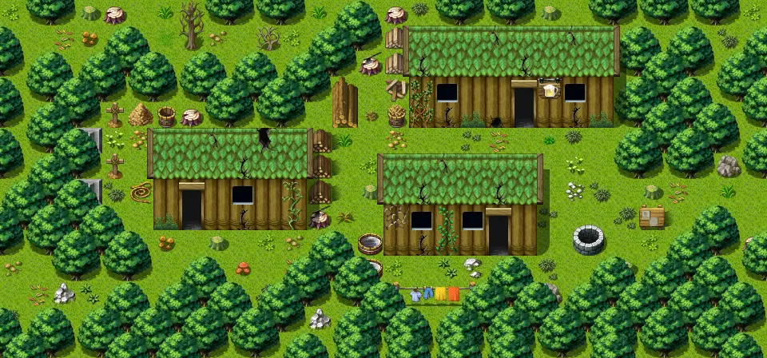
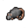

# Woodsettlement0

| | |
|---|---|
| **Map ID** | `woodsettlement0` |
| **Region** | Near Fallhaven (settlement) |
| **Type** | Outdoors |
| **Size** | 30×14 tiles |
| **World map** | [World1](index.md) |
| **Introduced** | v0.7.0 or earlier |
| **NPCs** | 3 |
| **Enemy types** | 3 |
| **Quests** | 1 |

**Woodsettlement0** is an outdoor map, near Fallhaven (settlement). It has 3 NPCs and 3 kinds of enemy. Exits lead to Roadbeforecrossroads2, Gapfillerhole, Woodhouse0, Woodhouse1 and 1 more.

## Map

<label class="lg"><input type="checkbox" data-t="spawn" checked><b>Red</b>&nbsp;Monsters / NPCs</label><label class="lg"><input type="checkbox" data-t="mapchange" checked><b>Blue</b>&nbsp;Exit to another map</label><label class="lg"><input type="checkbox" data-t="container" checked><b>Yellow</b>&nbsp;Container (click to see contents)</label><label class="lg"><input type="checkbox" data-t="sign" checked><b>Purple</b>&nbsp;Sign</label><label class="lg"><input type="checkbox" data-t="rest" checked><b>Green</b>&nbsp;Resting place</label><label class="lg"><input type="checkbox" data-t="key" checked><b>Orange dashed</b>&nbsp;Blocked until a quest step / item</label><label class="lg"><input type="checkbox" data-t="script"><b>Grey dotted</b>&nbsp;Scripted event</label><label class="lg"><input type="checkbox" data-t="replace"><b>White dotted</b>&nbsp;Changes during a quest</label><label class="lg"><input type="checkbox" data-t="pin" checked><b>Numbers</b>&nbsp;Numbered key points (see the key below the map)</label>

<a class="pin pin-exit" href="#key-1" style="left:98.333%;top:57.143%" title="Exit (east): to [Roadbeforecrossroads2](../roadbeforecrossroads2.md)">1</a><a class="pin pin-exit" href="#key-2" style="left:1.667%;top:82.143%" title="Exit (west): to [Gapfillerhole](../gapfillerhole.md)">2</a><a class="pin pin-exit" href="#key-3" style="left:25.000%;top:60.714%" title="Exit (door): to [Woodhouse0](../woodhouse0.md)">3</a><a class="pin pin-exit" href="#key-4" style="left:65.000%;top:67.857%" title="Exit (door): to [Woodhouse1](../woodhouse1.md)">4</a><a class="pin pin-exit" href="#key-5" style="left:68.333%;top:32.143%" title="Exit (door): to [Woodhouse2](../woodhouse2.md)">5</a><a class="pin pin-npc" href="#key-6" style="left:48.333%;top:25.000%" title="[Hagale](../../monsters/algore.md): 1 quest">6</a><a class="pin pin-npc" href="#key-7" style="left:55.000%;top:75.000%" title="[Outcast](../../monsters/smuggler6.md): NPC">7</a><a class="pin pin-npc" href="#key-8" style="left:81.667%;top:67.857%" title="[Pig](../../monsters/pig.md): NPC">8</a><a class="pin pin-script" href="#key-9" style="left:68.333%;top:39.286%" title="Quest trigger: Scripted event: advances the quest: hidden story flag “quest_burhczyd_nd” to stage 58 (“58=show oven in WoodSettlement”)">9</a><a class="pin pin-sign" href="#key-10" style="left:85.000%;top:60.714%" title="Sign: “Visitors are not welcome here!”">10</a><a class="pin pin-sign" href="#key-11" style="left:15.000%;top:39.286%" title="Sign: “Here lies an unnamed visitor. May her items that we took serve us well.”">11</a><a class="pin pin-sign" href="#key-12" style="left:15.000%;top:53.571%" title="Sign: “Here lies Khulrik. He always told us that he&#x27;d take one too many. Finally, he did.”">12</a><a class="pin pin-sign" href="#key-13" style="left:18.333%;top:32.143%" title="Sign: “Here lies Hagale. Killed by greedy $playername, just when he wanted to start a new life.”">13</a><a class="pin pin-script" href="#key-14" style="left:95.000%;top:57.143%" title="Quest trigger: Scripted event: advances the quest: hidden story flag “fungi_panic_nondisplayed” to stage 20 (“20=Algore grave”)">14</a><a class="pin pin-replace" href="#key-15" style="left:20.219%;top:26.786%" title="Changes during a quest: This area changes during the quest: hidden story flag “fungi_panic_nondisplayed” (stage 20: “20=Algore grave”)">15</a>

??? abstract "Key to the numbers on the map"

    | # | What | Details |
    |---|---|---|
    | 1 | Exit (east) | to [Roadbeforecrossroads2](../roadbeforecrossroads2.md) |
    | 2 | Exit (west) | to [Gapfillerhole](../gapfillerhole.md) |
    | 3 | Exit (door) | to [Woodhouse0](../woodhouse0.md) |
    | 4 | Exit (door) | to [Woodhouse1](../woodhouse1.md) |
    | 5 | Exit (door) | to [Woodhouse2](../woodhouse2.md) |
    | 6 | [Hagale](../monsters/algore.md) | 1 quest |
    | 7 | [Outcast](../monsters/smuggler6.md) | NPC |
    | 8 | [Pig](../monsters/pig.md) | NPC |
    | 9 | Quest trigger | Scripted event: advances the quest: hidden story flag “quest_burhczyd_nd” to stage 58 (“58=show oven in WoodSettlement”) |
    | 10 | Sign | “Visitors are not welcome here!” |
    | 11 | Sign | “Here lies an unnamed visitor. May her items that we took serve us well.” |
    | 12 | Sign | “Here lies Khulrik. He always told us that he'd take one too many. Finally, he did.” |
    | 13 | Sign | “Here lies Hagale. Killed by greedy $playername, just when he wanted to start a new life.” |
    | 14 | Quest trigger | Scripted event: advances the quest: hidden story flag “fungi_panic_nondisplayed” to stage 20 (“20=Algore grave”) |
    | 15 | Changes during a quest | This area changes during the quest: hidden story flag “fungi_panic_nondisplayed” (stage 20: “20=Algore grave”) |

Verified against v0.8.18 map data.

## Connections

| Direction | Leads to | Region there | Map # |
|---|---|---|---|
| East | [Roadbeforecrossroads2](roadbeforecrossroads2.md) | Fallhaven | 1 |
| West | [Gapfillerhole](gapfillerhole.md) | Fallhaven | 2 |
| Door | [Woodhouse0](woodhouse0.md) | Fallhaven | 3 |
| Door | [Woodhouse1](woodhouse1.md) | Fallhaven | 4 |
| Door | [Woodhouse2](woodhouse2.md) | Fallhaven | 5 |

## NPCs

- [Hagale](../monsters/algore.md) — quests: [Mine for the taking](../quests/graveyard_quest.md) (#6)
- [Outcast](../monsters/smuggler6.md) (#7)
- [Pig](../monsters/pig.md) (#8)

## Enemies

| Enemy | HP | Damage | Up to | Notes |
|---|---|---|---|---|
| [Rat](../monsters/vermin0.md) | 0 | 0–1 | 4 | shares spawn with Rat, Roach |
| [Roach](../monsters/vermin2.md) | 0 | 0–1 | 4 | shares spawn with Rat |
| [Rat](../monsters/vermin1.md) | 0 | 0–1 | 4 | shares spawn with Rat, Roach |

<small>“Up to” is the most that can be alive at once from the spawn areas on this map.</small>

## Quests

- [Mine for the taking](../quests/graveyard_quest.md): [Hagale](../monsters/algore.md) is involved
- [Fungi Panic - non displayed (hidden flag)](../quests/fungi_panic_nondisplayed.md): part of the map changes at stage 20; something on this map advances it; stepping on a trigger here sets stage 20
- [Young merchant Non-displayed (hidden flag)](../quests/quest_burhczyd_nd.md): something on this map advances it; stepping on a trigger here sets stage 58

## Points of interest

- **Quest trigger** (#9): Scripted event: advances the quest: hidden story flag “quest_burhczyd_nd” to stage 58 (“58=show oven in WoodSettlement”)
- **Sign** (#10): “Visitors are not welcome here!”
- **Sign** (#11): “Here lies an unnamed visitor. May her items that we took serve us well.”
- **Sign** (#12): “Here lies Khulrik. He always told us that he'd take one too many. Finally, he did.”
- **Sign** (#13): “Here lies Hagale. Killed by greedy $playername, just when he wanted to start a new life.”
- **Quest trigger** (#14): Scripted event: advances the quest: hidden story flag “fungi_panic_nondisplayed” to stage 20 (“20=Algore grave”)
- **Changes during a quest** (#15): This area changes during the quest: hidden story flag “fungi_panic_nondisplayed” (stage 20: “20=Algore grave”)

## Version history

| Version | Change |
|---|---|
| [v0.7.0](../versions/0.7.0.md) | Present in v0.7.0 (earliest release tracked) |
| [v0.7.1](../versions/0.7.1.md) | map layout or objects changed |
| [v0.7.2](../versions/0.7.2.md) | map layout or objects changed |
| [v0.7.11](../versions/0.7.11.md) | map layout or objects changed |
| [v0.7.13](../versions/0.7.13.md) | map layout or objects changed |
| [v0.8.2](../versions/0.8.2.md) | map layout or objects changed |

Verified against v0.8.18 and every earlier release back to v0.7.0 (game data compared release by release).

## Community notes

<small>Written by players, not generated from game data. **Observations**: what players notice in-game · **Lore**: the in-world story · **Trivia**: real-world facts, references, development history · **Theory / speculation**: unconfirmed ideas; may just be unfinished content</small>

### Observations

*Nothing here yet. Know something? [Add it](https://github.com/asdfghjkl628/Andor-s-Trail-Wikiiii/new/main/notes/maps?filename=woodsettlement0.md&value=%23%23%20Observations%0A%0A%3C%21--%20what%20players%20notice%20in-game%20--%3E%0A%0A%23%23%20Lore%0A%0A%3C%21--%20the%20in-world%20story%20--%3E%0A%0A%23%23%20Trivia%0A%0A%3C%21--%20real-world%20facts%2C%20references%2C%20development%20history%20--%3E%0A%0A%23%23%20Theory%20/%20speculation%0A%0A%3C%21--%20unconfirmed%20ideas%3B%20may%20just%20be%20unfinished%20content%20--%3E%0A).*

### Lore

*Nothing here yet. Know something? [Add it](https://github.com/asdfghjkl628/Andor-s-Trail-Wikiiii/new/main/notes/maps?filename=woodsettlement0.md&value=%23%23%20Observations%0A%0A%3C%21--%20what%20players%20notice%20in-game%20--%3E%0A%0A%23%23%20Lore%0A%0A%3C%21--%20the%20in-world%20story%20--%3E%0A%0A%23%23%20Trivia%0A%0A%3C%21--%20real-world%20facts%2C%20references%2C%20development%20history%20--%3E%0A%0A%23%23%20Theory%20/%20speculation%0A%0A%3C%21--%20unconfirmed%20ideas%3B%20may%20just%20be%20unfinished%20content%20--%3E%0A).*

### Trivia

*Nothing here yet. Know something? [Add it](https://github.com/asdfghjkl628/Andor-s-Trail-Wikiiii/new/main/notes/maps?filename=woodsettlement0.md&value=%23%23%20Observations%0A%0A%3C%21--%20what%20players%20notice%20in-game%20--%3E%0A%0A%23%23%20Lore%0A%0A%3C%21--%20the%20in-world%20story%20--%3E%0A%0A%23%23%20Trivia%0A%0A%3C%21--%20real-world%20facts%2C%20references%2C%20development%20history%20--%3E%0A%0A%23%23%20Theory%20/%20speculation%0A%0A%3C%21--%20unconfirmed%20ideas%3B%20may%20just%20be%20unfinished%20content%20--%3E%0A).*

### Theory / speculation

*Nothing here yet. Know something? [Add it](https://github.com/asdfghjkl628/Andor-s-Trail-Wikiiii/new/main/notes/maps?filename=woodsettlement0.md&value=%23%23%20Observations%0A%0A%3C%21--%20what%20players%20notice%20in-game%20--%3E%0A%0A%23%23%20Lore%0A%0A%3C%21--%20the%20in-world%20story%20--%3E%0A%0A%23%23%20Trivia%0A%0A%3C%21--%20real-world%20facts%2C%20references%2C%20development%20history%20--%3E%0A%0A%23%23%20Theory%20/%20speculation%0A%0A%3C%21--%20unconfirmed%20ideas%3B%20may%20just%20be%20unfinished%20content%20--%3E%0A).*

??? info "Technical information"

    | | |
    |---|---|
    | Map ID | `woodsettlement0` |
    | File | `res/xml/woodsettlement0.tmx` |
    | Size | 30×14 tiles (960×448 px) |
    | outdoors property | 1 |
    | Layers drawn | ground, objects, above |
    | Tilesets | map_bed_1, map_border_1, map_bridge_1, map_bridge_2, map_broken_1, map_cavewall_1, map_cavewall_2, map_cavewall_3, map_cavewall_4, map_chair_table_1, map_chair_table_2, map_crate_1, map_cupboard_1, map_curtain_1, map_entrance_1, map_entrance_2, map_fence_1, map_fence_2, map_fence_3, map_fence_4, map_ground_1, map_ground_2, map_ground_3, map_ground_4, map_ground_5, map_ground_6, map_ground_7, map_ground_8, map_house_1, map_house_2, map_indoor_1, map_indoor_2, map_kitchen_1, map_outdoor_1, map_pillar_1, map_pillar_2, map_plant_1, map_plant_2, map_rock_1, map_rock_2, map_roof_1, map_roof_2, map_roof_3, map_shop_1, map_sign_ladder_1, map_table_1, map_trail_1, map_transition_1, map_transition_2, map_transition_3, map_transition_4, map_transition_5, map_tree_1, map_tree_2, map_wall_1, map_wall_2, map_wall_3, map_wall_4, map_window_1, map_window_2 |
    | Map objects | spawn: 7, mapchange: 5, sign: 4, script: 2, replace: 1 |
    | World map position | segment `world1`, x 201, y 367 |

<small>Data from v0.8.18</small>
