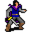

# { .sprite } Oseanpry

**Where to find Oseanpry:** Brightport: [brightport_thieves](../maps/brightport_thieves.md#pin-npc-Brightportthieves5)

<div class="infobox" markdown>

<p class="ib-img">{ .sprite }</p>

| | |
|---|---|
| **Type** | NPC (can be spoken to; cannot be attacked) |
| **Role** | Shopkeeper |
| **Found in** | Brightport |
| **Entry ID** | `Brightportthieves5` |
| **Introduced** | [v0.8.16.1](../versions/0.8.16.1.md) |

</div>

## Shop stock

| Item | Chance | Qty |
|---|---|---|
| [Cooked venison](../items/brightport_meat.md) | 100% | 5 |
| [Meat](../items/meat.md) | 100% | 5 |
| [Villain's blade](../items/sword_villains.md) | 100% | 1 |
| [Hunter's knife](../items/brightport_dagger.md) | 100% | 1 |
| [Raw venison](../items/brightport_rawmeat.md) | 100% | 1 |

## Quests

- [brightport_nondisplay (hidden flag)](../quests/brightport_nondisplay.md): stage 109

## Dialogue simulator

Set the quest stages, items and other conditions that apply to your game, then start the conversation with Oseanpry. The simulator applies the game's own rules: it performs the same silent checks, offers only the options that would be shown in the game, and applies their effects (quest stages, items handed over, rewards) as the conversation proceeds.

<div class="dlg-sim" data-src="../../assets/dialogue/brightport_oseanpry0.json" data-npc="Oseanpry" markdown="0"><noscript>The simulator needs JavaScript. The full dialogue is listed below.</noscript></div>

<p class="verified">Rules verified against v0.8.18 game code (ConversationController.java) and dialogue data.</p>

??? quote "Dialogue (8 lines)"

    *What the dialogue says, exactly as in the game files. Lines are listed once; links jump to the line a choice leads to.*

    <span id="d-brightport_oseanpry0"></span>**`brightport_oseanpry0`** [Dummy NPC](../monsters/none.md): “The man looks at you with a hunter-like gaze, giving you a slight shiver.”

    - Next → [brightport_oseanpry](#d-brightport_oseanpry)

    <span id="d-brightport_oseanpry"></span>**`brightport_oseanpry`** [Oseanpry](../monsters/Brightportthieves5.md): “A kid like you shouldn't be here.”

    - “Who are you?” → [brightport_oseanpry2](#d-brightport_oseanpry2)
    - “What do you mean?” → [brightport_oseanpry1](#d-brightport_oseanpry1)
    - “What's with this dog next to you?” *(if reached stage 108 of [brightport_nondisplay (hidden flag)](../quests/brightport_nondisplay.md#stage-108))* → [brightport_oseanpry5](#d-brightport_oseanpry5)

    <span id="d-brightport_oseanpry2"></span>**`brightport_oseanpry2`** [Oseanpry](../monsters/Brightportthieves5.md): “Im Oseanpry, a hunter, and the Guild's cook. I've hunted the deer of Brightport for many years, until the boss hired me to hunt for people.”

    - “Do you have any food for sale?” → *shop opens*
    - “Hunt people?” *(if reached stage 20 of [Immaculate kidnapping](../quests/Thieves02.md#stage-20))* → [brightport_oseanpry4](#d-brightport_oseanpry4)

    <span id="d-brightport_oseanpry1"></span>**`brightport_oseanpry1`** [Oseanpry](../monsters/Brightportthieves5.md): “I can read the naivety on your face. One like you will just be used to do someone's dirty work.”

    - “I'm old enough to be responsible for my actions. I do what is right for me.” → [brightport_oseanpry3](#d-brightport_oseanpry3)

    <span id="d-brightport_oseanpry5"></span>**`brightport_oseanpry5`** Oseanpry: “She is my loyal hunting partner. We've been through thick and thin.” — **effects:** sets stage 109 of [brightport_nondisplay (hidden flag)](../quests/brightport_nondisplay.md#stage-109)

    - “Wow! can I get one too?” → [brightport_oseanpry6](#d-brightport_oseanpry6)

    <span id="d-brightport_oseanpry4"></span>**`brightport_oseanpry4`** [Oseanpry](../monsters/Brightportthieves5.md): “Yes, like you did with Ambelie, and just like you, I was also searching for someone close to me... but I can't speak about it now...”

    - “Intriguing, but I have to go now.” → *conversation ends*

    <span id="d-brightport_oseanpry3"></span>**`brightport_oseanpry3`** [Oseanpry](../monsters/Brightportthieves5.md): “Very well, but remember, each of your choices has consequences. Once made, you won't be able to go back to how things were before.”

    - “Whatever you say.” → *conversation ends*
    - “Shadow be with you.” → *conversation ends*

    <span id="d-brightport_oseanpry6"></span>**`brightport_oseanpry6`** Oseanpry: “What?! No way kid, dogs are notoriously hard to tame. Now go away!”

    - “Aww dangit.” → *conversation ends*


## Version history

| Version | Change |
|---|---|
| [v0.8.16.1](../versions/0.8.16.1.md) | Added<br>Dialogue: 8 lines added |

<p class="verified">Verified against v0.8.18 and every earlier release back to v0.7.0 (game data compared release by release).</p>


??? info "Technical information"

    | | |
    |---|---|
    | Entry ID | `Brightportthieves5` |
    | Spawn group | `Brightportthieves5` |
    | Loot table | `brightport_oseanpry` |
    | Conversation | `brightport_oseanpry0` |
    | Faction | – |
    | Movement | – |
    | Icon | `monsters_ld1:114` |
    | Defined in | `res/raw/monsterlist_brightport.json` |

    Raw data:

    ```json
    {
     "id": "Brightportthieves5",
     "name": "Oseanpry",
     "iconID": "monsters_ld1:114",
     "unique": 1,
     "phraseID": "brightport_oseanpry0",
     "droplistID": "brightport_oseanpry"
    }
    ```


## Community notes

<small>Written by players, not generated from game data. **Observations**: what players notice in-game · **Lore**: the in-world story · **Trivia**: real-world facts, references, development history · **Theory / speculation**: unconfirmed ideas; may just be unfinished content</small>

### Observations

*No notes yet. Contributions are welcome: [add a note](https://github.com/asdfghjkl628/Andor-s-Trail-Wikiiii/new/main/notes/monsters?filename=Brightportthieves5.md&value=%23%23%20Observations%0A%0A%3C%21--%20what%20players%20notice%20in-game%20--%3E%0A%0A%23%23%20Lore%0A%0A%3C%21--%20the%20in-world%20story%20--%3E%0A%0A%23%23%20Trivia%0A%0A%3C%21--%20real-world%20facts%2C%20references%2C%20development%20history%20--%3E%0A%0A%23%23%20Theory%20/%20speculation%0A%0A%3C%21--%20unconfirmed%20ideas%3B%20may%20just%20be%20unfinished%20content%20--%3E%0A).*

### Lore

*No notes yet. Contributions are welcome: [add a note](https://github.com/asdfghjkl628/Andor-s-Trail-Wikiiii/new/main/notes/monsters?filename=Brightportthieves5.md&value=%23%23%20Observations%0A%0A%3C%21--%20what%20players%20notice%20in-game%20--%3E%0A%0A%23%23%20Lore%0A%0A%3C%21--%20the%20in-world%20story%20--%3E%0A%0A%23%23%20Trivia%0A%0A%3C%21--%20real-world%20facts%2C%20references%2C%20development%20history%20--%3E%0A%0A%23%23%20Theory%20/%20speculation%0A%0A%3C%21--%20unconfirmed%20ideas%3B%20may%20just%20be%20unfinished%20content%20--%3E%0A).*

### Trivia

*No notes yet. Contributions are welcome: [add a note](https://github.com/asdfghjkl628/Andor-s-Trail-Wikiiii/new/main/notes/monsters?filename=Brightportthieves5.md&value=%23%23%20Observations%0A%0A%3C%21--%20what%20players%20notice%20in-game%20--%3E%0A%0A%23%23%20Lore%0A%0A%3C%21--%20the%20in-world%20story%20--%3E%0A%0A%23%23%20Trivia%0A%0A%3C%21--%20real-world%20facts%2C%20references%2C%20development%20history%20--%3E%0A%0A%23%23%20Theory%20/%20speculation%0A%0A%3C%21--%20unconfirmed%20ideas%3B%20may%20just%20be%20unfinished%20content%20--%3E%0A).*

### Theory / speculation

*No notes yet. Contributions are welcome: [add a note](https://github.com/asdfghjkl628/Andor-s-Trail-Wikiiii/new/main/notes/monsters?filename=Brightportthieves5.md&value=%23%23%20Observations%0A%0A%3C%21--%20what%20players%20notice%20in-game%20--%3E%0A%0A%23%23%20Lore%0A%0A%3C%21--%20the%20in-world%20story%20--%3E%0A%0A%23%23%20Trivia%0A%0A%3C%21--%20real-world%20facts%2C%20references%2C%20development%20history%20--%3E%0A%0A%23%23%20Theory%20/%20speculation%0A%0A%3C%21--%20unconfirmed%20ideas%3B%20may%20just%20be%20unfinished%20content%20--%3E%0A).*


<small>Data from v0.8.18</small>
