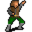

# { .sprite } Grabby

<div class="infobox" markdown>

<p class="ib-img">{ .sprite }</p>

| | |
|---|---|
| **Type** | NPC/Enemy (can be spoken to, but can also be fought) |
| **Found in** | Aidem base 2, Aidem camp, Aidem base 2, Fallhaven |
| **Class** | Humanoid |
| **HP** | 329 |
| **XP when defeated** | 707 |
| **Entries in game data** | 3 |
| **Introduced** | [v0.8.8](../versions/0.8.8.md) |

</div>

!!! info "3 entries in the game data"
    The game data defines 3 separate characters named Grabby. The game makes a new entry whenever a character needs different behaviour (another conversation later in a quest, another location, other stats). Some are the same person at different story points; others just share a generic name. Here the entries differ in: conversation, location, combat statistics, loot or shop stock, movement. Each entry has its own section below.

| Entry | Type | Location | Role | HP |
|---|---|---|---|---|
| [`aidem_camp_grabby`](#v-aidem_camp_grabby) | NPC | [Aidem base 2](../maps/aidem_base_2.md#pin-npc-aidem_camp_grabby), [Aidem camp](../maps/aidem_camp.md#pin-npc-aidem_camp_grabby) | – | – |
| [`aidem_base_grabby_aggressive`](#v-aidem_base_grabby_aggressive) | Enemy | [Aidem base 2](../maps/aidem_base_2.md) | – | 329 |
| [`aidem_jail_grabby`](#v-aidem_jail_grabby) | Enemy | Fallhaven: [Guildbrig 2](../maps/guildbrig2.md) | – | 1 |

## Aidem base 2 and 1 more (aidem_camp_grabby) { #v-aidem_camp_grabby }

**Entry ID:** `aidem_camp_grabby` · **Type:** NPC

**Location:** [Aidem base 2](../maps/aidem_base_2.md#pin-npc-aidem_camp_grabby), [Aidem camp](../maps/aidem_camp.md#pin-npc-aidem_camp_grabby)

### Locations

| Map | Region | Up to | Notes |
|---|---|---|---|
| [Aidem base 2](../maps/aidem_base_2.md) | – | 1 | Appears later, during a quest |
| [Aidem camp](../maps/aidem_camp.md) | – | 1 | Appears later, during a quest |

### Dialogue simulator

Set your quest stages and items, then talk to Grabby. Same rules as the game: same checks, same options, same effects.

<div class="dlg-sim" data-src="../../assets/dialogue/aidem_camp_grabby_10.json" data-npc="Grabby" markdown="0"><noscript>The simulator needs JavaScript. The full dialogue is listed below.</noscript></div>

<p class="verified">Rules verified against v0.8.18 game code (ConversationController.java) and dialogue data.</p>

??? quote "Dialogue (1 lines)"

    *Exactly as in the game files. Each line appears once; links jump to where a choice leads.*

    <span id="d-aidem_camp_grabby-aidem_camp_grabby_10"></span>**`aidem_camp_grabby_10`** Grabby: “I'm just the muscle around here. Go talk to Defy.”


### Version history

| Version | Change |
|---|---|
| [v0.8.8](../versions/0.8.8.md) | Added<br>Dialogue: 1 line added |

<p class="verified">Verified against v0.8.18 and every earlier release back to v0.7.0 (game data compared release by release).</p>


??? info "Technical information (aidem_camp_grabby)"

    | | |
    |---|---|
    | Entry ID | `aidem_camp_grabby` |
    | Spawn group | `aidem_camp_grabby` |
    | Loot table | `aidem_camp_grabby_dl` |
    | Conversation | `aidem_camp_grabby_10` |
    | Faction | – |
    | Movement | helpOthers |
    | Icon | `monsters_ld1:65` |
    | Defined in | `res/raw/monsterlist_mt_galmore.json` |

    Raw data:

    ```json
    {
     "id": "aidem_camp_grabby",
     "name": "Grabby",
     "iconID": "monsters_ld1:65",
     "maxHP": 1,
     "maxAP": 10,
     "moveCost": 10,
     "unique": 1,
     "monsterClass": "humanoid",
     "movementAggressionType": "helpOthers",
     "phraseID": "aidem_camp_grabby_10",
     "droplistID": "aidem_camp_grabby_dl"
    }
    ```


## Aidem base 2 (aidem_base_grabby_aggressive) { #v-aidem_base_grabby_aggressive }

**Entry ID:** `aidem_base_grabby_aggressive` · **Type:** Enemy

**Location:** [Aidem base 2](../maps/aidem_base_2.md)

### Combat statistics

| Statistic | Value |
|---|---|
| Class | Humanoid |
| HP | 329 |
| XP when defeated | 707 |
| Damage | 7 to 9 |
| Attack chance | 158 |
| Block chance | 170 |
| Damage resistance | 0 |
| Max AP | 10 |
| Attack cost | 3 AP |
| Attacks per turn | 3 |
| Move cost | 2 AP |
| Critical skill | 3 |
| Critical multiplier | 2.0 |
| Critical hit chance | 2% |


<p class="verified">Verified against v0.8.18 monster data and game code (`MonsterTypeParser.java`).</p>

### Drops

| Item | Chance | Qty |
|---|---|---|
| [Grabby's ring](../items/grabby_ring.md) | 100% | 1 |
| [Gold coins](../items/gold.md) | 100% | 2000 to 3500 |

### Locations

| Map | Region | Up to | Notes |
|---|---|---|---|
| [Aidem base 2](../maps/aidem_base_2.md) | – | 1 | Appears later, during a quest |

### Quests that count defeats

- [Wanted men](../quests/wanted_men.md#stage-76) with stepping on a trigger on [Aidem base 2](../maps/aidem_base_2.md) checks that this enemy has been defeated.


### Version history

| Version | Change |
|---|---|
| [v0.8.8](../versions/0.8.8.md) | Added |

<p class="verified">Verified against v0.8.18 and every earlier release back to v0.7.0 (game data compared release by release).</p>


??? info "Technical information (aidem_base_grabby_aggressive)"

    | | |
    |---|---|
    | Entry ID | `aidem_base_grabby_aggressive` |
    | Spawn group | `help_defy` |
    | Loot table | `aidem_camp_grabby_dl` |
    | Conversation | – |
    | Faction | – |
    | Movement | wholeMap |
    | Icon | `monsters_ld1:65` |
    | Defined in | `res/raw/monsterlist_mt_galmore.json` |

    Raw data:

    ```json
    {
     "id": "aidem_base_grabby_aggressive",
     "name": "Grabby",
     "iconID": "monsters_ld1:65",
     "maxHP": 329,
     "maxAP": 10,
     "moveCost": 2,
     "unique": 1,
     "monsterClass": "humanoid",
     "movementAggressionType": "wholeMap",
     "attackDamage": {
      "min": 7,
      "max": 9
     },
     "spawnGroup": "help_defy",
     "droplistID": "aidem_camp_grabby_dl",
     "attackCost": 3,
     "attackChance": 158,
     "criticalSkill": 3,
     "criticalMultiplier": 2.0,
     "blockChance": 170
    }
    ```


## Fallhaven, Guildbrig 2 (aidem_jail_grabby) { #v-aidem_jail_grabby }

**Entry ID:** `aidem_jail_grabby` · **Type:** Enemy

**Location:** Fallhaven: [Guildbrig 2](../maps/guildbrig2.md)

### Combat statistics

| Statistic | Value |
|---|---|
| Class | Humanoid |
| HP | 1 |
| XP when defeated | 1 |
| Damage | 0 |
| Attack chance | 0 |
| Block chance | 0 |
| Damage resistance | 0 |
| Max AP | 10 |
| Attack cost | 10 AP |
| Attacks per turn | 1 |
| Move cost | 10 AP |
| Critical skill | 0 |
| Critical multiplier | – |
| Critical hit chance | None (requires both critical skill and a critical multiplier) |


<p class="verified">Verified against v0.8.18 monster data and game code (`MonsterTypeParser.java`).</p>

### Locations

| Map | Region | Up to | Notes |
|---|---|---|---|
| [Guildbrig 2](../maps/guildbrig2.md) | Fallhaven | 1 | Appears later, during a quest |


### Version history

| Version | Change |
|---|---|
| [v0.8.8](../versions/0.8.8.md) | Added |

<p class="verified">Verified against v0.8.18 and every earlier release back to v0.7.0 (game data compared release by release).</p>


??? info "Technical information (aidem_jail_grabby)"

    | | |
    |---|---|
    | Entry ID | `aidem_jail_grabby` |
    | Spawn group | `aidem_jail_grabby` |
    | Loot table | – |
    | Conversation | – |
    | Faction | – |
    | Movement | none |
    | Icon | `monsters_ld1:65` |
    | Defined in | `res/raw/monsterlist_mt_galmore.json` |

    Raw data:

    ```json
    {
     "id": "aidem_jail_grabby",
     "name": "Grabby",
     "iconID": "monsters_ld1:65",
     "monsterClass": "humanoid",
     "movementAggressionType": "none"
    }
    ```


??? info "How the XP value is calculated"

    The game computes each enemy's experience value when it loads the data (`MonsterTypeParser.java`):

    XP = ⌈(attacks per turn × attack chance × average damage × (1 + critical skill × critical multiplier) × 3 + HP × (1 + block chance) + 9 × damage resistance) × 0.7⌉

    Percentages are used as fractions (e.g. 60% = 0.6). Enemies whose attacks inflict a condition are worth 50 XP more. The More Exp skill adds a percentage on top.


## Community notes

<small>Written by players, not generated from game data. **Observations**: what players notice in-game · **Lore**: the in-world story · **Trivia**: real-world facts, references, development history · **Theory / speculation**: unconfirmed ideas; may just be unfinished content</small>

### Observations

*No notes yet. Contributions are welcome: [add a note](https://github.com/asdfghjkl628/Andor-s-Trail-Wikiiii/new/main/notes/monsters?filename=aidem_camp_grabby.md&value=%23%23%20Observations%0A%0A%3C%21--%20what%20players%20notice%20in-game%20--%3E%0A%0A%23%23%20Lore%0A%0A%3C%21--%20the%20in-world%20story%20--%3E%0A%0A%23%23%20Trivia%0A%0A%3C%21--%20real-world%20facts%2C%20references%2C%20development%20history%20--%3E%0A%0A%23%23%20Theory%20/%20speculation%0A%0A%3C%21--%20unconfirmed%20ideas%3B%20may%20just%20be%20unfinished%20content%20--%3E%0A).*

### Lore

*No notes yet. Contributions are welcome: [add a note](https://github.com/asdfghjkl628/Andor-s-Trail-Wikiiii/new/main/notes/monsters?filename=aidem_camp_grabby.md&value=%23%23%20Observations%0A%0A%3C%21--%20what%20players%20notice%20in-game%20--%3E%0A%0A%23%23%20Lore%0A%0A%3C%21--%20the%20in-world%20story%20--%3E%0A%0A%23%23%20Trivia%0A%0A%3C%21--%20real-world%20facts%2C%20references%2C%20development%20history%20--%3E%0A%0A%23%23%20Theory%20/%20speculation%0A%0A%3C%21--%20unconfirmed%20ideas%3B%20may%20just%20be%20unfinished%20content%20--%3E%0A).*

### Trivia

*No notes yet. Contributions are welcome: [add a note](https://github.com/asdfghjkl628/Andor-s-Trail-Wikiiii/new/main/notes/monsters?filename=aidem_camp_grabby.md&value=%23%23%20Observations%0A%0A%3C%21--%20what%20players%20notice%20in-game%20--%3E%0A%0A%23%23%20Lore%0A%0A%3C%21--%20the%20in-world%20story%20--%3E%0A%0A%23%23%20Trivia%0A%0A%3C%21--%20real-world%20facts%2C%20references%2C%20development%20history%20--%3E%0A%0A%23%23%20Theory%20/%20speculation%0A%0A%3C%21--%20unconfirmed%20ideas%3B%20may%20just%20be%20unfinished%20content%20--%3E%0A).*

### Theory / speculation

*No notes yet. Contributions are welcome: [add a note](https://github.com/asdfghjkl628/Andor-s-Trail-Wikiiii/new/main/notes/monsters?filename=aidem_camp_grabby.md&value=%23%23%20Observations%0A%0A%3C%21--%20what%20players%20notice%20in-game%20--%3E%0A%0A%23%23%20Lore%0A%0A%3C%21--%20the%20in-world%20story%20--%3E%0A%0A%23%23%20Trivia%0A%0A%3C%21--%20real-world%20facts%2C%20references%2C%20development%20history%20--%3E%0A%0A%23%23%20Theory%20/%20speculation%0A%0A%3C%21--%20unconfirmed%20ideas%3B%20may%20just%20be%20unfinished%20content%20--%3E%0A).*


<small>Data from v0.8.18</small>
