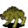

# { .sprite } Anklebiter

| Stat | Value |
|---|---|
| Class | animal |
| HP | 31 |
| Max AP | 10 |
| Attack cost | 5 |
| Move cost | 10 |
| Damage | 3 to 9 |
| Attack chance | 150 |
| Block chance | 60 |
| Damage resistance | 3 |
| Critical skill | 0 |
| Critical multiplier | 0 |

## Drops

| Item | Chance | Qty |
|---|---|---|
| [Gold coins](../items/gold.md) | 70% | 3 to 25 |
| [Glass gem](../items/gem1.md) | 5% | 1 |
| [Meat](../items/meat.md) | 30% | 1 |
| [Animal hair](../items/hair.md) | 30% | 1 |

## Found on

- [cabin_norcity_road1](../maps/cabin_norcity_road1.md)
- [crossroads](../maps/crossroads.md)
- [flagstone0](../maps/flagstone0.md)
- [guynmart_wood_11](../maps/guynmart_wood_11.md)
- [guynmart_wood_12](../maps/guynmart_wood_12.md)
- [guynmart_wood_13](../maps/guynmart_wood_13.md)
- [road3](../maps/road3.md)
- [road4](../maps/road4.md)
- [road5](../maps/road5.md)
- [roadbeforecrossroads2](../maps/roadbeforecrossroads2.md)
- [roadbeforecrossroads3](../maps/roadbeforecrossroads3.md)
- [roadbeforecrossroads4](../maps/roadbeforecrossroads4.md)
- [roadbeforecrossroads5](../maps/roadbeforecrossroads5.md)
- [roadbeforecrossroads6](../maps/roadbeforecrossroads6.md)
- [roadbeforecrossroads7](../maps/roadbeforecrossroads7.md)
- [wild14_cave](../maps/wild14_cave.md)
- [wild14_clearing](../maps/wild14_clearing.md)
- [wild16](../maps/wild16.md)

<small>Monster ID: `anklebiter` · Data from v0.8.18</small>
