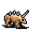

# { .sprite } Small horned anklebiter

| Stat | Value |
|---|---|
| Class | animal |
| HP | 38 |
| Max AP | 10 |
| Attack cost | 3 |
| Move cost | 5 |
| Damage | 3 to 7 |
| Attack chance | 96 |
| Block chance | 53 |
| Damage resistance | 1 |
| Critical skill | 0 |
| Critical multiplier | 0 |

## Drops

| Item | Chance | Qty |
|---|---|---|
| [Gold coins](../items/gold.md) | 50% | 0 to 5 |
| [Ruby gem](../items/gem2.md) | 5% | 1 |
| [Meat](../items/meat.md) | 10% | 1 |
| [Animal hair](../items/hair.md) | 30% | 1 |

## Found on

- [lodar0](../maps/lodar0.md)
- [lodar11](../maps/lodar11.md)
- [lodar14](../maps/lodar14.md)
- [lodar17](../maps/lodar17.md)
- [lodar19](../maps/lodar19.md)
- [lodar2](../maps/lodar2.md)
- [lodar4](../maps/lodar4.md)
- [lodar5](../maps/lodar5.md)
- [lodar7](../maps/lodar7.md)
- [lodar8](../maps/lodar8.md)
- [lodar9](../maps/lodar9.md)

<small>Monster ID: `anklebiter2` · Data from v0.8.18</small>
