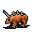

# { .sprite } Strong horned anklebiter

| Stat | Value |
|---|---|
| Class | animal |
| HP | 76 |
| Max AP | 10 |
| Attack cost | 3 |
| Move cost | 5 |
| Damage | 1 to 13 |
| Attack chance | 151 |
| Block chance | 85 |
| Damage resistance | 3 |
| Critical skill | 10 |
| Critical multiplier | 2.0 |

## Drops

| Item | Chance | Qty |
|---|---|---|
| [Gold coins](../items/gold.md) | 50% | 0 to 5 |
| [Ruby gem](../items/gem2.md) | 5% | 1 |
| [Meat](../items/meat.md) | 10% | 1 |
| [Animal hair](../items/hair.md) | 30% | 1 |

## Found on

- [lodar15](../maps/lodar15.md)
- [lodar17](../maps/lodar17.md)
- [lodar19](../maps/lodar19.md)
- [lodar21](../maps/lodar21.md)

<small>Monster ID: `anklebiter6` · Data from v0.8.18</small>
