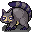

# { .sprite } Sow aroughcun

| Stat | Value |
|---|---|
| Class | animal |
| HP | 175 |
| Max AP | 10 |
| Attack cost | 4 |
| Move cost | 4 |
| Damage | 12 to 17 |
| Attack chance | 191 |
| Block chance | 176 |
| Damage resistance | 9 |
| Critical skill | 13 |
| Critical multiplier | 2.5 |

## On hit

- **On target:** Rabies (magnitude 2, 2 rounds, 30% chance)

## Drops

| Item | Chance | Qty |
|---|---|---|
| [Rosethorn apple](../items/rosethorn_apple.md) | 20% | 1 |
| [Bramblefin](../items/bramblefin_fish.md) | 20% | 1 |
| [Rotten fish](../items/rotten_fish.md) | 25% | 1 |
| [Headless fish](../items/headless_fish.md) | 20% | 1 |
| [Rotten meat](../items/meat2.md) | 30% | 1 |

## Found on

- [galmore_48](../maps/galmore_48.md)
- [galmore_57](../maps/galmore_57.md)
- [galmore_58](../maps/galmore_58.md)
- [galmore_58_house1](../maps/galmore_58_house1.md)
- [galmore_58_house1b](../maps/galmore_58_house1b.md)
- [galmore_66_house](../maps/galmore_66_house.md)
- [galmore_67](../maps/galmore_67.md)
- [galmore_68](../maps/galmore_68.md)
- [mt_galmore0_h2](../maps/mt_galmore0_h2.md)
- [undertell_exit](../maps/undertell_exit.md)

<small>Monster ID: `aroughcun_sow` · Data from v0.8.18</small>
