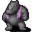

# { .sprite } Giant arulir

<div class="infobox" markdown>

<p class="ib-img">{ .sprite }</p>

| | |
|---|---|
| **Monster ID** | `arulir_2` |
| **Type** | Enemy |
| **Class** | Giant |
| **HP** | 330 |
| **XP when killed** | 407 |
| **Found in** | arulirmountain1, arulirmountain2, mountainlake5 |
| **Introduced** | v0.7.0 or earlier |

</div>

## Combat stats

| Stat | Value |
|---|---|
| HP | 330 |
| Damage | 1 to 20 |
| Attack chance | 70 |
| Block chance | 20 |
| Damage resistance | 8 |
| Max AP | 5 |
| Attack cost | 4 AP |
| Attacks per turn | 1 |
| Move cost | 5 AP |
| Critical skill | 30 |
| Critical multiplier | 3.0 |
| Crit chance | 19% |

**On hit:** On target: Stunned (magnitude 1, 3 rounds, 20% chance)

**XP formula** (from the game's loader): ⌈(attacks per turn × attack chance × average damage × (1 + critical skill × multiplier) × 3 + HP × (1 + block chance) + 9 × damage resistance) × 0.7⌉, +50 if its hits inflict a condition. More Exp adds a percentage on top.

<p class="verified">Verified against v0.8.18 monster data and game code (`MonsterTypeParser.java`).</p>


## Drops

| Item | Chance | Qty |
|---|---|---|
| [Gold coins](../items/gold.md) | 70% | 1 to 12 |
| [Meat](../items/meat.md) | 5% | 1 |
| [Animal hair](../items/hair.md) | 10% | 1 |
| [Arulir skin](../items/arulir_skin.md) | 1% | 1 |

## Locations

| Map | Region | Up to | Notes |
|---|---|---|---|
| [arulirmountain1](../maps/arulirmountain1.md) | – | 20 | – |
| [arulirmountain2](../maps/arulirmountain2.md) | – | 5 | – |
| [mountainlake5](../maps/mountainlake5.md) | – | 11 | – |


## Version history

| Version | Change |
|---|---|
| [v0.7.0](../versions/0.7.0.md) | Present in v0.7.0 (earliest release tracked) |
| [v0.7.2](../versions/0.7.2.md) | hitEffect: {"conditionsTarget": [{"chance": 20, "c… → {"conditionsTarget": [{"chance": "20", …; name: Giant Arulir → Giant arulir |
| [v0.7.4](../versions/0.7.4.md) | attackCost: 5 → 4 |

<p class="verified">Verified against v0.8.18 and every earlier release back to v0.7.0 (game data compared release by release).</p>


## Community notes

<small>Written by players, not generated from game data. **Observations**: what players notice in-game · **Lore**: the in-world story · **Trivia**: real-world facts, references, development history · **Theory / speculation**: unconfirmed ideas; may just be unfinished content</small>

### Observations

*Nothing here yet. Know something? [Add it](https://github.com/asdfghjkl628/Andor-s-Trail-Wikiiii/new/main/notes/monsters?filename=arulir_2.md&value=%23%23%20Observations%0A%0A%3C%21--%20what%20players%20notice%20in-game%20--%3E%0A%0A%23%23%20Lore%0A%0A%3C%21--%20the%20in-world%20story%20--%3E%0A%0A%23%23%20Trivia%0A%0A%3C%21--%20real-world%20facts%2C%20references%2C%20development%20history%20--%3E%0A%0A%23%23%20Theory%20/%20speculation%0A%0A%3C%21--%20unconfirmed%20ideas%3B%20may%20just%20be%20unfinished%20content%20--%3E%0A).*

### Lore

*Nothing here yet. Know something? [Add it](https://github.com/asdfghjkl628/Andor-s-Trail-Wikiiii/new/main/notes/monsters?filename=arulir_2.md&value=%23%23%20Observations%0A%0A%3C%21--%20what%20players%20notice%20in-game%20--%3E%0A%0A%23%23%20Lore%0A%0A%3C%21--%20the%20in-world%20story%20--%3E%0A%0A%23%23%20Trivia%0A%0A%3C%21--%20real-world%20facts%2C%20references%2C%20development%20history%20--%3E%0A%0A%23%23%20Theory%20/%20speculation%0A%0A%3C%21--%20unconfirmed%20ideas%3B%20may%20just%20be%20unfinished%20content%20--%3E%0A).*

### Trivia

*Nothing here yet. Know something? [Add it](https://github.com/asdfghjkl628/Andor-s-Trail-Wikiiii/new/main/notes/monsters?filename=arulir_2.md&value=%23%23%20Observations%0A%0A%3C%21--%20what%20players%20notice%20in-game%20--%3E%0A%0A%23%23%20Lore%0A%0A%3C%21--%20the%20in-world%20story%20--%3E%0A%0A%23%23%20Trivia%0A%0A%3C%21--%20real-world%20facts%2C%20references%2C%20development%20history%20--%3E%0A%0A%23%23%20Theory%20/%20speculation%0A%0A%3C%21--%20unconfirmed%20ideas%3B%20may%20just%20be%20unfinished%20content%20--%3E%0A).*

### Theory / speculation

*Nothing here yet. Know something? [Add it](https://github.com/asdfghjkl628/Andor-s-Trail-Wikiiii/new/main/notes/monsters?filename=arulir_2.md&value=%23%23%20Observations%0A%0A%3C%21--%20what%20players%20notice%20in-game%20--%3E%0A%0A%23%23%20Lore%0A%0A%3C%21--%20the%20in-world%20story%20--%3E%0A%0A%23%23%20Trivia%0A%0A%3C%21--%20real-world%20facts%2C%20references%2C%20development%20history%20--%3E%0A%0A%23%23%20Theory%20/%20speculation%0A%0A%3C%21--%20unconfirmed%20ideas%3B%20may%20just%20be%20unfinished%20content%20--%3E%0A).*


??? info "Technical information"

    | | |
    |---|---|
    | Monster ID | `arulir_2` |
    | Spawn group | `arulir_1` |
    | Loot table | `arulir` |
    | Conversation | – |
    | Faction | – |
    | Movement | – |
    | Icon | `monsters_rltiles1:13` |
    | Defined in | `res/raw/monsterlist_v0611_monsters1.json` |

    Raw data:

    ```json
    {
     "id": "arulir_2",
     "name": "Giant arulir",
     "iconID": "monsters_rltiles1:13",
     "maxHP": 330,
     "maxAP": 5,
     "moveCost": 5,
     "monsterClass": "giant",
     "attackDamage": {
      "min": 1,
      "max": 20
     },
     "spawnGroup": "arulir_1",
     "droplistID": "arulir",
     "attackCost": 4,
     "attackChance": 70,
     "criticalSkill": 30,
     "criticalMultiplier": 3.0,
     "blockChance": 20,
     "damageResistance": 8,
     "hitEffect": {
      "conditionsTarget": [
       {
        "condition": "stunned",
        "magnitude": 1,
        "duration": 3,
        "chance": "20"
       }
      ]
     }
    }
    ```


<small>Data from v0.8.18</small>
