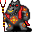

# { .sprite } Demonic Arulir

| Stat | Value |
|---|---|
| Class | giant |
| HP | 750 |
| Max AP | 10 |
| Attack cost | 5 |
| Move cost | 10 |
| Damage | 4 to 20 |
| Attack chance | 110 |
| Block chance | 32 |
| Damage resistance | 14 |
| Critical skill | 50 |
| Critical multiplier | 3.0 |

## On hit

- **On target:** Stunned (magnitude 1, 4 rounds, 30% chance)

## Drops

| Item | Chance | Qty |
|---|---|---|
| [Arulir skin](../items/arulir_skin.md) | 10% | 1 |
| [Gold coins](../items/gold.md) | 70% | 10 to 60 |
| [Hunter's Sword](../items/hunters_sword.md) | 0.1% | 1 |
| [Blue Crystals](../items/crystal_blue.md) | 3% | 1 |
| [Red Crystals](../items/crystal_red.md) | 3% | 1 |

## Found on

- [arulircave6](../maps/arulircave6.md)

<small>Monster ID: `arulir_8` · Data from v0.8.18</small>
