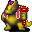

# { .sprite } Arulir Pack Leader

**Found in:** [arulircave6](../maps/arulircave6.md)

<div class="infobox" markdown>

<p class="ib-img">{ .sprite }</p>

| | |
|---|---|
| **Type** | Enemy (hostile on sight) |
| **Found in** | arulircave6 |
| **Class** | Giant |
| **HP** | 1000 |
| **XP when defeated** | 1,299 |
| **Entry ID** | `arulir_leader` |
| **Introduced** | [v0.7.8](../versions/0.7.8.md) |

</div>

## Combat statistics

| Statistic | Value |
|---|---|
| Class | Giant |
| HP | 1000 |
| XP when defeated | 1,299 |
| Damage | 10 to 20 |
| Attack chance | 125 |
| Block chance | 35 |
| Damage resistance | 15 |
| Max AP | 10 |
| Attack cost | 5 AP |
| Attacks per turn | 2 |
| Move cost | 10 AP |
| Critical skill | 55 |
| Critical multiplier | 3.0 |
| Critical hit chance | 28% |

**On hit:** On self: [Minor berserker rage](../conditions/rage_minor.md) (magnitude 1, 1 round, 50% chance); On target: [Stunned](../conditions/stunned.md) (magnitude 1, 4 rounds, 35% chance)


<p class="verified">Verified against v0.8.18 monster data and game code (`MonsterTypeParser.java`).</p>

## Drops

| Item | Chance | Qty |
|---|---|---|
| [Arulir skin](../items/arulir_skin.md) | 90% | 1 |
| [Gold coins](../items/gold.md) | 70% | 20 to 80 |
| [Blue Crystals](../items/crystal_blue.md) | 5% | 1 |
| [Red Crystals](../items/crystal_red.md) | 5% | 1 |
| [Giant's flail](../items/flail_giant.md) | 100% | 1 |
| [Giant's hauberk](../items/haub_giant.md) | 100% | 1 |

## Locations

| Map | Region | Up to | Notes |
|---|---|---|---|
| [arulircave6](../maps/arulircave6.md) | – | 1 | – |


## Version history

| Version | Change |
|---|---|
| [v0.7.8](../versions/0.7.8.md) | Added |

<p class="verified">Verified against v0.8.18 and every earlier release back to v0.7.0 (game data compared release by release).</p>


??? info "Technical information"

    | | |
    |---|---|
    | Entry ID | `arulir_leader` |
    | Spawn group | `arulir_leader` |
    | Loot table | `arulir_leader` |
    | Conversation | – |
    | Faction | – |
    | Movement | – |
    | Icon | `monsters_arulirs:8` |
    | Defined in | `res/raw/monsterlist_arulir_mountain.json` |

    Raw data:

    ```json
    {
     "id": "arulir_leader",
     "name": "Arulir Pack Leader",
     "iconID": "monsters_arulirs:8",
     "maxHP": 1000,
     "unique": 1,
     "monsterClass": "giant",
     "attackDamage": {
      "min": 10,
      "max": 20
     },
     "spawnGroup": "arulir_leader",
     "droplistID": "arulir_leader",
     "attackCost": 5,
     "attackChance": 125,
     "criticalSkill": 55,
     "criticalMultiplier": 3.0,
     "blockChance": 35,
     "damageResistance": 15,
     "hitEffect": {
      "conditionsSource": [
       {
        "condition": "rage_minor",
        "magnitude": 1,
        "duration": 1,
        "chance": "50"
       }
      ],
      "conditionsTarget": [
       {
        "condition": "stunned",
        "magnitude": 1,
        "duration": 4,
        "chance": "35"
       }
      ]
     }
    }
    ```


??? info "How the XP value is calculated"

    The game computes each enemy's experience value when it loads the data (`MonsterTypeParser.java`):

    XP = ⌈(attacks per turn × attack chance × average damage × (1 + critical skill × critical multiplier) × 3 + HP × (1 + block chance) + 9 × damage resistance) × 0.7⌉

    Percentages are used as fractions (e.g. 60% = 0.6). Enemies whose attacks inflict a condition are worth 50 XP more. The More Exp skill adds a percentage on top.


## Community notes

<small>Written by players, not generated from game data. **Observations**: what players notice in-game · **Lore**: the in-world story · **Trivia**: real-world facts, references, development history · **Theory / speculation**: unconfirmed ideas; may just be unfinished content</small>

### Observations

*No notes yet. Contributions are welcome: [add a note](https://github.com/asdfghjkl628/Andor-s-Trail-Wikiiii/new/main/notes/monsters?filename=arulir_leader.md&value=%23%23%20Observations%0A%0A%3C%21--%20what%20players%20notice%20in-game%20--%3E%0A%0A%23%23%20Lore%0A%0A%3C%21--%20the%20in-world%20story%20--%3E%0A%0A%23%23%20Trivia%0A%0A%3C%21--%20real-world%20facts%2C%20references%2C%20development%20history%20--%3E%0A%0A%23%23%20Theory%20/%20speculation%0A%0A%3C%21--%20unconfirmed%20ideas%3B%20may%20just%20be%20unfinished%20content%20--%3E%0A).*

### Lore

*No notes yet. Contributions are welcome: [add a note](https://github.com/asdfghjkl628/Andor-s-Trail-Wikiiii/new/main/notes/monsters?filename=arulir_leader.md&value=%23%23%20Observations%0A%0A%3C%21--%20what%20players%20notice%20in-game%20--%3E%0A%0A%23%23%20Lore%0A%0A%3C%21--%20the%20in-world%20story%20--%3E%0A%0A%23%23%20Trivia%0A%0A%3C%21--%20real-world%20facts%2C%20references%2C%20development%20history%20--%3E%0A%0A%23%23%20Theory%20/%20speculation%0A%0A%3C%21--%20unconfirmed%20ideas%3B%20may%20just%20be%20unfinished%20content%20--%3E%0A).*

### Trivia

*No notes yet. Contributions are welcome: [add a note](https://github.com/asdfghjkl628/Andor-s-Trail-Wikiiii/new/main/notes/monsters?filename=arulir_leader.md&value=%23%23%20Observations%0A%0A%3C%21--%20what%20players%20notice%20in-game%20--%3E%0A%0A%23%23%20Lore%0A%0A%3C%21--%20the%20in-world%20story%20--%3E%0A%0A%23%23%20Trivia%0A%0A%3C%21--%20real-world%20facts%2C%20references%2C%20development%20history%20--%3E%0A%0A%23%23%20Theory%20/%20speculation%0A%0A%3C%21--%20unconfirmed%20ideas%3B%20may%20just%20be%20unfinished%20content%20--%3E%0A).*

### Theory / speculation

*No notes yet. Contributions are welcome: [add a note](https://github.com/asdfghjkl628/Andor-s-Trail-Wikiiii/new/main/notes/monsters?filename=arulir_leader.md&value=%23%23%20Observations%0A%0A%3C%21--%20what%20players%20notice%20in-game%20--%3E%0A%0A%23%23%20Lore%0A%0A%3C%21--%20the%20in-world%20story%20--%3E%0A%0A%23%23%20Trivia%0A%0A%3C%21--%20real-world%20facts%2C%20references%2C%20development%20history%20--%3E%0A%0A%23%23%20Theory%20/%20speculation%0A%0A%3C%21--%20unconfirmed%20ideas%3B%20may%20just%20be%20unfinished%20content%20--%3E%0A).*


<small>Data from v0.8.18</small>
