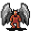

# { .sprite } Ash spawn

| Stat | Value |
|---|---|
| Class | demon |
| HP | 83 |
| Max AP | 10 |
| Attack cost | 3 |
| Move cost | 5 |
| Damage | 0 to 5 |
| Attack chance | 141 |
| Block chance | 86 |
| Damage resistance | 0 |
| Critical skill | 15 |
| Critical multiplier | 4.0 |

!!! note "Immune to critical hits"
    Ghosts, constructs and demons can't be critically hit. Your crit build will have to sit this one out.

## Drops

| Item | Chance | Qty |
|---|---|---|
| [Burnt ash](../items/ash.md) | 10% | 0 to 2 |
| [Reinforced black axe](../items/axe_black2.md) | 5% | 1 |
| [Gem of warmth](../items/gem_fire.md) | 0.1% | 1 |

## Found on

- [lostmine2](../maps/lostmine2.md)
- [lostmine3](../maps/lostmine3.md)
- [lostmine5](../maps/lostmine5.md)
- [lostmine6](../maps/lostmine6.md)

## Version history

| Version | Change |
|---|---|
| [v0.7.0](../versions/0.7.0.md) | Present in v0.7.0 (earliest release tracked) |
| [v0.7.2](../versions/0.7.2.md) | attackDamage: {"max": 5} → {"max": 5, "min": 0} |

Verified against v0.8.18 and every earlier release back to v0.7.0 (game data compared release by release).

<small>Monster ID: `ash6` · Data from v0.8.18</small>
