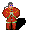

# { .sprite } Athamyr

**Where to find Athamyr:** not placed on any map; appears through a quest or scripted event.

<div class="infobox" markdown>

<p class="ib-img">{ .sprite }</p>

| | |
|---|---|
| **Type** | NPC (can be spoken to; cannot be attacked) |
| **Entry ID** | `athamyr` |
| **Introduced** | v0.7.0 or earlier |

</div>

## Quests

- [Key of Luthor](../quests/bucus.md): stages 30, 40, 50
- [Feygard story flags (hidden flag)](../quests/feygard_nondisplayed.md): stages 60, 61, 63, 71, 73

## Dialogue simulator

Set your quest stages and items, then talk to Athamyr. Same rules as the game: same checks, same options, same effects.

<div class="dlg-sim" data-src="../../assets/dialogue/athamyr.json" data-npc="Athamyr" markdown="0"><noscript>The simulator needs JavaScript. The full dialogue is listed below.</noscript></div>

<p class="verified">Rules verified against v0.8.18 game code (ConversationController.java) and dialogue data.</p>

??? quote "Dialogue (29 lines)"

    *Exactly as in the game files. Each line appears once; links jump to where a choice leads.*

    <span id="d-athamyr"></span>**`athamyr`** Athamyr: “Walk with the Shadow.”

    - “Have you been down in the catacombs?” *(if reached stage 20 of [Key of Luthor](../quests/bucus.md#stage-20); NOT reached stage 100 of [Key of Luthor](../quests/bucus.md#stage-100))* → [athamyr_select](#d-athamyr_select)
    - “May I ask you a question? Do you know a way to climb over the graveyard fence to the south?” *(if reached stage 100 of [Key of Luthor](../quests/bucus.md#stage-100); NOT reached stage 60 of [Feygard story flags (hidden flag)](../quests/feygard_nondisplayed.md#stage-60); NOT reached stage 69 of [Feygard story flags (hidden flag)](../quests/feygard_nondisplayed.md#stage-69); NOT carry 1× [Jewel of Fallhaven](../items/jewel_fallhaven.md); NOT wearing [Jewel of Fallhaven](../items/jewel_fallhaven.md))* → [athamyr_coup_10](#d-athamyr_coup_10)
    - “What about the ladder?” *(if reached stage 60 of [Feygard story flags (hidden flag)](../quests/feygard_nondisplayed.md#stage-60); NOT reached stage 61 of [Feygard story flags (hidden flag)](../quests/feygard_nondisplayed.md#stage-61); NOT reached stage 69 of [Feygard story flags (hidden flag)](../quests/feygard_nondisplayed.md#stage-69))* → [athamyr_coup_24a](#d-athamyr_coup_24a)
    - “I will go and find your ladder.” *(if reached stage 71 of [Feygard story flags (hidden flag)](../quests/feygard_nondisplayed.md#stage-71); NOT reached stage 69 of [Feygard story flags (hidden flag)](../quests/feygard_nondisplayed.md#stage-69))* → *conversation ends*
    - “I tried the ladder, but the window is locked.” *(if reached stage 62 of [Feygard story flags (hidden flag)](../quests/feygard_nondisplayed.md#stage-62); NOT reached stage 63 of [Feygard story flags (hidden flag)](../quests/feygard_nondisplayed.md#stage-63); NOT reached stage 69 of [Feygard story flags (hidden flag)](../quests/feygard_nondisplayed.md#stage-69))* → [athamyr_coup_30](#d-athamyr_coup_30)
    - “The ladder is gone and the window shut.” *(if reached stage 63 of [Feygard story flags (hidden flag)](../quests/feygard_nondisplayed.md#stage-63); reached stage 69 of [Feygard story flags (hidden flag)](../quests/feygard_nondisplayed.md#stage-69))* → [athamyr_coup_40](#d-athamyr_coup_40)
    - “The catacombs were interesting.” *(if reached stage 100 of [Key of Luthor](../quests/bucus.md#stage-100))* → [athamyr_complete_12](#d-athamyr_complete_12)

    <span id="d-athamyr_select"></span>**`athamyr_select`** *(silent check: the first matching branch below is taken)*

    - branch 1 *(if reached stage 40 of [Key of Luthor](../quests/bucus.md#stage-40))* → [athamyr_complete_2](#d-athamyr_complete_2)
    - branch 2 → [athamyr_1](#d-athamyr_1)

    <span id="d-athamyr_coup_10"></span>**`athamyr_coup_10`** Athamyr: “No, there is no way over the fence.”

    - Next → [athamyr_coup_11](#d-athamyr_coup_11)

    <span id="d-athamyr_coup_24a"></span>**`athamyr_coup_24a`** Athamyr: “What about the cooked meat?”

    - “I have ten deliciously cooked pieces of meat now.” *(if carry 10× [Cooked meat](../items/meat_cooked.md))* → [athamyr_coup_26](#d-athamyr_coup_26)
    - “I will go for it now.” *(if NOT carry 10× [Cooked meat](../items/meat_cooked.md))* → *conversation ends*

    <span id="d-athamyr_coup_30"></span>**`athamyr_coup_30`** Athamyr: “Oh, is that so? Hmm.”

    - “Yes. And you know it perfectly well.” → [athamyr_coup_32](#d-athamyr_coup_32)

    <span id="d-athamyr_coup_40"></span>**`athamyr_coup_40`** Athamyr: “Yes. I tidied up a bit again.”

    - “Could you ...” → [athamyr_coup_42](#d-athamyr_coup_42)

    <span id="d-athamyr_complete_12"></span>**`athamyr_complete_12`** Athamyr: “I hope you behaved well there.”


    <span id="d-athamyr_complete_2"></span>**`athamyr_complete_2`** Athamyr: “You have my permission to enter the catacombs of Fallhaven Church.” — **effects:** sets stage 50 of [Key of Luthor](../quests/bucus.md#stage-50)


    <span id="d-athamyr_1"></span>**`athamyr_1`** Athamyr: “Yes, I have been in the catacombs beneath Fallhaven Church.”

    - Next → [athamyr_2](#d-athamyr_2)

    <span id="d-athamyr_coup_11"></span>**`athamyr_coup_11`** Athamyr: “Why do you ask?”

    - “Oh, nothing.” → [athamyr_coup_12](#d-athamyr_coup_12)

    <span id="d-athamyr_coup_26"></span>**`athamyr_coup_26`** Athamyr: “Ohh ...”

    - “Here, take it.” *(if hand over 10× [Cooked meat](../items/meat_cooked.md))* → [athamyr_coup_28](#d-athamyr_coup_28)

    <span id="d-athamyr_coup_32"></span>**`athamyr_coup_32`** Athamyr: “Well, maybe I could risk borrowing the key and unlocking the window.”

    - “Maybe? What does that mean?!” → [athamyr_coup_34](#d-athamyr_coup_34)

    <span id="d-athamyr_coup_42"></span>**`athamyr_coup_42`** Athamyr: “... unlock the window again for you? No, I have enough cooked meat for a long time.”


    <span id="d-athamyr_2"></span>**`athamyr_2`** Athamyr: “But I'm the only one that has both the permission and the bravery to go down there.”

    - “How can I get permission to go down there?” → [athamyr_3](#d-athamyr_3)

    <span id="d-athamyr_coup_12"></span>**`athamyr_coup_12`** Athamyr: “You can tell me.”

    - “Well, behind the fence is the shop of the tailor.” → [athamyr_coup_14](#d-athamyr_coup_14)

    <span id="d-athamyr_coup_28"></span>**`athamyr_coup_28`** Athamyr: “I knew you would do that, my friend. So I have already hidden the ladder in the basement near the window.” — **effects:** sets stage 61 of [Feygard story flags (hidden flag)](../quests/feygard_nondisplayed.md#stage-61), sets stage 71 of [Feygard story flags (hidden flag)](../quests/feygard_nondisplayed.md#stage-71)

    - “Thank you.” → *conversation ends*

    <span id="d-athamyr_coup_34"></span>**`athamyr_coup_34`** Athamyr: “Bring twenty more pieces of cooked meat. Yes, twenty should do. That's worth my risk of ending up as bonemeal.”

    - “I have bought the twenty cooked pieces of cooked meat.” *(if carry 20× [Cooked meat](../items/meat_cooked.md))* → [athamyr_coup_36](#d-athamyr_coup_36)
    - “I will go for it now.” *(if NOT carry 20× [Cooked meat](../items/meat_cooked.md))* → *conversation ends*
    - “Forget it.” → *conversation ends*

    <span id="d-athamyr_3"></span>**`athamyr_3`** Athamyr: “You want to go down in the catacombs? Hmm, maybe we can make a deal.”

    - Next → [athamyr_4](#d-athamyr_4)

    <span id="d-athamyr_coup_14"></span>**`athamyr_coup_14`** Athamyr: “That's right.”

    - “And there is always a window open.” → [athamyr_coup_16](#d-athamyr_coup_16)

    <span id="d-athamyr_coup_36"></span>**`athamyr_coup_36`** Athamyr: “Ohh, that smells delicious! You are a true friend.”

    - “Here take it. And don't forget to unlock the window.” *(if hand over 20× [Cooked meat](../items/meat_cooked.md))* → [athamyr_coup_38](#d-athamyr_coup_38)

    <span id="d-athamyr_4"></span>**`athamyr_4`** Athamyr: “Bring me some of that delicious cooked meat from the tavern and I will give you my permission to enter the catacombs of Fallhaven Church.” — **effects:** sets stage 30 of [Key of Luthor](../quests/bucus.md#stage-30)

    - “Here, I have cooked meat for you.” *(if hand over 1× [Cooked meat](../items/meat_cooked.md))* → [athamyr_complete](#d-athamyr_complete)
    - “OK, I'll go get some.” → *conversation ends*

    <span id="d-athamyr_coup_16"></span>**`athamyr_coup_16`** Athamyr: “Ah, I understand. You want to surprise your friend, the tailor.”

    - “Eh, yes. Exactly.” → [athamyr_coup_18](#d-athamyr_coup_18)

    <span id="d-athamyr_coup_38"></span>**`athamyr_coup_38`** Athamyr: “The window is already unlocked.” — **effects:** sets stage 63 of [Feygard story flags (hidden flag)](../quests/feygard_nondisplayed.md#stage-63), clears stage 72 of [Feygard story flags (hidden flag)](../quests/feygard_nondisplayed.md#stage-72), sets stage 73 of [Feygard story flags (hidden flag)](../quests/feygard_nondisplayed.md#stage-73)

    - “Thank you.” → *conversation ends*
    - “I hope for your sake that was all.” → *conversation ends*

    <span id="d-athamyr_complete"></span>**`athamyr_complete`** Athamyr: “Thanks, this will do nicely.” — **effects:** sets stage 40 of [Key of Luthor](../quests/bucus.md#stage-40)

    - Next → [athamyr_complete_2](#d-athamyr_complete_2)

    <span id="d-athamyr_coup_18"></span>**`athamyr_coup_18`** Athamyr: “Then I have a better idea. I am your man.”

    - “Great! I will thank you with a delicious piece of cooked meat.” → [athamyr_coup_20](#d-athamyr_coup_20)

    <span id="d-athamyr_coup_20"></span>**`athamyr_coup_20`** Athamyr: “Ten.”

    - “What?” → [athamyr_coup_22](#d-athamyr_coup_22)

    <span id="d-athamyr_coup_22"></span>**`athamyr_coup_22`** Athamyr: “Make it ten. Ten cooked meat.”

    - “Are you crazy?” → [athamyr_coup_23](#d-athamyr_coup_23)

    <span id="d-athamyr_coup_23"></span>**`athamyr_coup_23`** Athamyr: “I have to smuggle a ladder into the basement of the church, which is very risky for me.”

    - Next → [athamyr_coup_24](#d-athamyr_coup_24)

    <span id="d-athamyr_coup_24"></span>**`athamyr_coup_24`** Athamyr: “Then you can climb through a window and reach a path right to the back of the tailor's house.” — **effects:** sets stage 60 of [Feygard story flags (hidden flag)](../quests/feygard_nondisplayed.md#stage-60)

    - “OK. I have ten deliciously cooked pieces of meat now.” *(if carry 10× [Cooked meat](../items/meat_cooked.md))* → [athamyr_coup_26](#d-athamyr_coup_26)
    - “I will go for it now.” *(if NOT carry 10× [Cooked meat](../items/meat_cooked.md))* → *conversation ends*
    - “Forget it.” → *conversation ends*


## Version history

| Version | Change |
|---|---|
| [v0.7.0](../versions/0.7.0.md) | Present in v0.7.0 (earliest release tracked) |
| [v0.7.2](../versions/0.7.2.md) | Dialogue: 4 lines changed<br>· text: “You want to go down in the catacombs? Hm, maybe we can make a deal.” → “You want to go down in the catacombs? Hmm, maybe we can make a deal.” |
| [v0.8.12.1](../versions/0.8.12.1.md) | Dialogue: 21 lines added, 2 lines changed<br>· text: “But I'm the only one that both has the permission and the bravery to …” → “But I'm the only one that has both the permission and the bravery to …” |

<p class="verified">Verified against v0.8.18 and every earlier release back to v0.7.0 (game data compared release by release).</p>


??? info "Technical information"

    | | |
    |---|---|
    | Entry ID | `athamyr` |
    | Spawn group | `athamyr` |
    | Loot table | – |
    | Conversation | `athamyr` |
    | Faction | – |
    | Movement | – |
    | Icon | `monsters_men:4` |
    | Defined in | `res/raw/monsterlist_fallhaven_npcs.json` |

    Raw data:

    ```json
    {
     "id": "athamyr",
     "name": "Athamyr",
     "iconID": "monsters_men:4",
     "monsterClass": "humanoid",
     "spawnGroup": "athamyr",
     "phraseID": "athamyr"
    }
    ```


## Community notes

<small>Written by players, not generated from game data. **Observations**: what players notice in-game · **Lore**: the in-world story · **Trivia**: real-world facts, references, development history · **Theory / speculation**: unconfirmed ideas; may just be unfinished content</small>

### Observations

*No notes yet. Contributions are welcome: [add a note](https://github.com/asdfghjkl628/Andor-s-Trail-Wikiiii/new/main/notes/monsters?filename=athamyr.md&value=%23%23%20Observations%0A%0A%3C%21--%20what%20players%20notice%20in-game%20--%3E%0A%0A%23%23%20Lore%0A%0A%3C%21--%20the%20in-world%20story%20--%3E%0A%0A%23%23%20Trivia%0A%0A%3C%21--%20real-world%20facts%2C%20references%2C%20development%20history%20--%3E%0A%0A%23%23%20Theory%20/%20speculation%0A%0A%3C%21--%20unconfirmed%20ideas%3B%20may%20just%20be%20unfinished%20content%20--%3E%0A).*

### Lore

*No notes yet. Contributions are welcome: [add a note](https://github.com/asdfghjkl628/Andor-s-Trail-Wikiiii/new/main/notes/monsters?filename=athamyr.md&value=%23%23%20Observations%0A%0A%3C%21--%20what%20players%20notice%20in-game%20--%3E%0A%0A%23%23%20Lore%0A%0A%3C%21--%20the%20in-world%20story%20--%3E%0A%0A%23%23%20Trivia%0A%0A%3C%21--%20real-world%20facts%2C%20references%2C%20development%20history%20--%3E%0A%0A%23%23%20Theory%20/%20speculation%0A%0A%3C%21--%20unconfirmed%20ideas%3B%20may%20just%20be%20unfinished%20content%20--%3E%0A).*

### Trivia

*No notes yet. Contributions are welcome: [add a note](https://github.com/asdfghjkl628/Andor-s-Trail-Wikiiii/new/main/notes/monsters?filename=athamyr.md&value=%23%23%20Observations%0A%0A%3C%21--%20what%20players%20notice%20in-game%20--%3E%0A%0A%23%23%20Lore%0A%0A%3C%21--%20the%20in-world%20story%20--%3E%0A%0A%23%23%20Trivia%0A%0A%3C%21--%20real-world%20facts%2C%20references%2C%20development%20history%20--%3E%0A%0A%23%23%20Theory%20/%20speculation%0A%0A%3C%21--%20unconfirmed%20ideas%3B%20may%20just%20be%20unfinished%20content%20--%3E%0A).*

### Theory / speculation

*No notes yet. Contributions are welcome: [add a note](https://github.com/asdfghjkl628/Andor-s-Trail-Wikiiii/new/main/notes/monsters?filename=athamyr.md&value=%23%23%20Observations%0A%0A%3C%21--%20what%20players%20notice%20in-game%20--%3E%0A%0A%23%23%20Lore%0A%0A%3C%21--%20the%20in-world%20story%20--%3E%0A%0A%23%23%20Trivia%0A%0A%3C%21--%20real-world%20facts%2C%20references%2C%20development%20history%20--%3E%0A%0A%23%23%20Theory%20/%20speculation%0A%0A%3C%21--%20unconfirmed%20ideas%3B%20may%20just%20be%20unfinished%20content%20--%3E%0A).*


<small>Data from v0.8.18</small>
