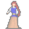

# { .sprite } Audela

**Where to find Audela:** Lake Laeroth: [Laerothtomb 1](../maps/laerothtomb1.md#pin-npc-audela)

<div class="infobox" markdown>

<p class="ib-img">{ .sprite }</p>

| | |
|---|---|
| **Type** | NPC (talk only; never fought) |
| **Found in** | Lake Laeroth |
| **Introduced** | [v0.8.11](../versions/0.8.11.md) |

</div>

## Quests

- [Take care of the caretaker](../quests/laeroth_caretaker.md): stage 160

## Dialogue simulator

Set your quest stages and items, then talk to Audela. Same rules as the game: same checks, same options, same effects.

<div class="dlg-sim" data-src="../../assets/dialogue/audela_0.json" data-npc="Audela" markdown="0"><noscript>The simulator needs JavaScript. The full dialogue is listed below.</noscript></div>

<p class="verified">Rules verified against v0.8.18 game code (ConversationController.java) and dialogue data.</p>

??? quote "Dialogue (3 lines)"

    *Exactly as in the game files. Each line appears once; links jump to where a choice leads.*

    <span id="d-audela_0"></span>**`audela_0`** [Audela](../monsters/audela.md): “Why did you summon me? I was finally at rest, after spending years directing my husband about what he needed to do each day.”

    - “I am $playername. Apologies for distubing you, but I need some help.” → [audela_1](#d-audela_1)

    <span id="d-audela_1"></span>**`audela_1`** Audela: “What sort of help?”

    - “Your family has left Laeroth, and it is now abandoned. But the caretaker is still here. He is bound by an oath his…” → [audela_2](#d-audela_2)

    <span id="d-audela_2"></span>**`audela_2`** Audela: “So typical of my husband! He always found excuses to do something other than what I asked him to do. Either that, or he just hid somewhere in the manor so that I couldn't even find him. Always gave the excuse that he was doing "something…” — **effects:** removes monsters from laerothtomb1, sets stage 160 of [Take care of the caretaker](../quests/laeroth_caretaker.md#stage-160), gives 1× [Nearly depleted oegyth crystal](../items/oegyth6.md)

    - Next → *NPC leaves*


## Version history

| Version | Change |
|---|---|
| [v0.8.11](../versions/0.8.11.md) | Added<br>Dialogue: 3 lines added |

<p class="verified">Verified against v0.8.18 and every earlier release back to v0.7.0 (game data compared release by release).</p>


## Behind the scenes

*How the game data handles this character. Not needed for playing.*

??? info "Technical information"

    | | |
    |---|---|
    | Entry ID | `audela` |
    | Type (wiki) | NPC |
    | Spawn group | `audela` |
    | Loot table | – |
    | Conversation | `audela_0` |
    | Faction | – |
    | Movement | – |
    | Icon | `monsters_gisons:15` |
    | Defined in | `res/raw/monsterlist_laeroth.json` |

    Raw data:

    ```json
    {
     "id": "audela",
     "name": "Audela",
     "iconID": "monsters_gisons:15",
     "monsterClass": "undead",
     "spawnGroup": "audela",
     "phraseID": "audela_0"
    }
    ```


## Community notes

<small>Written by players, not generated from game data. **Observations**: what players notice in-game · **Lore**: the in-world story · **Trivia**: real-world facts, references, development history · **Theory / speculation**: unconfirmed ideas; may just be unfinished content</small>

### Observations

*No notes yet. Contributions are welcome: [add a note](https://github.com/asdfghjkl628/Andor-s-Trail-Wikiiii/new/main/notes/monsters?filename=audela.md&value=%23%23%20Observations%0A%0A%3C%21--%20what%20players%20notice%20in-game%20--%3E%0A%0A%23%23%20Lore%0A%0A%3C%21--%20the%20in-world%20story%20--%3E%0A%0A%23%23%20Trivia%0A%0A%3C%21--%20real-world%20facts%2C%20references%2C%20development%20history%20--%3E%0A%0A%23%23%20Theory%20/%20speculation%0A%0A%3C%21--%20unconfirmed%20ideas%3B%20may%20just%20be%20unfinished%20content%20--%3E%0A).*

### Lore

*No notes yet. Contributions are welcome: [add a note](https://github.com/asdfghjkl628/Andor-s-Trail-Wikiiii/new/main/notes/monsters?filename=audela.md&value=%23%23%20Observations%0A%0A%3C%21--%20what%20players%20notice%20in-game%20--%3E%0A%0A%23%23%20Lore%0A%0A%3C%21--%20the%20in-world%20story%20--%3E%0A%0A%23%23%20Trivia%0A%0A%3C%21--%20real-world%20facts%2C%20references%2C%20development%20history%20--%3E%0A%0A%23%23%20Theory%20/%20speculation%0A%0A%3C%21--%20unconfirmed%20ideas%3B%20may%20just%20be%20unfinished%20content%20--%3E%0A).*

### Trivia

*No notes yet. Contributions are welcome: [add a note](https://github.com/asdfghjkl628/Andor-s-Trail-Wikiiii/new/main/notes/monsters?filename=audela.md&value=%23%23%20Observations%0A%0A%3C%21--%20what%20players%20notice%20in-game%20--%3E%0A%0A%23%23%20Lore%0A%0A%3C%21--%20the%20in-world%20story%20--%3E%0A%0A%23%23%20Trivia%0A%0A%3C%21--%20real-world%20facts%2C%20references%2C%20development%20history%20--%3E%0A%0A%23%23%20Theory%20/%20speculation%0A%0A%3C%21--%20unconfirmed%20ideas%3B%20may%20just%20be%20unfinished%20content%20--%3E%0A).*

### Theory / speculation

*No notes yet. Contributions are welcome: [add a note](https://github.com/asdfghjkl628/Andor-s-Trail-Wikiiii/new/main/notes/monsters?filename=audela.md&value=%23%23%20Observations%0A%0A%3C%21--%20what%20players%20notice%20in-game%20--%3E%0A%0A%23%23%20Lore%0A%0A%3C%21--%20the%20in-world%20story%20--%3E%0A%0A%23%23%20Trivia%0A%0A%3C%21--%20real-world%20facts%2C%20references%2C%20development%20history%20--%3E%0A%0A%23%23%20Theory%20/%20speculation%0A%0A%3C%21--%20unconfirmed%20ideas%3B%20may%20just%20be%20unfinished%20content%20--%3E%0A).*


<small>Data from v0.8.18</small>
