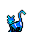

# { .sprite } Old Blue

**Where to find Old Blue:** Flagstone Prison: [rat_mountain_3](../maps/rat_mountain_3.md#pin-npc-blue_cat)

<div class="infobox" markdown>

<p class="ib-img">{ .sprite }</p>

| | |
|---|---|
| **Type** | NPC (can be spoken to; cannot be attacked) |
| **Found in** | Flagstone Prison |
| **Entry ID** | `blue_cat` |
| **Introduced** | [v0.8.8](../versions/0.8.8.md) |

</div>

## Dialogue simulator

Set the quest stages, items and other conditions that apply to your game, then start the conversation with Old Blue. The simulator applies the game's own rules: it performs the same silent checks, offers only the options that would be shown in the game, and applies their effects (quest stages, items handed over, rewards) as the conversation proceeds.

<div class="dlg-sim" data-src="../../assets/dialogue/blue_cat_1.json" data-npc="Old Blue" markdown="0"><noscript>The simulator needs JavaScript. The full dialogue is listed below.</noscript></div>

<p class="verified">Rules verified against v0.8.18 game code (ConversationController.java) and dialogue data.</p>

??? quote "Dialogue (9 lines)"

    *What the dialogue says, exactly as in the game files. Lines are listed once; links jump to the line a choice leads to.*

    <span id="d-blue_cat_1"></span>**`blue_cat_1`** Old Blue: “Hello, my name is "Old Blue".”

    - “What! You can talk?” → [blue_cat_talk](#d-blue_cat_talk)
    - “You are an unusual color. Why are you blue?” → [blue_cat_blue](#d-blue_cat_blue)

    <span id="d-blue_cat_talk"></span>**`blue_cat_talk`** Old Blue: “Talk? Well, let me ask you this: Why don't my friends up there talk?”

    - “Well, I guess you've got me there.” → *conversation ends*

    <span id="d-blue_cat_blue"></span>**`blue_cat_blue`** Old Blue: “It was Bonicksa, that wicked witch, she did this to me.”

    - “What? Why?” → [blue_cat_blue2](#d-blue_cat_blue2)

    <span id="d-blue_cat_blue2"></span>**`blue_cat_blue2`** Old Blue: “Well, you see those rats over there? The ones in the cage?”

    - “Yeah.” → [blue_cat_blue3](#d-blue_cat_blue3)

    <span id="d-blue_cat_blue3"></span>**`blue_cat_blue3`** Old Blue: “You see, those things are delicious.”

    - “Um, OK, but what does that have to do with Bonicksa?” → [blue_cat_blue4](#d-blue_cat_blue4)

    <span id="d-blue_cat_blue4"></span>**`blue_cat_blue4`** Old Blue: “Oh, you don't know? Those are Bonicksa's rats and she doesn't appreciate anything happening to them.”

    - “OK...” → [blue_cat_blue5](#d-blue_cat_blue5)

    <span id="d-blue_cat_blue5"></span>**`blue_cat_blue5`** Old Blue: “She caught me killing her favorite one day. I got away that day, but she was relentless in her attempts to hurt me.”

    - “What happened next?” → [blue_cat_blue6](#d-blue_cat_blue6)

    <span id="d-blue_cat_blue6"></span>**`blue_cat_blue6`** Old Blue: “Well, after many months of trying, she was lucky one day and was able to capture me.”

    - “Then?” → [blue_cat_blue7](#d-blue_cat_blue7)

    <span id="d-blue_cat_blue7"></span>**`blue_cat_blue7`** Old Blue: “She used her black magic to turn my beautiful white fur to this awful color I am now.”

    - “Oh, I am so sorry for you.” → *conversation ends*


## Version history

| Version | Change |
|---|---|
| [v0.8.8](../versions/0.8.8.md) | Added<br>Dialogue: 9 lines added |

<p class="verified">Verified against v0.8.18 and every earlier release back to v0.7.0 (game data compared release by release).</p>


??? info "Technical information"

    | | |
    |---|---|
    | Entry ID | `blue_cat` |
    | Spawn group | `blue_cat` |
    | Loot table | – |
    | Conversation | `blue_cat_1` |
    | Faction | – |
    | Movement | – |
    | Icon | `monsters_cats:3` |
    | Defined in | `res/raw/monsterlist_mt_galmore.json` |

    Raw data:

    ```json
    {
     "id": "blue_cat",
     "name": "Old Blue",
     "iconID": "monsters_cats:3",
     "monsterClass": "animal",
     "phraseID": "blue_cat_1"
    }
    ```


## Community notes

<small>Written by players, not generated from game data. **Observations**: what players notice in-game · **Lore**: the in-world story · **Trivia**: real-world facts, references, development history · **Theory / speculation**: unconfirmed ideas; may just be unfinished content</small>

### Observations

*No notes yet. Contributions are welcome: [add a note](https://github.com/asdfghjkl628/Andor-s-Trail-Wikiiii/new/main/notes/monsters?filename=blue_cat.md&value=%23%23%20Observations%0A%0A%3C%21--%20what%20players%20notice%20in-game%20--%3E%0A%0A%23%23%20Lore%0A%0A%3C%21--%20the%20in-world%20story%20--%3E%0A%0A%23%23%20Trivia%0A%0A%3C%21--%20real-world%20facts%2C%20references%2C%20development%20history%20--%3E%0A%0A%23%23%20Theory%20/%20speculation%0A%0A%3C%21--%20unconfirmed%20ideas%3B%20may%20just%20be%20unfinished%20content%20--%3E%0A).*

### Lore

*No notes yet. Contributions are welcome: [add a note](https://github.com/asdfghjkl628/Andor-s-Trail-Wikiiii/new/main/notes/monsters?filename=blue_cat.md&value=%23%23%20Observations%0A%0A%3C%21--%20what%20players%20notice%20in-game%20--%3E%0A%0A%23%23%20Lore%0A%0A%3C%21--%20the%20in-world%20story%20--%3E%0A%0A%23%23%20Trivia%0A%0A%3C%21--%20real-world%20facts%2C%20references%2C%20development%20history%20--%3E%0A%0A%23%23%20Theory%20/%20speculation%0A%0A%3C%21--%20unconfirmed%20ideas%3B%20may%20just%20be%20unfinished%20content%20--%3E%0A).*

### Trivia

*No notes yet. Contributions are welcome: [add a note](https://github.com/asdfghjkl628/Andor-s-Trail-Wikiiii/new/main/notes/monsters?filename=blue_cat.md&value=%23%23%20Observations%0A%0A%3C%21--%20what%20players%20notice%20in-game%20--%3E%0A%0A%23%23%20Lore%0A%0A%3C%21--%20the%20in-world%20story%20--%3E%0A%0A%23%23%20Trivia%0A%0A%3C%21--%20real-world%20facts%2C%20references%2C%20development%20history%20--%3E%0A%0A%23%23%20Theory%20/%20speculation%0A%0A%3C%21--%20unconfirmed%20ideas%3B%20may%20just%20be%20unfinished%20content%20--%3E%0A).*

### Theory / speculation

*No notes yet. Contributions are welcome: [add a note](https://github.com/asdfghjkl628/Andor-s-Trail-Wikiiii/new/main/notes/monsters?filename=blue_cat.md&value=%23%23%20Observations%0A%0A%3C%21--%20what%20players%20notice%20in-game%20--%3E%0A%0A%23%23%20Lore%0A%0A%3C%21--%20the%20in-world%20story%20--%3E%0A%0A%23%23%20Trivia%0A%0A%3C%21--%20real-world%20facts%2C%20references%2C%20development%20history%20--%3E%0A%0A%23%23%20Theory%20/%20speculation%0A%0A%3C%21--%20unconfirmed%20ideas%3B%20may%20just%20be%20unfinished%20content%20--%3E%0A).*


<small>Data from v0.8.18</small>
