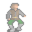

# { .sprite } Bollo

| Stat | Value |
|---|---|
| Class | humanoid |
| HP | 0 |
| Max AP | 10 |
| Attack cost | 10 |
| Move cost | 10 |
| Damage | 0 |
| Attack chance | 0 |
| Block chance | 0 |
| Damage resistance | 0 |
| Critical skill | 0 |
| Critical multiplier | 0 |

## Found on

- [mushroom_m2_4b](../maps/mushroom_m2_4b.md)

??? quote "Dialogue (45 lines)"

    *What the dialogue says, exactly as in the game files. Lines are listed once; links jump to the line a choice leads to.*

    **`bogsten_gambler2`** Bollo: “Let's have another Skat game - Bogal, you bid.”

    - Next → [bogsten_gambler_18](#d-bogsten_gambler_18)

    **`bogsten_gambler_18`** [Bogal](../monsters/bogsten_gambler1.md): “18”

    - Next → [bogsten_gambler_18a](#d-bogsten_gambler_18a)

    **`bogsten_gambler_18a`** *(silent check: the first matching branch below is taken)*

    - branch 1 *(if random chance (10%))* → [bogsten_gambler_out](#d-bogsten_gambler_out)
    - branch 2 → [bogsten_gambler_20](#d-bogsten_gambler_20)

    **`bogsten_gambler_out`** [Bogal](../monsters/bogsten_gambler1.md): “OK. It's your game.”

    **`bogsten_gambler_20`** [Bogal](../monsters/bogsten_gambler1.md): “20”

    - Next → [bogsten_gambler_20a](#d-bogsten_gambler_20a)

    **`bogsten_gambler_20a`** *(silent check: the first matching branch below is taken)*

    - branch 1 *(if random chance (10%))* → [bogsten_gambler_out](#d-bogsten_gambler_out)
    - branch 2 → [bogsten_gambler_22](#d-bogsten_gambler_22)

    **`bogsten_gambler_22`** [Bogal](../monsters/bogsten_gambler1.md): “2”

    - Next → [bogsten_gambler_22a](#d-bogsten_gambler_22a)

    **`bogsten_gambler_22a`** *(silent check: the first matching branch below is taken)*

    - branch 1 *(if random chance (10%))* → [bogsten_gambler_out](#d-bogsten_gambler_out)
    - branch 2 → [bogsten_gambler_23](#d-bogsten_gambler_23)

    **`bogsten_gambler_23`** [Bogal](../monsters/bogsten_gambler1.md): “0”

    - Next → [bogsten_gambler_23a](#d-bogsten_gambler_23a)

    **`bogsten_gambler_23a`** *(silent check: the first matching branch below is taken)*

    - branch 1 *(if random chance (10%))* → [bogsten_gambler_out](#d-bogsten_gambler_out)
    - branch 2 → [bogsten_gambler_24](#d-bogsten_gambler_24)

    **`bogsten_gambler_24`** [Bogal](../monsters/bogsten_gambler1.md): “4”

    - Next → [bogsten_gambler_24a](#d-bogsten_gambler_24a)

    **`bogsten_gambler_24a`** *(silent check: the first matching branch below is taken)*

    - branch 1 *(if random chance (20%))* → [bogsten_gambler_24b](#d-bogsten_gambler_24b)
    - branch 2 *(if random chance (20%))* → [bogsten_gambler_out](#d-bogsten_gambler_out)
    - branch 3 → [bogsten_gambler_27](#d-bogsten_gambler_27)

    **`bogsten_gambler_24b`** [Bollo](../monsters/bogsten_gambler3.md): “Ah, good. I already thought you wanted to play Null.”

    - Next → [bogsten_gambler_27](#d-bogsten_gambler_27)

    **`bogsten_gambler_27`** [Bogal](../monsters/bogsten_gambler1.md): “7”

    - Next → [bogsten_gambler_27a](#d-bogsten_gambler_27a)

    **`bogsten_gambler_27a`** *(silent check: the first matching branch below is taken)*

    - branch 1 *(if random chance (20%))* → [bogsten_gambler_out](#d-bogsten_gambler_out)
    - branch 2 → [bogsten_gambler_30](#d-bogsten_gambler_30)

    **`bogsten_gambler_30`** [Bogal](../monsters/bogsten_gambler1.md): “30”

    - Next → [bogsten_gambler_30a](#d-bogsten_gambler_30a)

    **`bogsten_gambler_30a`** *(silent check: the first matching branch below is taken)*

    - branch 1 *(if random chance (20%))* → [bogsten_gambler_out](#d-bogsten_gambler_out)
    - branch 2 → [bogsten_gambler_33](#d-bogsten_gambler_33)

    **`bogsten_gambler_33`** [Bogal](../monsters/bogsten_gambler1.md): “33”

    - Next → [bogsten_gambler_33a](#d-bogsten_gambler_33a)

    **`bogsten_gambler_33a`** *(silent check: the first matching branch below is taken)*

    - branch 1 *(if random chance (20%))* → [bogsten_gambler_33b](#d-bogsten_gambler_33b)
    - branch 2 *(if random chance (20%))* → [bogsten_gambler_out](#d-bogsten_gambler_out)
    - branch 3 → [bogsten_gambler_36](#d-bogsten_gambler_36)

    **`bogsten_gambler_33b`** [Bollo](../monsters/bogsten_gambler3.md): “Hey, you've forgotten 30!”

    - Next → [bogsten_gambler_33b_2](#d-bogsten_gambler_33b_2)

    **`bogsten_gambler_36`** [Bogal](../monsters/bogsten_gambler1.md): “36”

    - Next → [bogsten_gambler_36a](#d-bogsten_gambler_36a)

    **`bogsten_gambler_33b_2`** [Bogal](../monsters/bogsten_gambler1.md): “Nonsense. I've been playing Skat for over 150 years now. I wouldn't make such a silly mistake.”

    - Next → [bogsten_gambler_36](#d-bogsten_gambler_36)

    **`bogsten_gambler_36a`** *(silent check: the first matching branch below is taken)*

    - branch 1 *(if random chance (20%))* → [bogsten_gambler_36b](#d-bogsten_gambler_36b)
    - branch 2 *(if random chance (20%))* → [bogsten_gambler_out](#d-bogsten_gambler_out)
    - branch 3 → [bogsten_gambler_40](#d-bogsten_gambler_40)

    **`bogsten_gambler_36b`** [Botisto](../monsters/bogsten_gambler2.md): “Don't you dare play clubs!”

    - Next → [bogsten_gambler_36b_2](#d-bogsten_gambler_36b_2)

    **`bogsten_gambler_40`** [Bogal](../monsters/bogsten_gambler1.md): “40”

    - Next → [bogsten_gambler_40a](#d-bogsten_gambler_40a)

    **`bogsten_gambler_36b_2`** [Bogal](../monsters/bogsten_gambler1.md): “I'm old enough to decide that on my own. * giggle *”

    - Next → [bogsten_gambler_40](#d-bogsten_gambler_40)

    **`bogsten_gambler_40a`** *(silent check: the first matching branch below is taken)*

    - branch 1 *(if random chance (20%))* → [bogsten_gambler_40b](#d-bogsten_gambler_40b)
    - branch 2 *(if random chance (20%))* → [bogsten_gambler_out](#d-bogsten_gambler_out)
    - branch 3 → [bogsten_gambler_44](#d-bogsten_gambler_44)

    **`bogsten_gambler_40b`** [Bollo](../monsters/bogsten_gambler3.md): “You already said 30.”

    - Next → [bogsten_gambler_40b_2](#d-bogsten_gambler_40b_2)

    **`bogsten_gambler_44`** [Bogal](../monsters/bogsten_gambler1.md): “44”

    - Next → [bogsten_gambler_44a](#d-bogsten_gambler_44a)

    **`bogsten_gambler_40b_2`** [Bogal](../monsters/bogsten_gambler1.md): “I said FORTY, you deaf idiot!”

    - Next → [bogsten_gambler_40b_3](#d-bogsten_gambler_40b_3)

    **`bogsten_gambler_44a`** *(silent check: the first matching branch below is taken)*

    - branch 1 *(if random chance (20%))* → [bogsten_gambler_out](#d-bogsten_gambler_out)
    - branch 2 → [bogsten_gambler_48](#d-bogsten_gambler_48)

    **`bogsten_gambler_40b_3`** [Bollo](../monsters/bogsten_gambler3.md): “Who's an idiot??”

    - Next → [bogsten_gambler_40b_4](#d-bogsten_gambler_40b_4)

    **`bogsten_gambler_48`** [Bogal](../monsters/bogsten_gambler1.md): “48”

    - Next → [bogsten_gambler_48a](#d-bogsten_gambler_48a)

    **`bogsten_gambler_40b_4`** [Botisto](../monsters/bogsten_gambler2.md): “Both of you. Now go on, Bogal.”

    - Next → [bogsten_gambler_44](#d-bogsten_gambler_44)

    **`bogsten_gambler_48a`** *(silent check: the first matching branch below is taken)*

    - branch 1 *(if random chance (50%))* → [bogsten_gambler_48b](#d-bogsten_gambler_48b)
    - branch 2 *(if random chance (20%))* → [bogsten_gambler_out](#d-bogsten_gambler_out)
    - branch 3 → [bogsten_gambler_50](#d-bogsten_gambler_50)

    **`bogsten_gambler_48b`** [Botisto](../monsters/bogsten_gambler2.md): “Why is this kid staring at us? Hey, you! Never seen a Skat game?”

    - “Eh...” → [bogsten_gambler_48b_2](#d-bogsten_gambler_48b_2)
    - “Sure. I'm a Skat pro myself.” → [bogsten_gambler_48b_3](#d-bogsten_gambler_48b_3)
    - “No. My father always forbade me to gamble.” → [bogsten_gambler_48b_2](#d-bogsten_gambler_48b_2)

    **`bogsten_gambler_50`** [Bogal](../monsters/bogsten_gambler1.md): “50”

    - Next → [bogsten_gambler_50a](#d-bogsten_gambler_50a)

    **`bogsten_gambler_48b_2`** Bollo: “Oh dear. Go on, Bogal. I don't want to rot here.”

    - Next → [bogsten_gambler_50](#d-bogsten_gambler_50)

    **`bogsten_gambler_48b_3`** Bollo: “Well, whoever would believe that ...”

    - “Hee!” → [bogsten_gambler_50](#d-bogsten_gambler_50)

    **`bogsten_gambler_50a`** *(silent check: the first matching branch below is taken)*

    - branch 1 *(if random chance (20%))* → [bogsten_gambler_out](#d-bogsten_gambler_out)
    - branch 2 → [bogsten_gambler_50b](#d-bogsten_gambler_50b)

    **`bogsten_gambler_50b`** [Bogal](../monsters/bogsten_gambler1.md): “50 - still yes?? You must be cheating!”

    - Next → [bogsten_gambler_50b_2](#d-bogsten_gambler_50b_2)

    **`bogsten_gambler_50b_2`** [Bollo](../monsters/bogsten_gambler3.md): “Cheating - me? Dare to say that again!”

    - Next → [bogsten_gambler_50b_3](#d-bogsten_gambler_50b_3)

    **`bogsten_gambler_50b_3`** [Bogal](../monsters/bogsten_gambler1.md): “We all know that you always do. Calm down.”

    - Next → [bogsten_gambler_50b_4](#d-bogsten_gambler_50b_4)

    **`bogsten_gambler_50b_4`** [Bollo](../monsters/bogsten_gambler3.md): “Oooh! If you were not already dead, you would be now!”

    - “But gentlemen! It's just a game!” → [bogsten_gambler_50b_5](#d-bogsten_gambler_50b_5)

    **`bogsten_gambler_50b_5`** [Botisto](../monsters/bogsten_gambler2.md): “Just a game? Get out! Away with you!”

## Community notes

<small>Written by players, not generated from game data. **Observations**: what players notice in-game · **Lore**: the in-world story · **Trivia**: real-world facts, references, development history · **Theory / speculation**: unconfirmed ideas; may just be unfinished content</small>

### Observations

*Nothing here yet. Know something? [Add it](https://github.com/asdfghjkl628/Andor-s-Trail-Wikiiii/new/main/notes/monsters?filename=bogsten_gambler3.md&value=%23%23%20Observations%0A%0A%3C%21--%20what%20players%20notice%20in-game%20--%3E%0A%0A%23%23%20Lore%0A%0A%3C%21--%20the%20in-world%20story%20--%3E%0A%0A%23%23%20Trivia%0A%0A%3C%21--%20real-world%20facts%2C%20references%2C%20development%20history%20--%3E%0A%0A%23%23%20Theory%20/%20speculation%0A%0A%3C%21--%20unconfirmed%20ideas%3B%20may%20just%20be%20unfinished%20content%20--%3E%0A).*

### Lore

*Nothing here yet. Know something? [Add it](https://github.com/asdfghjkl628/Andor-s-Trail-Wikiiii/new/main/notes/monsters?filename=bogsten_gambler3.md&value=%23%23%20Observations%0A%0A%3C%21--%20what%20players%20notice%20in-game%20--%3E%0A%0A%23%23%20Lore%0A%0A%3C%21--%20the%20in-world%20story%20--%3E%0A%0A%23%23%20Trivia%0A%0A%3C%21--%20real-world%20facts%2C%20references%2C%20development%20history%20--%3E%0A%0A%23%23%20Theory%20/%20speculation%0A%0A%3C%21--%20unconfirmed%20ideas%3B%20may%20just%20be%20unfinished%20content%20--%3E%0A).*

### Trivia

*Nothing here yet. Know something? [Add it](https://github.com/asdfghjkl628/Andor-s-Trail-Wikiiii/new/main/notes/monsters?filename=bogsten_gambler3.md&value=%23%23%20Observations%0A%0A%3C%21--%20what%20players%20notice%20in-game%20--%3E%0A%0A%23%23%20Lore%0A%0A%3C%21--%20the%20in-world%20story%20--%3E%0A%0A%23%23%20Trivia%0A%0A%3C%21--%20real-world%20facts%2C%20references%2C%20development%20history%20--%3E%0A%0A%23%23%20Theory%20/%20speculation%0A%0A%3C%21--%20unconfirmed%20ideas%3B%20may%20just%20be%20unfinished%20content%20--%3E%0A).*

### Theory / speculation

*Nothing here yet. Know something? [Add it](https://github.com/asdfghjkl628/Andor-s-Trail-Wikiiii/new/main/notes/monsters?filename=bogsten_gambler3.md&value=%23%23%20Observations%0A%0A%3C%21--%20what%20players%20notice%20in-game%20--%3E%0A%0A%23%23%20Lore%0A%0A%3C%21--%20the%20in-world%20story%20--%3E%0A%0A%23%23%20Trivia%0A%0A%3C%21--%20real-world%20facts%2C%20references%2C%20development%20history%20--%3E%0A%0A%23%23%20Theory%20/%20speculation%0A%0A%3C%21--%20unconfirmed%20ideas%3B%20may%20just%20be%20unfinished%20content%20--%3E%0A).*

<small>Monster ID: `bogsten_gambler3` · Data from v0.8.18</small>
