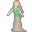

# { .sprite } Undina Bogsten

**Where to find Undina Bogsten:** [Mushroom m 2 4](#v-bogsten_granny), [Mushroom m 2 4](#v-bogsten_granny1)

<div class="infobox" markdown>

<p class="ib-img"></p>

| | |
|---|---|
| **Type** | NPC (talk only; never fought) |
| **Found in** | Mushroom m 2 4 |
| **Introduced** | [v0.7.13](../versions/0.7.13.md) |

</div>

## Mushroom m 2 4 { #v-bogsten_granny }

**Where:** [Mushroom m 2 4](../maps/mushroom_m2_4.md#pin-npc-bogsten_granny)

### Quests

- [Fungi Panic story flags (hidden flag)](../quests/fungi_panic_nondisplayed.md): stage 200

### Dialogue simulator

Talk to Undina Bogsten as you would in the game. When the conversation depends on your progress (a quest, an item, a dice roll…), the simulator asks you. Try another answer with **Undo**.

<div class="dlg-sim" data-src="../../assets/dialogue/bogsten_granny.json" data-npc="Undina Bogsten" markdown="0"><noscript>The simulator needs JavaScript. The full dialogue is listed below.</noscript></div>

<p class="verified">Follows the game's own conversation rules (v0.8.18).</p>

??? quote "Dialogue (17 lines)"

    *Exactly as in the game files. Each line appears once; links jump to where a choice leads.*

    <span id="d-bogsten_granny-bogsten_granny"></span>**`bogsten_granny`** *(silent check: the first matching branch below is taken)*

    - branch 1 *(if carry 1× [Gardener's gloves](../items/gardener_gloves.md))* → [bogsten_granny_94](#d-bogsten_granny-bogsten_granny_94)
    - branch 2 *(if reached stage 210 of [Fungi Panic story flags (hidden flag)](../quests/fungi_panic_nondisplayed.md#stage-210))* → [bogsten_granny_92](#d-bogsten_granny-bogsten_granny_92)
    - branch 3 *(if reached stage 200 of [Fungi Panic story flags (hidden flag)](../quests/fungi_panic_nondisplayed.md#stage-200))* → [bogsten_granny_90](#d-bogsten_granny-bogsten_granny_90)
    - branch 4 → [bogsten_granny_10](#d-bogsten_granny-bogsten_granny_10)

    <span id="d-bogsten_granny-bogsten_granny_94"></span>**`bogsten_granny_94`** Undina Bogsten: “So you've chosen my gardening gloves. A wise choice!”

    - Next → [bogsten_granny_96](#d-bogsten_granny-bogsten_granny_96)

    <span id="d-bogsten_granny-bogsten_granny_92"></span>**`bogsten_granny_92`** Undina Bogsten: “Ah, so you found your way downstairs. Smart child, it was a pleasure to meet you. Farewell!”


    <span id="d-bogsten_granny-bogsten_granny_90"></span>**`bogsten_granny_90`** Undina Bogsten: “It was a pleasure to meet you. Farewell, kid!”


    <span id="d-bogsten_granny-bogsten_granny_10"></span>**`bogsten_granny_10`** Undina Bogsten: “Bogsten, my dear great-grandchild! After all these years you come to visit me again!”

    - “Sorry, I am not of your family. I am $playername from Crossglen.” → [bogsten_granny_20](#d-bogsten_granny-bogsten_granny_20)

    <span id="d-bogsten_granny-bogsten_granny_96"></span>**`bogsten_granny_96`** Undina Bogsten: “There used to be also a family-owned cookbook. Unfortunately that has been lost. It contained valuable recipes - the mushroom soup in particular was a dream!”

    - Next → [bogsten_granny_90](#d-bogsten_granny-bogsten_granny_90)

    <span id="d-bogsten_granny-bogsten_granny_20"></span>**`bogsten_granny_20`** Undina Bogsten: “Really? My eyes don't seem to be as clear as they used to be.”

    - Next → [bogsten_granny_30](#d-bogsten_granny-bogsten_granny_30)

    <span id="d-bogsten_granny-bogsten_granny_30"></span>**`bogsten_granny_30`** Undina Bogsten: “Where is this naughty boy? He should have come for cleaning every week.”

    - “He is dead.” *(if killed 1× [Bogsten](../monsters/bogsten.md))* → [bogsten_granny_32](#d-bogsten_granny-bogsten_granny_32)
    - “I met him in the house upstairs. He was very ill.” *(if NOT killed 1× [Bogsten](../monsters/bogsten.md))* → [bogsten_granny_34](#d-bogsten_granny-bogsten_granny_34)
    - “I don't know.” → [bogsten_granny_40](#d-bogsten_granny-bogsten_granny_40)

    <span id="d-bogsten_granny-bogsten_granny_32"></span>**`bogsten_granny_32`** Undina Bogsten: “Death is not a reason to neglect one's duties!”

    - Next → [bogsten_granny_40](#d-bogsten_granny-bogsten_granny_40)

    <span id="d-bogsten_granny-bogsten_granny_34"></span>**`bogsten_granny_34`** Undina Bogsten: “Ill? You mean lazy and sleepy!”

    - Next → [bogsten_granny_40](#d-bogsten_granny-bogsten_granny_40)

    <span id="d-bogsten_granny-bogsten_granny_40"></span>**`bogsten_granny_40`** Undina Bogsten: “I never could stand that spoiled kid. He only ever comes to get new gold from the family treasure.”

    - “How ungrateful!” → [bogsten_granny_42](#d-bogsten_granny-bogsten_granny_42)

    <span id="d-bogsten_granny-bogsten_granny_42"></span>**`bogsten_granny_42`** Undina Bogsten: “Ungrateful indeed. I would rather give our gold to some random beggar than to see it squandered by him.”

    - Next → [bogsten_granny_50](#d-bogsten_granny-bogsten_granny_50)

    <span id="d-bogsten_granny-bogsten_granny_50"></span>**`bogsten_granny_50`** Undina Bogsten: “Tell me child, where are you going in the world?”

    - “My father sent me to find my brother Andor. He left some time ago and hasn't come back yet.” → [bogsten_granny_52](#d-bogsten_granny-bogsten_granny_52)

    <span id="d-bogsten_granny-bogsten_granny_52"></span>**`bogsten_granny_52`** Undina Bogsten: “It really is an honorable goal. I like you, my child. Truly.”

    - “Did you see my brother? He looks a bit like me.” → [bogsten_granny_54](#d-bogsten_granny-bogsten_granny_54)

    <span id="d-bogsten_granny-bogsten_granny_54"></span>**`bogsten_granny_54`** Undina Bogsten: “No, I haven't seen Andor. I hope that you will find him soon and that you can return to your father together.”

    - “My father will be very glad.” → [bogsten_granny_60](#d-bogsten_granny-bogsten_granny_60)

    <span id="d-bogsten_granny-bogsten_granny_60"></span>**`bogsten_granny_60`** Undina Bogsten: “How touching! I will give you something. You really deserve a little gold.”

    - “Oh, you don't have to!” → [bogsten_granny_80](#d-bogsten_granny-bogsten_granny_80)
    - “At last some gold.” → [bogsten_granny_80](#d-bogsten_granny-bogsten_granny_80)

    <span id="d-bogsten_granny-bogsten_granny_80"></span>**`bogsten_granny_80`** Undina Bogsten: “Go ye into our family tomb. You may pick something from our treasures.” — **effects:** sets stage 200 of [Fungi Panic story flags (hidden flag)](../quests/fungi_panic_nondisplayed.md#stage-200), removes monsters from mushroom_m2_4, spawns monsters on mushroom_m2_4


### Version history

| Version | Change |
|---|---|
| [v0.7.13](../versions/0.7.13.md) | Added<br>Dialogue: 17 lines added |

<p class="verified">Verified against v0.8.18 and every earlier release back to v0.7.0 (game data compared release by release).</p>


## Mushroom m 2 4 (2) { #v-bogsten_granny1 }

**Where:** [Mushroom m 2 4](../maps/mushroom_m2_4.md#pin-npc-bogsten_granny1)

### Quests

- [Fungi Panic story flags (hidden flag)](../quests/fungi_panic_nondisplayed.md): stage 200

### Dialogue simulator

Talk to Undina Bogsten as you would in the game. When the conversation depends on your progress (a quest, an item, a dice roll…), the simulator asks you. Try another answer with **Undo**.

<div class="dlg-sim" data-src="../../assets/dialogue/bogsten_granny.json" data-npc="Undina Bogsten" markdown="0"><noscript>The simulator needs JavaScript. The full dialogue is listed below.</noscript></div>

<p class="verified">Follows the game's own conversation rules (v0.8.18).</p>

The full dialogue for this entry is included in the listing for an earlier entry on this page, starting at [bogsten_granny](#d-bogsten_granny-bogsten_granny).


### Version history

| Version | Change |
|---|---|
| [v0.7.13](../versions/0.7.13.md) | Added<br>Dialogue: 17 lines added |

<p class="verified">Verified against v0.8.18 and every earlier release back to v0.7.0 (game data compared release by release).</p>


## Behind the scenes

*How the game data handles this character. Not needed for playing.*

**2 entries.** The game data defines 2 separate characters named Undina Bogsten. The game makes a new entry whenever a character needs different behaviour (another conversation later in a quest, another place, other stats). Some are the same person at different points in the story; others just share a generic name. Here they differ in: movement.

| Entry | Type | Section |
|---|---|---|
| `bogsten_granny` | NPC | [Mushroom m 2 4](#v-bogsten_granny) |
| `bogsten_granny1` | NPC | [Mushroom m 2 4](#v-bogsten_granny1) |

??? info "Technical information: bogsten_granny"

    | | |
    |---|---|
    | Entry ID | `bogsten_granny` |
    | Type (wiki) | NPC |
    | Spawn group | `bogsten_granny` |
    | Loot table | – |
    | Conversation | `bogsten_granny` |
    | Faction | – |
    | Movement | – |
    | Icon | `monsters_gisons:8` |
    | Defined in | `res/raw/monsterlist_fungi_panic.json` |

    Raw data:

    ```json
    {
     "id": "bogsten_granny",
     "name": "Undina Bogsten",
     "iconID": "monsters_gisons:8",
     "moveCost": 10,
     "monsterClass": "humanoid",
     "spawnGroup": "bogsten_granny",
     "phraseID": "bogsten_granny"
    }
    ```

??? info "Technical information: bogsten_granny1"

    | | |
    |---|---|
    | Entry ID | `bogsten_granny1` |
    | Type (wiki) | NPC |
    | Spawn group | `bogsten_granny1` |
    | Loot table | – |
    | Conversation | `bogsten_granny` |
    | Faction | – |
    | Movement | wholeMap |
    | Icon | `monsters_gisons:8` |
    | Defined in | `res/raw/monsterlist_fungi_panic.json` |

    Raw data:

    ```json
    {
     "id": "bogsten_granny1",
     "name": "Undina Bogsten",
     "iconID": "monsters_gisons:8",
     "moveCost": 10,
     "monsterClass": "humanoid",
     "movementAggressionType": "wholeMap",
     "spawnGroup": "bogsten_granny1",
     "phraseID": "bogsten_granny"
    }
    ```


## Community notes

<small>Written by players, not generated from game data. **Observations**: what players notice in-game · **Lore**: the in-world story · **Trivia**: real-world facts, references, development history · **Theory / speculation**: unconfirmed ideas; may just be unfinished content</small>

### Observations

*No notes yet. Contributions are welcome: [add a note](https://github.com/asdfghjkl628/Andor-s-Trail-Wikiiii/new/main/notes/monsters?filename=bogsten_granny.md&value=%23%23%20Observations%0A%0A%3C%21--%20what%20players%20notice%20in-game%20--%3E%0A%0A%23%23%20Lore%0A%0A%3C%21--%20the%20in-world%20story%20--%3E%0A%0A%23%23%20Trivia%0A%0A%3C%21--%20real-world%20facts%2C%20references%2C%20development%20history%20--%3E%0A%0A%23%23%20Theory%20/%20speculation%0A%0A%3C%21--%20unconfirmed%20ideas%3B%20may%20just%20be%20unfinished%20content%20--%3E%0A).*

### Lore

*No notes yet. Contributions are welcome: [add a note](https://github.com/asdfghjkl628/Andor-s-Trail-Wikiiii/new/main/notes/monsters?filename=bogsten_granny.md&value=%23%23%20Observations%0A%0A%3C%21--%20what%20players%20notice%20in-game%20--%3E%0A%0A%23%23%20Lore%0A%0A%3C%21--%20the%20in-world%20story%20--%3E%0A%0A%23%23%20Trivia%0A%0A%3C%21--%20real-world%20facts%2C%20references%2C%20development%20history%20--%3E%0A%0A%23%23%20Theory%20/%20speculation%0A%0A%3C%21--%20unconfirmed%20ideas%3B%20may%20just%20be%20unfinished%20content%20--%3E%0A).*

### Trivia

*No notes yet. Contributions are welcome: [add a note](https://github.com/asdfghjkl628/Andor-s-Trail-Wikiiii/new/main/notes/monsters?filename=bogsten_granny.md&value=%23%23%20Observations%0A%0A%3C%21--%20what%20players%20notice%20in-game%20--%3E%0A%0A%23%23%20Lore%0A%0A%3C%21--%20the%20in-world%20story%20--%3E%0A%0A%23%23%20Trivia%0A%0A%3C%21--%20real-world%20facts%2C%20references%2C%20development%20history%20--%3E%0A%0A%23%23%20Theory%20/%20speculation%0A%0A%3C%21--%20unconfirmed%20ideas%3B%20may%20just%20be%20unfinished%20content%20--%3E%0A).*

### Theory / speculation

*No notes yet. Contributions are welcome: [add a note](https://github.com/asdfghjkl628/Andor-s-Trail-Wikiiii/new/main/notes/monsters?filename=bogsten_granny.md&value=%23%23%20Observations%0A%0A%3C%21--%20what%20players%20notice%20in-game%20--%3E%0A%0A%23%23%20Lore%0A%0A%3C%21--%20the%20in-world%20story%20--%3E%0A%0A%23%23%20Trivia%0A%0A%3C%21--%20real-world%20facts%2C%20references%2C%20development%20history%20--%3E%0A%0A%23%23%20Theory%20/%20speculation%0A%0A%3C%21--%20unconfirmed%20ideas%3B%20may%20just%20be%20unfinished%20content%20--%3E%0A).*


<small>Data from v0.8.18</small>
