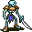

# { .sprite } Bone warrior

| Stat | Value |
|---|---|
| Class | construct |
| HP | 32 |
| Max AP | 10 |
| Attack cost | 5 |
| Move cost | 10 |
| Damage | 3 to 9 |
| Attack chance | 120 |
| Block chance | 60 |
| Damage resistance | 2 |
| Critical skill | 0 |
| Critical multiplier | 0 |

!!! note "Immune to critical hits"
    Monsters of this class cannot be critically hit.

## Drops

| Item | Chance | Qty |
|---|---|---|
| [Gold coins](../items/gold.md) | 70% | 16 to 23 |
| [Ruby gem](../items/gem2.md) | 25% | 1 |
| [Regular potion of health](../items/health.md) | 25% | 1 |
| [Bone](../items/bone.md) | 30% | 1 |
| [Ring of damage +1](../items/ring_dmg1.md) | 1% | 1 |

## Found on

- [flagstone1](../maps/flagstone1.md)
- [flagstone2](../maps/flagstone2.md)
- [flagstone3](../maps/flagstone3.md)
- [flagstone_inner](../maps/flagstone_inner.md)
- [flagstone_upper](../maps/flagstone_upper.md)
- [waytobrimhavencave2](../maps/waytobrimhavencave2.md)
- [waytobrimhavencave4](../maps/waytobrimhavencave4.md)

<small>Monster ID: `bone_warrior` · Data from v0.8.18</small>
