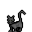

# { .sprite } Duleian panther cub

| Stat | Value |
|---|---|
| Class | animal |
| HP | 0 |
| Max AP | 10 |
| Attack cost | 10 |
| Move cost | 10 |
| Damage | 0 |
| Attack chance | 0 |
| Block chance | 0 |
| Damage resistance | 0 |
| Critical skill | 0 |
| Critical multiplier | 0 |

## Found on

- [brightport_cave4](../maps/brightport_cave4.md)

<small>Monster ID: `brightport_cat3` · Data from v0.8.18</small>
