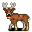

# { .sprite } Virulent forest deer

| Stat | Value |
|---|---|
| Class | animal |
| HP | 240 |
| Max AP | 14 |
| Attack cost | 8 |
| Move cost | 7 |
| Damage | 8 to 19 |
| Attack chance | 182 |
| Block chance | 154 |
| Damage resistance | 8 |
| Critical skill | 15 |
| Critical multiplier | 1.0 |

## On hit

- **On target:** Brainworm infection (magnitude 1, 3 rounds, 40% chance)

## Drops

| Item | Chance | Qty |
|---|---|---|
| [Gold coins](../items/gold.md) | 100% | 4 to 16 |
| [Deer antlers](../items/brightport_deer.md) | 5% | 0 to 1 |
| [Raw venison](../items/brightport_rawmeat.md) | 5% | 1 |

## Found on

- [brightportwild1](../maps/brightportwild1.md)
- [brightportwild18](../maps/brightportwild18.md)
- [brightportwild19](../maps/brightportwild19.md)
- [brightportwild2](../maps/brightportwild2.md)
- [brightportwild7](../maps/brightportwild7.md)
- [waytobrightport12](../maps/waytobrightport12.md)
- [waytobrightport14](../maps/waytobrightport14.md)
- [waytobrightport15](../maps/waytobrightport15.md)
- [waytobrightport16](../maps/waytobrightport16.md)
- [waytobrightport18](../maps/waytobrightport18.md)
- [waytobrightport19](../maps/waytobrightport19.md)
- [waytobrightport5](../maps/waytobrightport5.md)

<small>Monster ID: `brightport_deer` · Data from v0.8.18</small>
