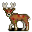

# { .sprite } Virulent forest fawn

**Found in:** Brightport: [Waytobrightport 22](../maps/waytobrightport22.md), Brightport: [Waytobrightport 23](../maps/waytobrightport23.md), [Waytobrightport 11](../maps/waytobrightport11.md), [Waytobrightport 12](../maps/waytobrightport12.md) (+4 more)

<div class="infobox" markdown>

<p class="ib-img"></p>

| | |
|---|---|
| **Type** | Enemy (hostile on sight) |
| **Found in** | Brightport |
| **Class** | Animal |
| **HP** | 144 |
| **XP when defeated** | 403 |
| **Introduced** | [v0.8.16.1](../versions/0.8.16.1.md) |

</div>

## Combat

| | |
|---|---|
| Class | Animal |
| HP | 144 |
| XP when defeated | 403 |
| Damage | 7 to 14 |
| AC | 176 |
| BC | 182 |
| DR | 4 |
| Attacks per turn | 1 (8 AP each, 14 AP) |
| Crit chance | none |

**Its hits:** On target: [Brainworm infection](../conditions/brightport_worm.md) (magnitude 1, 3 rounds, 40% chance)

**When it dies:** On self: [Brainworm infection](../conditions/brightport_worm.md) (magnitude 2, 4 rounds, 70% chance)


<p class="verified">Verified against v0.8.18 monster data.</p>

## Drops

| Item | Chance | Qty |
|---|---|---|
| [Gold coins](../items/gold.md) | 100% | 4 to 16 |
| [Deer antlers](../items/brightport_deer.md) | 5% | 0 to 1 |
| [Raw venison](../items/brightport_rawmeat.md) | 5% | 1 |

## Locations

| Map | Region | Up to | Notes |
|---|---|---|---|
| [Waytobrightport 11](../maps/waytobrightport11.md) | – | 6 | – |
| [Waytobrightport 12](../maps/waytobrightport12.md) | – | 4 | – |
| [Waytobrightport 13](../maps/waytobrightport13.md) | – | 9 | – |
| [Waytobrightport 14](../maps/waytobrightport14.md) | – | 7 | – |
| [Waytobrightport 22](../maps/waytobrightport22.md) | Brightport | 2 | – |
| [Waytobrightport 23](../maps/waytobrightport23.md) | Brightport | 1 | – |
| [Waytobrightport 4](../maps/waytobrightport4.md) | – | 2 | – |
| [Waytobrightport 7](../maps/waytobrightport7.md) | – | 1 | – |


## Version history

| Version | Change |
|---|---|
| [v0.8.16.1](../versions/0.8.16.1.md) | Added |

<p class="verified">Verified against v0.8.18 and every earlier release back to v0.7.0 (game data compared release by release).</p>


## Behind the scenes

*How the game data handles this character. Not needed for playing.*

??? info "How the XP value is calculated"

    The game computes each enemy's experience value when it loads the data (`MonsterTypeParser.java`):

    XP = ⌈(attacks per turn × attack chance × average damage × (1 + critical skill × critical multiplier) × 3 + HP × (1 + block chance) + 9 × damage resistance) × 0.7⌉

    Percentages are used as fractions (e.g. 60% = 0.6). Enemies whose attacks inflict a condition are worth 50 XP more. The More Exp skill adds a percentage on top.

??? info "Technical information"

    | | |
    |---|---|
    | Entry ID | `brightport_fawn` |
    | Type (wiki) | Enemy |
    | Spawn group | `brightport_fawn` |
    | Loot table | `brightport_sickdeer` |
    | Conversation | – |
    | Faction | – |
    | Movement | protectSpawn |
    | Icon | `monsters_johny:10` |
    | Defined in | `res/raw/monsterlist_brightport.json` |

    Raw data:

    ```json
    {
     "id": "brightport_fawn",
     "name": "Virulent forest fawn",
     "iconID": "monsters_johny:10",
     "maxHP": 144,
     "maxAP": 14,
     "moveCost": 7,
     "monsterClass": "animal",
     "movementAggressionType": "protectSpawn",
     "attackDamage": {
      "min": 7,
      "max": 14
     },
     "droplistID": "brightport_sickdeer",
     "attackCost": 8,
     "attackChance": 176,
     "criticalSkill": 10,
     "criticalMultiplier": 1.0,
     "blockChance": 182,
     "damageResistance": 4,
     "hitEffect": {
      "conditionsTarget": [
       {
        "condition": "brightport_worm",
        "magnitude": 1,
        "duration": 3,
        "chance": "40"
       }
      ]
     },
     "deathEffect": {
      "conditionsSource": [
       {
        "condition": "brightport_worm",
        "magnitude": 2,
        "duration": 4,
        "chance": "70"
       }
      ]
     }
    }
    ```


## Community notes

<small>Written by players, not generated from game data. **Observations**: what players notice in-game · **Lore**: the in-world story · **Trivia**: real-world facts, references, development history · **Theory / speculation**: unconfirmed ideas; may just be unfinished content</small>

### Observations

*No notes yet. Contributions are welcome: [add a note](https://github.com/asdfghjkl628/Andor-s-Trail-Wikiiii/new/main/notes/monsters?filename=brightport_fawn.md&value=%23%23%20Observations%0A%0A%3C%21--%20what%20players%20notice%20in-game%20--%3E%0A%0A%23%23%20Lore%0A%0A%3C%21--%20the%20in-world%20story%20--%3E%0A%0A%23%23%20Trivia%0A%0A%3C%21--%20real-world%20facts%2C%20references%2C%20development%20history%20--%3E%0A%0A%23%23%20Theory%20/%20speculation%0A%0A%3C%21--%20unconfirmed%20ideas%3B%20may%20just%20be%20unfinished%20content%20--%3E%0A).*

### Lore

*No notes yet. Contributions are welcome: [add a note](https://github.com/asdfghjkl628/Andor-s-Trail-Wikiiii/new/main/notes/monsters?filename=brightport_fawn.md&value=%23%23%20Observations%0A%0A%3C%21--%20what%20players%20notice%20in-game%20--%3E%0A%0A%23%23%20Lore%0A%0A%3C%21--%20the%20in-world%20story%20--%3E%0A%0A%23%23%20Trivia%0A%0A%3C%21--%20real-world%20facts%2C%20references%2C%20development%20history%20--%3E%0A%0A%23%23%20Theory%20/%20speculation%0A%0A%3C%21--%20unconfirmed%20ideas%3B%20may%20just%20be%20unfinished%20content%20--%3E%0A).*

### Trivia

*No notes yet. Contributions are welcome: [add a note](https://github.com/asdfghjkl628/Andor-s-Trail-Wikiiii/new/main/notes/monsters?filename=brightport_fawn.md&value=%23%23%20Observations%0A%0A%3C%21--%20what%20players%20notice%20in-game%20--%3E%0A%0A%23%23%20Lore%0A%0A%3C%21--%20the%20in-world%20story%20--%3E%0A%0A%23%23%20Trivia%0A%0A%3C%21--%20real-world%20facts%2C%20references%2C%20development%20history%20--%3E%0A%0A%23%23%20Theory%20/%20speculation%0A%0A%3C%21--%20unconfirmed%20ideas%3B%20may%20just%20be%20unfinished%20content%20--%3E%0A).*

### Theory / speculation

*No notes yet. Contributions are welcome: [add a note](https://github.com/asdfghjkl628/Andor-s-Trail-Wikiiii/new/main/notes/monsters?filename=brightport_fawn.md&value=%23%23%20Observations%0A%0A%3C%21--%20what%20players%20notice%20in-game%20--%3E%0A%0A%23%23%20Lore%0A%0A%3C%21--%20the%20in-world%20story%20--%3E%0A%0A%23%23%20Trivia%0A%0A%3C%21--%20real-world%20facts%2C%20references%2C%20development%20history%20--%3E%0A%0A%23%23%20Theory%20/%20speculation%0A%0A%3C%21--%20unconfirmed%20ideas%3B%20may%20just%20be%20unfinished%20content%20--%3E%0A).*


<small>Data from v0.8.18</small>
