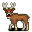

# { .sprite } Forest deer

| Stat | Value |
|---|---|
| Class | animal |
| HP | 212 |
| Max AP | 14 |
| Attack cost | 8 |
| Move cost | 7 |
| Damage | 6 to 16 |
| Attack chance | 168 |
| Block chance | 148 |
| Damage resistance | 6 |
| Critical skill | 10 |
| Critical multiplier | 1.0 |

## Drops

| Item | Chance | Qty |
|---|---|---|
| [Deer antlers](../items/brightport_deer.md) | 2% | 1 |
| [Raw venison](../items/brightport_rawmeat.md) | 15% | 1 |
| [Gold coins](../items/gold.md) | 100% | 3 to 18 |

## Found on

- [brightportwild18](../maps/brightportwild18.md)
- [waytobrightport11](../maps/waytobrightport11.md)
- [waytobrightport13](../maps/waytobrightport13.md)
- [waytobrightport18](../maps/waytobrightport18.md)
- [waytobrightport20](../maps/waytobrightport20.md)
- [waytobrightport5](../maps/waytobrightport5.md)
- [waytobrightport7](../maps/waytobrightport7.md)

## Version history

| Version | Change |
|---|---|
| [v0.8.16.1](../versions/0.8.16.1.md) | Added |

Verified against v0.8.18 and every earlier release back to v0.7.0 (game data compared release by release).

<small>Monster ID: `brightport_sickdeer` · Data from v0.8.18</small>
