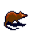

# { .sprite } Rash Muskrat

**Found in:** Brightport: [brightportwild18](../maps/brightportwild18.md), Brightport: [waytobrightport18](../maps/waytobrightport18.md), Buried citadel: [brightport_cave2](../maps/brightport_cave2.md), [brightportwild10](../maps/brightportwild10.md) (+5 more)

<div class="infobox" markdown>

<p class="ib-img">{ .sprite }</p>

| | |
|---|---|
| **Type** | Enemy (hostile on sight) |
| **Found in** | Buried citadel, Brightport |
| **Class** | Animal |
| **HP** | 140 |
| **XP when defeated** | 402 |
| **Entry ID** | `brightport_squirrel2` |
| **Introduced** | [v0.8.16.1](../versions/0.8.16.1.md) |

</div>

## Combat statistics

| Statistic | Value |
|---|---|
| Class | Animal |
| HP | 140 |
| XP when defeated | 402 |
| Damage | 6 to 19 |
| Attack chance | 205 |
| Block chance | 120 |
| Damage resistance | 2 |
| Max AP | 12 |
| Attack cost | 4 AP |
| Attacks per turn | 3 |
| Move cost | 4 AP |
| Critical skill | 15 |
| Critical multiplier | 0.5 |
| Critical hit chance | 12% |


<p class="verified">Verified against v0.8.18 monster data and game code (`MonsterTypeParser.java`).</p>

## Locations

| Map | Region | Up to | Notes |
|---|---|---|---|
| [brightport_cave2](../maps/brightport_cave2.md) | Buried citadel | 2 | – |
| [brightportwild10](../maps/brightportwild10.md) | – | 3 | – |
| [brightportwild18](../maps/brightportwild18.md) | Brightport | 2 | – |
| [brightportwild19](../maps/brightportwild19.md) | – | 1 | – |
| [brightportwild5](../maps/brightportwild5.md) | – | 4 | – |
| [brightportwild8](../maps/brightportwild8.md) | – | 4 | – |
| [brightportwild9](../maps/brightportwild9.md) | – | 4 | – |
| [waytobrightport18](../maps/waytobrightport18.md) | Brightport | 2 | – |
| [waytobrightport9](../maps/waytobrightport9.md) | – | 3 | – |


## Version history

| Version | Change |
|---|---|
| [v0.8.16.1](../versions/0.8.16.1.md) | Added |

<p class="verified">Verified against v0.8.18 and every earlier release back to v0.7.0 (game data compared release by release).</p>


??? info "Technical information"

    | | |
    |---|---|
    | Entry ID | `brightport_squirrel2` |
    | Spawn group | `brightport_squirrel2` |
    | Loot table | – |
    | Conversation | – |
    | Faction | – |
    | Movement | protectSpawn |
    | Icon | `monsters_tometik5:27` |
    | Defined in | `res/raw/monsterlist_brightport.json` |

    Raw data:

    ```json
    {
     "id": "brightport_squirrel2",
     "name": "Rash Muskrat",
     "iconID": "monsters_tometik5:27",
     "maxHP": 140,
     "maxAP": 12,
     "moveCost": 4,
     "monsterClass": "animal",
     "movementAggressionType": "protectSpawn",
     "attackDamage": {
      "min": 6,
      "max": 19
     },
     "attackCost": 4,
     "attackChance": 205,
     "criticalSkill": 15,
     "criticalMultiplier": 0.5,
     "blockChance": 120,
     "damageResistance": 2
    }
    ```


??? info "How the XP value is calculated"

    The game computes each enemy's experience value when it loads the data (`MonsterTypeParser.java`):

    XP = ⌈(attacks per turn × attack chance × average damage × (1 + critical skill × critical multiplier) × 3 + HP × (1 + block chance) + 9 × damage resistance) × 0.7⌉

    Percentages are used as fractions (e.g. 60% = 0.6). Enemies whose attacks inflict a condition are worth 50 XP more. The More Exp skill adds a percentage on top.


## Community notes

<small>Written by players, not generated from game data. **Observations**: what players notice in-game · **Lore**: the in-world story · **Trivia**: real-world facts, references, development history · **Theory / speculation**: unconfirmed ideas; may just be unfinished content</small>

### Observations

*No notes yet. Contributions are welcome: [add a note](https://github.com/asdfghjkl628/Andor-s-Trail-Wikiiii/new/main/notes/monsters?filename=brightport_squirrel2.md&value=%23%23%20Observations%0A%0A%3C%21--%20what%20players%20notice%20in-game%20--%3E%0A%0A%23%23%20Lore%0A%0A%3C%21--%20the%20in-world%20story%20--%3E%0A%0A%23%23%20Trivia%0A%0A%3C%21--%20real-world%20facts%2C%20references%2C%20development%20history%20--%3E%0A%0A%23%23%20Theory%20/%20speculation%0A%0A%3C%21--%20unconfirmed%20ideas%3B%20may%20just%20be%20unfinished%20content%20--%3E%0A).*

### Lore

*No notes yet. Contributions are welcome: [add a note](https://github.com/asdfghjkl628/Andor-s-Trail-Wikiiii/new/main/notes/monsters?filename=brightport_squirrel2.md&value=%23%23%20Observations%0A%0A%3C%21--%20what%20players%20notice%20in-game%20--%3E%0A%0A%23%23%20Lore%0A%0A%3C%21--%20the%20in-world%20story%20--%3E%0A%0A%23%23%20Trivia%0A%0A%3C%21--%20real-world%20facts%2C%20references%2C%20development%20history%20--%3E%0A%0A%23%23%20Theory%20/%20speculation%0A%0A%3C%21--%20unconfirmed%20ideas%3B%20may%20just%20be%20unfinished%20content%20--%3E%0A).*

### Trivia

*No notes yet. Contributions are welcome: [add a note](https://github.com/asdfghjkl628/Andor-s-Trail-Wikiiii/new/main/notes/monsters?filename=brightport_squirrel2.md&value=%23%23%20Observations%0A%0A%3C%21--%20what%20players%20notice%20in-game%20--%3E%0A%0A%23%23%20Lore%0A%0A%3C%21--%20the%20in-world%20story%20--%3E%0A%0A%23%23%20Trivia%0A%0A%3C%21--%20real-world%20facts%2C%20references%2C%20development%20history%20--%3E%0A%0A%23%23%20Theory%20/%20speculation%0A%0A%3C%21--%20unconfirmed%20ideas%3B%20may%20just%20be%20unfinished%20content%20--%3E%0A).*

### Theory / speculation

*No notes yet. Contributions are welcome: [add a note](https://github.com/asdfghjkl628/Andor-s-Trail-Wikiiii/new/main/notes/monsters?filename=brightport_squirrel2.md&value=%23%23%20Observations%0A%0A%3C%21--%20what%20players%20notice%20in-game%20--%3E%0A%0A%23%23%20Lore%0A%0A%3C%21--%20the%20in-world%20story%20--%3E%0A%0A%23%23%20Trivia%0A%0A%3C%21--%20real-world%20facts%2C%20references%2C%20development%20history%20--%3E%0A%0A%23%23%20Theory%20/%20speculation%0A%0A%3C%21--%20unconfirmed%20ideas%3B%20may%20just%20be%20unfinished%20content%20--%3E%0A).*


<small>Data from v0.8.18</small>
