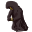

# { .sprite } Wraith

| Stat | Value |
|---|---|
| Class | undead |
| HP | 150 |
| Max AP | 10 |
| Attack cost | 5 |
| Move cost | 5 |
| Damage | 16 to 31 |
| Attack chance | 240 |
| Block chance | 140 |
| Damage resistance | 3 |
| Critical skill | 0 |
| Critical multiplier | 0.0 |

## Drops

| Item | Chance | Qty |
|---|---|---|
| [Gold coins](../items/gold.md) | 100% | 4 to 56 |
| [Wraithguard](../items/brightport_wraith.md) | 1% | 1 |

## Found on

- [brightport_cave18](../maps/brightport_cave18.md)
- [brightport_cave19](../maps/brightport_cave19.md)
- [brightport_cave20](../maps/brightport_cave20.md)
- [brightport_cave5](../maps/brightport_cave5.md)
- [brightport_cave7](../maps/brightport_cave7.md)
- [brightport_cave8](../maps/brightport_cave8.md)

## Version history

| Version | Change |
|---|---|
| [v0.8.16.1](../versions/0.8.16.1.md) | Added |

Verified against v0.8.18 and every earlier release back to v0.7.0 (game data compared release by release).

<small>Monster ID: `brightport_wraith` · Data from v0.8.18</small>
