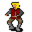

# { .sprite } Dynes

**Where to find Dynes:** Brightport: [Brightport benbyr](../maps/brightport_benbyr.md#pin-npc-brightportgoons)

<div class="infobox" markdown>

<p class="ib-img">{ .sprite }</p>

| | |
|---|---|
| **Type** | NPC (can be spoken to; cannot be attacked) |
| **Found in** | Brightport |
| **Entry ID** | `brightportgoons` |
| **Introduced** | [v0.8.16.1](../versions/0.8.16.1.md) |

</div>

## Dialogue simulator

Set your quest stages and items, then talk to Dynes. Same rules as the game: same checks, same options, same effects.

<div class="dlg-sim" data-src="../../assets/dialogue/brightport_dynes0.json" data-npc="Dynes" markdown="0"><noscript>The simulator needs JavaScript. The full dialogue is listed below.</noscript></div>

<p class="verified">Rules verified against v0.8.18 game code (ConversationController.java) and dialogue data.</p>

??? quote "Dialogue (16 lines)"

    *Exactly as in the game files. Each line appears once; links jump to where a choice leads.*

    <span id="d-brightport_dynes0"></span>**`brightport_dynes0`** *(silent check: the first matching branch below is taken)*

    - Next *(if reached stage 130 of [Priceful vengeance](../quests/brightport_goons.md#stage-130))* → [brightport_dynes_superextreme](#d-brightport_dynes_superextreme)
    - Next *(if reached stage 120 of [Priceful vengeance](../quests/brightport_goons.md#stage-120))* → [brightport_dynes_extreme](#d-brightport_dynes_extreme)
    - Next *(if reached stage 100 of [Priceful vengeance](../quests/brightport_goons.md#stage-100))* → [brightport_dynes_superhigh](#d-brightport_dynes_superhigh)
    - Next *(if reached stage 90 of [Priceful vengeance](../quests/brightport_goons.md#stage-90))* → [brightport_dynes_high](#d-brightport_dynes_high)
    - Next *(if reached stage 30 of [Priceful vengeance](../quests/brightport_goons.md#stage-30); NOT reached stage 139 of [Brightport story flags (hidden flag)](../quests/brightport_nondisplay.md#stage-139))* → [brightport_dynes_medium](#d-brightport_dynes_medium)
    - Next *(if reached stage 129 of [Brightport story flags (hidden flag)](../quests/brightport_nondisplay.md#stage-129))* → [brightport_dynes_mediumlow](#d-brightport_dynes_mediumlow)
    - Next *(if NOT reached stage 128 of [Brightport story flags (hidden flag)](../quests/brightport_nondisplay.md#stage-128))* → [brightport_dynes_low](#d-brightport_dynes_low)

    <span id="d-brightport_dynes_superextreme"></span>**`brightport_dynes_superextreme`** Dynes: “Tch, get out of here, you greedy sellout. Money can be earned again. Trust doesn't come back.”


    <span id="d-brightport_dynes_extreme"></span>**`brightport_dynes_extreme`** Dynes: “You traitor! Watch your back in Nor City's alleys, our friends won't forget what you did!”


    <span id="d-brightport_dynes_superhigh"></span>**`brightport_dynes_superhigh`** Dynes: “You really showed that Feygard dog who's boss, haha!”

    - “What's your history with Benbyr?” → [brightport_dynes](#d-brightport_dynes)
    - “Yup, I did.” → *conversation ends*

    <span id="d-brightport_dynes_high"></span>**`brightport_dynes_high`** Dynes: “It's nice to see you around, friend.”

    - “What's your history with Benbyr?” → [brightport_dynes](#d-brightport_dynes)
    - “Good to see you too.” → *conversation ends*

    <span id="d-brightport_dynes_medium"></span>**`brightport_dynes_medium`** Dynes: “Got something you want to talk about?”

    - “I was just wondering how you manage to keep business going with all those watchful eyes around, I remember you…” *(if reached stage 80 of [Priceful vengeance](../quests/brightport_goons.md#stage-80))* → [brightport_dynes_medium1](#d-brightport_dynes_medium1)
    - “What's your history with Benbyr?” → [brightport_dynes1](#d-brightport_dynes1)
    - “No, not really.” → *conversation ends*

    <span id="d-brightport_dynes_mediumlow"></span>**`brightport_dynes_mediumlow`** Dynes: “Hello. It's nice to see you around.”


    <span id="d-brightport_dynes_low"></span>**`brightport_dynes_low`** Dynes: “You've got a reason to be here? Yeah right, get out of here, whelp.”


    <span id="d-brightport_dynes"></span>**`brightport_dynes`** Dynes: “Us and Benbyr go way back, we're old business partners. Wouldn't call him a friend, but he's no stranger either.”

    - Next → [brightport_dynes2](#d-brightport_dynes2)

    <span id="d-brightport_dynes_medium1"></span>**`brightport_dynes_medium1`** Dynes: “Yes, an old mine to the east. It was really ingenious of us to use an old mining cave for that purpose, but it's teeming with bugs. And if you're not careful, a lizardman could swim up to the shore and snatch you on the way.”

    - “That sounds nasty. It's not as if I would be going there.” → [brightport_dynes_medium2](#d-brightport_dynes_medium2)

    <span id="d-brightport_dynes1"></span>**`brightport_dynes1`** Dynes: “Once you're done with the work we can talk about it.”

    - “Fine.” → *conversation ends*

    <span id="d-brightport_dynes2"></span>**`brightport_dynes2`** [Dynes](../monsters/brightportgoons.md): “His clientele was different, so we had no falling out. He got caught a few years ago dealing with some strange ingredient.”

    - Next → [brightport_dynes3](#d-brightport_dynes3)

    <span id="d-brightport_dynes_medium2"></span>**`brightport_dynes_medium2`** Dynes: “Haha, yeah. You've still got that request from us to do, unless you feel like you're not up to the task?”

    - “Nope, I'm on my way.” → *conversation ends*

    <span id="d-brightport_dynes3"></span>**`brightport_dynes3`** [Dynes](../monsters/brightportgoons.md): “Hey Barthold, do you remember what it was?”

    - Next → [brightport_dynes4](#d-brightport_dynes4)

    <span id="d-brightport_dynes4"></span>**`brightport_dynes4`** [Barthold](../monsters/brightportgoons1.md): “I think it was called Kazarite or something, he tried hooking us in with those big earnings, but we didn't want the risk.”

    - Next → [brightport_dynes5](#d-brightport_dynes5)

    <span id="d-brightport_dynes5"></span>**`brightport_dynes5`** [Dynes](../monsters/brightportgoons.md): “If the first thing he did after getting out was chase revenge, then he hasn't learned his lesson.”

    - “I see, bye.” → *conversation ends*


## Version history

| Version | Change |
|---|---|
| [v0.8.16.1](../versions/0.8.16.1.md) | Added<br>Dialogue: 16 lines added |

<p class="verified">Verified against v0.8.18 and every earlier release back to v0.7.0 (game data compared release by release).</p>


??? info "Technical information"

    | | |
    |---|---|
    | Entry ID | `brightportgoons` |
    | Spawn group | `brightportgoons` |
    | Loot table | – |
    | Conversation | `brightport_dynes0` |
    | Faction | – |
    | Movement | – |
    | Icon | `monsters_ld1:63` |
    | Defined in | `res/raw/monsterlist_brightport.json` |

    Raw data:

    ```json
    {
     "id": "brightportgoons",
     "name": "Dynes",
     "iconID": "monsters_ld1:63",
     "phraseID": "brightport_dynes0"
    }
    ```


## Community notes

<small>Written by players, not generated from game data. **Observations**: what players notice in-game · **Lore**: the in-world story · **Trivia**: real-world facts, references, development history · **Theory / speculation**: unconfirmed ideas; may just be unfinished content</small>

### Observations

*No notes yet. Contributions are welcome: [add a note](https://github.com/asdfghjkl628/Andor-s-Trail-Wikiiii/new/main/notes/monsters?filename=brightportgoons.md&value=%23%23%20Observations%0A%0A%3C%21--%20what%20players%20notice%20in-game%20--%3E%0A%0A%23%23%20Lore%0A%0A%3C%21--%20the%20in-world%20story%20--%3E%0A%0A%23%23%20Trivia%0A%0A%3C%21--%20real-world%20facts%2C%20references%2C%20development%20history%20--%3E%0A%0A%23%23%20Theory%20/%20speculation%0A%0A%3C%21--%20unconfirmed%20ideas%3B%20may%20just%20be%20unfinished%20content%20--%3E%0A).*

### Lore

*No notes yet. Contributions are welcome: [add a note](https://github.com/asdfghjkl628/Andor-s-Trail-Wikiiii/new/main/notes/monsters?filename=brightportgoons.md&value=%23%23%20Observations%0A%0A%3C%21--%20what%20players%20notice%20in-game%20--%3E%0A%0A%23%23%20Lore%0A%0A%3C%21--%20the%20in-world%20story%20--%3E%0A%0A%23%23%20Trivia%0A%0A%3C%21--%20real-world%20facts%2C%20references%2C%20development%20history%20--%3E%0A%0A%23%23%20Theory%20/%20speculation%0A%0A%3C%21--%20unconfirmed%20ideas%3B%20may%20just%20be%20unfinished%20content%20--%3E%0A).*

### Trivia

*No notes yet. Contributions are welcome: [add a note](https://github.com/asdfghjkl628/Andor-s-Trail-Wikiiii/new/main/notes/monsters?filename=brightportgoons.md&value=%23%23%20Observations%0A%0A%3C%21--%20what%20players%20notice%20in-game%20--%3E%0A%0A%23%23%20Lore%0A%0A%3C%21--%20the%20in-world%20story%20--%3E%0A%0A%23%23%20Trivia%0A%0A%3C%21--%20real-world%20facts%2C%20references%2C%20development%20history%20--%3E%0A%0A%23%23%20Theory%20/%20speculation%0A%0A%3C%21--%20unconfirmed%20ideas%3B%20may%20just%20be%20unfinished%20content%20--%3E%0A).*

### Theory / speculation

*No notes yet. Contributions are welcome: [add a note](https://github.com/asdfghjkl628/Andor-s-Trail-Wikiiii/new/main/notes/monsters?filename=brightportgoons.md&value=%23%23%20Observations%0A%0A%3C%21--%20what%20players%20notice%20in-game%20--%3E%0A%0A%23%23%20Lore%0A%0A%3C%21--%20the%20in-world%20story%20--%3E%0A%0A%23%23%20Trivia%0A%0A%3C%21--%20real-world%20facts%2C%20references%2C%20development%20history%20--%3E%0A%0A%23%23%20Theory%20/%20speculation%0A%0A%3C%21--%20unconfirmed%20ideas%3B%20may%20just%20be%20unfinished%20content%20--%3E%0A).*


<small>Data from v0.8.18</small>
