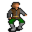

# { .sprite } Barthold

**Where to find Barthold:** Brightport: [brightport_benbyr](../maps/brightport_benbyr.md#pin-npc-brightportgoons1)

<div class="infobox" markdown>

<p class="ib-img">{ .sprite }</p>

| | |
|---|---|
| **Type** | NPC (can be spoken to; cannot be attacked) |
| **Role** | Starts [Priceful vengeance](../quests/brightport_goons.md) |
| **Found in** | Brightport |
| **Entry ID** | `brightportgoons1` |
| **Introduced** | [v0.8.16.1](../versions/0.8.16.1.md) |

</div>

## Quests

- [Priceful vengeance](../quests/brightport_goons.md): stages 10, 20, 30, 90, 100, 130, 136
- [brightport_nondisplay (hidden flag)](../quests/brightport_nondisplay.md): stages 129, 131, 139

## Dialogue simulator

Set the quest stages, items and other conditions that apply to your game, then start the conversation with Barthold. The simulator applies the game's own rules: it performs the same silent checks, offers only the options that would be shown in the game, and applies their effects (quest stages, items handed over, rewards) as the conversation proceeds.

<div class="dlg-sim" data-src="../../assets/dialogue/brightport_goon_selector.json" data-npc="Barthold" markdown="0"><noscript>The simulator needs JavaScript. The full dialogue is listed below.</noscript></div>

<p class="verified">Rules verified against v0.8.18 game code (ConversationController.java) and dialogue data.</p>

??? quote "Dialogue (54 lines)"

    *What the dialogue says, exactly as in the game files. Lines are listed once; links jump to the line a choice leads to.*

    <span id="d-brightport_goon_selector"></span>**`brightport_goon_selector`** *(silent check: the first matching branch below is taken)*

    - Next *(if NOT reached stage 139 of [brightport_nondisplay (hidden flag)](../quests/brightport_nondisplay.md#stage-139); NOT reached stage 130 of [Priceful vengeance](../quests/brightport_goons.md#stage-130))* → [brightport_goons_selector](#d-brightport_goons_selector)
    - Next *(if NOT reached stage 139 of [brightport_nondisplay (hidden flag)](../quests/brightport_nondisplay.md#stage-139); reached stage 130 of [Priceful vengeance](../quests/brightport_goons.md#stage-130))* → [brightport_goonselectorbribe](#d-brightport_goonselectorbribe)
    - Next *(if reached stage 139 of [brightport_nondisplay (hidden flag)](../quests/brightport_nondisplay.md#stage-139))* → [brightport_goons_selectorafter](#d-brightport_goons_selectorafter)

    <span id="d-brightport_goons_selector"></span>**`brightport_goons_selector`** *(silent check: the first matching branch below is taken)*

    - Next *(if reached stage 30 of [Priceful vengeance](../quests/brightport_goons.md#stage-30))* → [brightport_goons25](#d-brightport_goons25)
    - Next *(if reached stage 20 of [Priceful vengeance](../quests/brightport_goons.md#stage-20); NOT reached stage 30 of [Priceful vengeance](../quests/brightport_goons.md#stage-30))* → [brightport_goons21](#d-brightport_goons21)
    - Next *(if reached stage 129 of [brightport_nondisplay (hidden flag)](../quests/brightport_nondisplay.md#stage-129))* → [brightport_goons13](#d-brightport_goons13)
    - Next *(if NOT reached stage 131 of [brightport_nondisplay (hidden flag)](../quests/brightport_nondisplay.md#stage-131))* → [brightport_goons](#d-brightport_goons)
    - Next *(if reached stage 131 of [brightport_nondisplay (hidden flag)](../quests/brightport_nondisplay.md#stage-131))* → [brightport_goons0](#d-brightport_goons0)

    <span id="d-brightport_goonselectorbribe"></span>**`brightport_goonselectorbribe`** Barthold: “How dare you come back after selling us out! I hope the gold was worth it, coward.”


    <span id="d-brightport_goons_selectorafter"></span>**`brightport_goons_selectorafter`** *(silent check: the first matching branch below is taken)*

    - Next *(if reached stage 130 of [Priceful vengeance](../quests/brightport_goons.md#stage-130); NOT reached stage 212 of [brightport_nondisplay (hidden flag)](../quests/brightport_nondisplay.md#stage-212))* → [brightport_goons_after0](#d-brightport_goons_after0)
    - Next *(if reached stage 212 of [brightport_nondisplay (hidden flag)](../quests/brightport_nondisplay.md#stage-212))* → [brightport_goons_after](#d-brightport_goons_after)
    - Next *(if reached stage 90 of [Priceful vengeance](../quests/brightport_goons.md#stage-90))* → [brightport_goons_after1](#d-brightport_goons_after1)
    - Next *(if reached stage 100 of [Priceful vengeance](../quests/brightport_goons.md#stage-100))* → [brightport_goons_after2](#d-brightport_goons_after2)
    - Next *(if reached stage 136 of [Priceful vengeance](../quests/brightport_goons.md#stage-136))* → [brightport_goons_gaveup](#d-brightport_goons_gaveup)

    <span id="d-brightport_goons25"></span>**`brightport_goons25`** Barthold: “Hey kid, any news on your task?”

    - “It was a hard fight, but I killed him, They'll probably think a lizardman got him.” *(if reached stage 70 of [Priceful vengeance](../quests/brightport_goons.md#stage-70))* → [brightport_goons26](#d-brightport_goons26)
    - “I think you guys owe me some gold now.” *(if carry 1× [Nor city made blade](../items/brightport_sword0.md); reached stage 110 of [Priceful vengeance](../quests/brightport_goons.md#stage-110); NOT reached stage 135 of [Priceful vengeance](../quests/brightport_goons.md#stage-135))* → [brightport_goons33](#d-brightport_goons33)
    - “I tried so hard, and got so far. But in the end, I couldn't find anything.” *(if reached stage 135 of [Priceful vengeance](../quests/brightport_goons.md#stage-135))* → [brightport_barthold1](#d-brightport_barthold1)
    - “Good news. The commander's going to be turning a blind eye to your deals for a while. [Show him the compromising…” *(if reached stage 60 of [Priceful vengeance](../quests/brightport_goons.md#stage-60))* → [brightport_goons30](#d-brightport_goons30)
    - “No. But I'll see it through.” → *conversation ends*

    <span id="d-brightport_goons21"></span>**`brightport_goons21`** [Barthold](../monsters/brightportgoons1.md): “That's a dangerous thing you're saying, there is no way you can do that. He's not exactly a sheep; Gunfryk is a skilled and cunning warrior.” — **effects:** sets stage 20 of [Priceful vengeance](../quests/brightport_goons.md#stage-20)

    - Next → [brightport_goons22](#d-brightport_goons22)

    <span id="d-brightport_goons13"></span>**`brightport_goons13`** Barthold: “It's nice to see a trustworthy fellow like you around. You need something?”

    - “I'm looking for my brother Andor, have you seen him?” *(if NOT latest stage of [Excluded endings for the main quest andor (hidden flag)](../quests/andor_ending.md#stage-900) is 900)* → [brightport_goons9](#d-brightport_goons9)
    - “Benbyr said to come and see you.” → [brightport_goons8](#d-brightport_goons8)

    <span id="d-brightport_goons"></span>**`brightport_goons`** Barthold: “Who are you, and what do you need from us?”

    - “What do you do around here?” → [brightport_goons0](#d-brightport_goons0)

    <span id="d-brightport_goons0"></span>**`brightport_goons0`** Barthold: “Who in Dhayavar are you? You better get out of here before we mess you up!” — **effects:** sets stage 131 of [brightport_nondisplay (hidden flag)](../quests/brightport_nondisplay.md#stage-131)

    - Next → [brightport_goons_selector2](#d-brightport_goons_selector2)

    <span id="d-brightport_goons_after0"></span>**`brightport_goons_after0`** Barthold: “How dare you come back after selling us out! Hope the gold was worth it, coward.”


    <span id="d-brightport_goons_after"></span>**`brightport_goons_after`** Barthold: “Enjoy your reward, traitor. Just remember, that gold won't keep you safe when my friends set their eyes on you!” — **effects:** starts timer “brightport_arrest”

    - Next → [brightport_goons_after3](#d-brightport_goons_after3)

    <span id="d-brightport_goons_after1"></span>**`brightport_goons_after1`** Barthold: “Good to see you again, friend. Business has been steadier lately.”

    - “Good to hear. [Leave]” → *conversation ends*

    <span id="d-brightport_goons_after2"></span>**`brightport_goons_after2`** Barthold: “Nice to see you around $playername. Can't say we've been doing better than before.”

    - Next → [brightport_goons37](#d-brightport_goons37)

    <span id="d-brightport_goons_gaveup"></span>**`brightport_goons_gaveup`** Barthold: “Hello, friend. It's a shame you helped our friend but couldn't help us.”

    - “Well I'm a bit busy searching for my brother.” → *conversation ends*

    <span id="d-brightport_goons26"></span>**`brightport_goons26`** Barthold: “You killed him!? You're really tough! But him being dead is not ideal.”

    - Next → [brightport_goons27](#d-brightport_goons27)

    <span id="d-brightport_goons33"></span>**`brightport_goons33`** Barthold: “Ha! What gives, or are you making a joke?”

    - “Right, I was joking, sorry.” → *conversation ends*
    - “You don't have the Guild's protection. Either I give this blade I took from your hideout to the guards. Or 2,000 gold.…” *(if carry 1× [Nor city made blade](../items/brightport_sword0.md))* → [brightport_goons34](#d-brightport_goons34)

    <span id="d-brightport_barthold1"></span>**`brightport_barthold1`** Barthold: “Is that so? I'm a little disappointed, thought you're more than just a sheep butcher.” — **effects:** sets stage 139 of [brightport_nondisplay (hidden flag)](../quests/brightport_nondisplay.md#stage-139), sets stage 136 of [Priceful vengeance](../quests/brightport_goons.md#stage-136)

    - Next → [brightport_barthold2](#d-brightport_barthold2)

    <span id="d-brightport_goons30"></span>**`brightport_goons30`** [Barthold](../monsters/brightportgoons1.md): “Give me that! [Barthold skips through some of the pages with a puzzled expression.]”

    - Next → [brightport_goons31](#d-brightport_goons31)

    <span id="d-brightport_goons22"></span>**`brightport_goons22`** [Dynes](../monsters/brightportgoons.md): “Yeah you'd have to be more discreet, we don't want things to go in a worse direction. If you can pull it off, we'll reward you handsomely. But if you fail you've got nothing to do with us. Understand?”

    - Next → [brightport_goons23](#d-brightport_goons23)

    <span id="d-brightport_goons9"></span>**`brightport_goons9`** Barthold: “Hmm, doesn't ring a bell.”

    - Next → [brightport_goons10](#d-brightport_goons10)

    <span id="d-brightport_goons8"></span>**`brightport_goons8`** Barthold: “Benbyr did? Ha! I guess that guy's still up for business! Say, you want to work for us?” — **effects:** sets stage 10 of [Priceful vengeance](../quests/brightport_goons.md#stage-10)

    - “The kind of work that sent Benbyr to jail? No thanks.” → [brightport_goons15](#d-brightport_goons15)
    - “I'm not sure, what kind of work exactly?” → [brightport_goons16](#d-brightport_goons16)
    - “Sure, I have a history of getting things done.” → [brightport_goons14](#d-brightport_goons14)

    <span id="d-brightport_goons_selector2"></span>**`brightport_goons_selector2`** *(silent check: the first matching branch below is taken)*

    - Next *(if NOT reached stage 30 of [Cheap cuts](../quests/benbyr.md#stage-30))* → [brightport_goons1](#d-brightport_goons1)
    - Next → [brightport_goons2](#d-brightport_goons2)

    <span id="d-brightport_goons_after3"></span>**`brightport_goons_after3`** [Brightport guard](../monsters/brightportguard.md#v-brightport_guardgoons): “Oh shut up, we still have an investigation to do here.”


    <span id="d-brightport_goons37"></span>**`brightport_goons37`** [Dynes](../monsters/brightportgoons.md): “The old commander's gone but his mutts have kept their pace, though we've managed to sneak in a few more bribes than usual, he he.”

    - Next *(if reached stage 152 of [brightport_nondisplay (hidden flag)](../quests/brightport_nondisplay.md#stage-152))* → [brightport_goons38](#d-brightport_goons38)

    <span id="d-brightport_goons27"></span>**`brightport_goons27`** [Dynes](../monsters/brightportgoons.md): “What's wrong, Barthold? With Gunfryk dead, we've got free rein!”

    - Next → [brightport_goons28](#d-brightport_goons28)

    <span id="d-brightport_goons34"></span>**`brightport_goons34`** Barthold: “Argh! Dynes, hand him all of our gold!”

    - Next → [brightport_goons35](#d-brightport_goons35)

    <span id="d-brightport_barthold2"></span>**`brightport_barthold2`** Barthold: “You can stick around though, but we don't have any more work for you.”


    <span id="d-brightport_goons31"></span>**`brightport_goons31`** Barthold: “Ha ha ha ha! That's soo funny, who would have guessed that stern Feygard dog would have such hobbies. And in Nor City nonetheless! Northerners and their pride. He surely wants to avoid his men finding out.”

    - Next → [brightport_goons32](#d-brightport_goons32)

    <span id="d-brightport_goons23"></span>**`brightport_goons23`** [Barthold](../monsters/brightportgoons1.md): “Dang it, Dynes, don't egg on the kid. Killing is off the list, understood? Just make him less of a problem for us.” — **effects:** sets stage 30 of [Priceful vengeance](../quests/brightport_goons.md#stage-30)

    - “Got it, I'll "persuade" him to not be a problem, heh.” → *conversation ends*
    - “How else can I deal with him then?” → [brightport_goons24](#d-brightport_goons24)

    <span id="d-brightport_goons10"></span>**`brightport_goons10`** Barthold: “Hey Dynes! have you seen this Andor guy?”

    - Next → [brightport_goons11](#d-brightport_goons11)

    <span id="d-brightport_goons15"></span>**`brightport_goons15`** Barthold: “Don't lump us in with him. Benbyr's greed got the best of him, he started dealing with rather questionable merchandise. On the other hand, we're not doing anything illegal, just inconvenient for those stuck-up guards.”

    - “Inconvenient enough that you can't do your work anymore, sounds like it's illegal to me.” → [brightport_goons17](#d-brightport_goons17)

    <span id="d-brightport_goons16"></span>**`brightport_goons16`** Barthold: “We have some deliveries to make, but we're under observation and can't receive more merchandise. If we had a new face to do it for us, we could fare better.”

    - Next → [brightport_goons18](#d-brightport_goons18)

    <span id="d-brightport_goons14"></span>**`brightport_goons14`** Barthold: “That's the spirit!”

    - Next → [brightport_goons18](#d-brightport_goons18)

    <span id="d-brightport_goons1"></span>**`brightport_goons1`** [Dynes](../monsters/brightportgoons.md): “Yeah yeah, get out of here!”


    <span id="d-brightport_goons2"></span>**`brightport_goons2`** [Dynes](../monsters/brightportgoons.md): “Wait, wait Barthold! Isn't that the kid?”

    - Next → [brightport_goons3](#d-brightport_goons3)

    <span id="d-brightport_goons38"></span>**`brightport_goons38`** [Barthold](../monsters/brightportgoons1.md): “Feygard sent a new guy if you haven't heard already. Seems like your lie has worked. This guy is more of a warrior than a justiciar, so we're optimistic for now.”

    - “If you need someone dead you know who to call. The guard buster $playername.” → *conversation ends*

    <span id="d-brightport_goons28"></span>**`brightport_goons28`** [Barthold](../monsters/brightportgoons1.md): “Free rein? It bought us time. Even if it looked like a lizardman attack, there's no guarantee the replacement Feygard sends won't be someone more extreme.”

    - Next → [brightport_goons29](#d-brightport_goons29)

    <span id="d-brightport_goons35"></span>**`brightport_goons35`** [Dummy NPC](../monsters/none.md): “Dynes begrudgingly takes out a bag of gold and throws it your way.” — **effects:** gives 1869× [Gold coins](../items/gold.md), sets stage 130 of [Priceful vengeance](../quests/brightport_goons.md#stage-130)

    - Next → [brightport_goons36](#d-brightport_goons36)

    <span id="d-brightport_goons32"></span>**`brightport_goons32`** Barthold: “And for a job well done here is your reward; rather generous I say. You'll surely find more work to do in Nor City, just tell them Barthold sent you.” — **effects:** gives 1200× [Gold coins](../items/gold.md), sets stage 90 of [Priceful vengeance](../quests/brightport_goons.md#stage-90), sets stage 139 of [brightport_nondisplay (hidden flag)](../quests/brightport_nondisplay.md#stage-139)

    - “It was my pleasure, Bye.” → *conversation ends*
    - “If not information about my brother at least some gold.” → *conversation ends*

    <span id="d-brightport_goons24"></span>**`brightport_goons24`** Barthold: “I don't know, you're our sheep culling expert here. But surely Gunfryk has some secrets he wishes to hide.”

    - “Got it, just watch.” → *conversation ends*

    <span id="d-brightport_goons11"></span>**`brightport_goons11`** [Dynes](../monsters/brightportgoons.md): “Dunno, beats me.”

    - Next → [brightport_goons12](#d-brightport_goons12)

    <span id="d-brightport_goons17"></span>**`brightport_goons17`** Barthold: “Listen, all our goods are legal. But they want us to pay those things called "taxes" and follow their "trade restrictions" Completely ridiculous! So, you want to work for us or not?”

    - “Sure.” → [brightport_goons18](#d-brightport_goons18)

    <span id="d-brightport_goons18"></span>**`brightport_goons18`** Barthold: “Hmm, on second thoughts, I'd feel bad about giving you that kind of responsibility. Gunfryk's men are ruthless, if you get caught, you'll have no peace in Brightport.”

    - “Who is this Gunfryk guy?” → [brightport_goons19](#d-brightport_goons19)
    - “I met Gunfryk, he didn't seem like a bad guy.” *(if reached stage 156 of [brightport_nondisplay (hidden flag)](../quests/brightport_nondisplay.md#stage-156))* → [brightport_goons_gunfryk](#d-brightport_goons_gunfryk)

    <span id="d-brightport_goons3"></span>**`brightport_goons3`** [Barthold](../monsters/brightportgoons1.md): “What, who?”

    - Next → [brightport_goons4](#d-brightport_goons4)

    <span id="d-brightport_goons29"></span>**`brightport_goons29`** Barthold: “Anyway, here's your reward. With skills like yours, you'll surely find more work to do for our friends in Nor City.” — **effects:** sets stage 100 of [Priceful vengeance](../quests/brightport_goons.md#stage-100), gives 1000× [Gold coins](../items/gold.md), sets stage 139 of [brightport_nondisplay (hidden flag)](../quests/brightport_nondisplay.md#stage-139)

    - “At least I got some gold.” → *conversation ends*

    <span id="d-brightport_goons36"></span>**`brightport_goons36`** [Barthold](../monsters/brightportgoons1.md): “Curses on that Benbyr for sending a rat like you our way! Now get out breadface, our deal is over!”


    <span id="d-brightport_goons12"></span>**`brightport_goons12`** [Barthold](../monsters/brightportgoons1.md): “You heard him. Sorry we have no information to help you. Anything else?”

    - “Benbyr said to come and see you.” → [brightport_goons8](#d-brightport_goons8)

    <span id="d-brightport_goons19"></span>**`brightport_goons19`** Barthold: “He is the guard captain. We used to make a killing with our trade. Well, we're still in business but Gunfryk has significantly cut down on it. His men pay no heed to bribes or the Shadow, except for some enlisted locals.”

    - Next → [brightport_goons20](#d-brightport_goons20)

    <span id="d-brightport_goons_gunfryk"></span>**`brightport_goons_gunfryk`** Barthold: “On the surface, he's done good for the locals, they like him, like sheep love the shepherd. But for us, who keep the economy of this town alive, the laws he's upholding have done us more harm than good.”

    - Next → [brightport_goons20](#d-brightport_goons20)

    <span id="d-brightport_goons4"></span>**`brightport_goons4`** [Dynes](../monsters/brightportgoons.md): “It's the kid Benbyr wrote us about, remember?”

    - Next → [brightport_goons5](#d-brightport_goons5)

    <span id="d-brightport_goons20"></span>**`brightport_goons20`** [Dynes](../monsters/brightportgoons.md): “Yeah, he really complicated things. That guard outside has been there watching us for a year now. We've only managed to stay afloat thanks to a cave I use to hide some merchandise.”

    - “Then all that it takes should be getting rid of him?” → [brightport_goons21](#d-brightport_goons21)

    <span id="d-brightport_goons5"></span>**`brightport_goons5`** [Barthold](../monsters/brightportgoons1.md): “Oh yeah, kinda does look like the one he wrote us about.”

    - Next → [brightport_goons6](#d-brightport_goons6)

    <span id="d-brightport_goons6"></span>**`brightport_goons6`** Barthold: “I was convinced you were sent to spy on us. So, what brings you around here.” — **effects:** sets stage 129 of [brightport_nondisplay (hidden flag)](../quests/brightport_nondisplay.md#stage-129)

    - “I'm looking around the town searching for my brother.” → [brightport_goons7](#d-brightport_goons7)
    - “Benbyr said to come see you.” → [brightport_goons8](#d-brightport_goons8)

    <span id="d-brightport_goons7"></span>**`brightport_goons7`** Barthold: “Really, what does he look like?”

    - “He looks a lot like me, his name is Andor.” → [brightport_goons9](#d-brightport_goons9)


## Version history

| Version | Change |
|---|---|
| [v0.8.16.1](../versions/0.8.16.1.md) | Added<br>Dialogue: 54 lines added |
| [v0.8.18](../versions/0.8.18.md) | Dialogue: 1 line changed |

<p class="verified">Verified against v0.8.18 and every earlier release back to v0.7.0 (game data compared release by release).</p>


??? info "Technical information"

    | | |
    |---|---|
    | Entry ID | `brightportgoons1` |
    | Spawn group | `brightportgoons1` |
    | Loot table | – |
    | Conversation | `brightport_goon_selector` |
    | Faction | – |
    | Movement | – |
    | Icon | `monsters_ld1:64` |
    | Defined in | `res/raw/monsterlist_brightport.json` |

    Raw data:

    ```json
    {
     "id": "brightportgoons1",
     "name": "Barthold",
     "iconID": "monsters_ld1:64",
     "phraseID": "brightport_goon_selector"
    }
    ```


## Community notes

<small>Written by players, not generated from game data. **Observations**: what players notice in-game · **Lore**: the in-world story · **Trivia**: real-world facts, references, development history · **Theory / speculation**: unconfirmed ideas; may just be unfinished content</small>

### Observations

*No notes yet. Contributions are welcome: [add a note](https://github.com/asdfghjkl628/Andor-s-Trail-Wikiiii/new/main/notes/monsters?filename=brightportgoons1.md&value=%23%23%20Observations%0A%0A%3C%21--%20what%20players%20notice%20in-game%20--%3E%0A%0A%23%23%20Lore%0A%0A%3C%21--%20the%20in-world%20story%20--%3E%0A%0A%23%23%20Trivia%0A%0A%3C%21--%20real-world%20facts%2C%20references%2C%20development%20history%20--%3E%0A%0A%23%23%20Theory%20/%20speculation%0A%0A%3C%21--%20unconfirmed%20ideas%3B%20may%20just%20be%20unfinished%20content%20--%3E%0A).*

### Lore

*No notes yet. Contributions are welcome: [add a note](https://github.com/asdfghjkl628/Andor-s-Trail-Wikiiii/new/main/notes/monsters?filename=brightportgoons1.md&value=%23%23%20Observations%0A%0A%3C%21--%20what%20players%20notice%20in-game%20--%3E%0A%0A%23%23%20Lore%0A%0A%3C%21--%20the%20in-world%20story%20--%3E%0A%0A%23%23%20Trivia%0A%0A%3C%21--%20real-world%20facts%2C%20references%2C%20development%20history%20--%3E%0A%0A%23%23%20Theory%20/%20speculation%0A%0A%3C%21--%20unconfirmed%20ideas%3B%20may%20just%20be%20unfinished%20content%20--%3E%0A).*

### Trivia

*No notes yet. Contributions are welcome: [add a note](https://github.com/asdfghjkl628/Andor-s-Trail-Wikiiii/new/main/notes/monsters?filename=brightportgoons1.md&value=%23%23%20Observations%0A%0A%3C%21--%20what%20players%20notice%20in-game%20--%3E%0A%0A%23%23%20Lore%0A%0A%3C%21--%20the%20in-world%20story%20--%3E%0A%0A%23%23%20Trivia%0A%0A%3C%21--%20real-world%20facts%2C%20references%2C%20development%20history%20--%3E%0A%0A%23%23%20Theory%20/%20speculation%0A%0A%3C%21--%20unconfirmed%20ideas%3B%20may%20just%20be%20unfinished%20content%20--%3E%0A).*

### Theory / speculation

*No notes yet. Contributions are welcome: [add a note](https://github.com/asdfghjkl628/Andor-s-Trail-Wikiiii/new/main/notes/monsters?filename=brightportgoons1.md&value=%23%23%20Observations%0A%0A%3C%21--%20what%20players%20notice%20in-game%20--%3E%0A%0A%23%23%20Lore%0A%0A%3C%21--%20the%20in-world%20story%20--%3E%0A%0A%23%23%20Trivia%0A%0A%3C%21--%20real-world%20facts%2C%20references%2C%20development%20history%20--%3E%0A%0A%23%23%20Theory%20/%20speculation%0A%0A%3C%21--%20unconfirmed%20ideas%3B%20may%20just%20be%20unfinished%20content%20--%3E%0A).*


<small>Data from v0.8.18</small>
