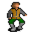

# { .sprite } Stanwick

**Where to find Stanwick:** Brightport: [Brightport school 7](../maps/brightport_school7.md#pin-npc-brightportnpc)

<div class="infobox" markdown>

<p class="ib-img"></p>

| | |
|---|---|
| **Type** | NPC (talk only; never fought) |
| **Found in** | Brightport |
| **Introduced** | [v0.8.16.1](../versions/0.8.16.1.md) |

</div>

## Quests

- [No rest for the wicked](../quests/Stanwickquest.md): stages 20, 25, 110
- [Search for Andor](../quests/andor.md): stages 126, 127, 128
- [Brightport story flags (hidden flag)](../quests/brightport_nondisplay.md): stage 70

## Dialogue simulator

Talk to Stanwick as you would in the game. When the conversation depends on your progress (a quest, an item, a dice roll…), the simulator asks you. Try another answer with **Undo**.

<div class="dlg-sim" data-src="../../assets/dialogue/brightport_stanwick_selector.json" data-npc="Stanwick" markdown="0"><noscript>The simulator needs JavaScript. The full dialogue is listed below.</noscript></div>

<p class="verified">Follows the game's own conversation rules (v0.8.18).</p>

??? quote "Dialogue (37 lines)"

    *Exactly as in the game files. Each line appears once; links jump to where a choice leads.*

    <span id="d-brightport_stanwick_selector"></span>**`brightport_stanwick_selector`** *(silent check: the first matching branch below is taken)*

    - Next *(if reached stage 128 of [Search for Andor](../quests/andor.md#stage-128))* → [brightport_stanwick_common](#d-brightport_stanwick_common)
    - Next *(if 4 rounds passed since timer “stanwick”; NOT reached stage 128 of [Search for Andor](../quests/andor.md#stage-128))* → [brightport_stanwick_andor0](#d-brightport_stanwick_andor0)
    - Next *(if reached stage 70 of [Brightport story flags (hidden flag)](../quests/brightport_nondisplay.md#stage-70); NOT reached stage 128 of [Search for Andor](../quests/andor.md#stage-128))* → [brightport_stanwick_end](#d-brightport_stanwick_end)
    - Next *(if reached stage 25 of [No rest for the wicked](../quests/Stanwickquest.md#stage-25); NOT reached stage 70 of [Brightport story flags (hidden flag)](../quests/brightport_nondisplay.md#stage-70))* → [brightport_stanwick12](#d-brightport_stanwick12)
    - Next *(if reached stage 20 of [No rest for the wicked](../quests/Stanwickquest.md#stage-20); NOT reached stage 25 of [No rest for the wicked](../quests/Stanwickquest.md#stage-25))* → [brightport_stanwick7](#d-brightport_stanwick7)
    - Next *(if NOT reached stage 20 of [No rest for the wicked](../quests/Stanwickquest.md#stage-20); reached stage 15 of [No rest for the wicked](../quests/Stanwickquest.md#stage-15))* → [brightport_stanwick1](#d-brightport_stanwick1)

    <span id="d-brightport_stanwick_common"></span>**`brightport_stanwick_common`** Stanwick: “Hey $playername, how is your search going?”

    - “I'm still looking for Andor.” → *conversation ends*

    <span id="d-brightport_stanwick_andor0"></span>**`brightport_stanwick_andor0`** Stanwick: “I think I now remember some things that could be useful in your search.”

    - Next → [brightport_stanwick_andor1](#d-brightport_stanwick_andor1)

    <span id="d-brightport_stanwick_end"></span>**`brightport_stanwick_end`** [Stanwick](../monsters/brightportnpc.md): “Thank you $playername. I knew I could entrust this to you.”

    - Next → [brightport_stanwick_andor](#d-brightport_stanwick_andor)

    <span id="d-brightport_stanwick12"></span>**`brightport_stanwick12`** Stanwick: “How's the investigation going, $playername?”

    - “Do you know how I can enter the library?” *(if reached stage 45 of [No rest for the wicked](../quests/Stanwickquest.md#stage-45); NOT reached stage 47 of [No rest for the wicked](../quests/Stanwickquest.md#stage-47); NOT reached stage 96 of [No rest for the wicked](../quests/Stanwickquest.md#stage-96))* → [brightport_stanwick13](#d-brightport_stanwick13)
    - “Could you explain to me the details surrounding the incident?” *(if NOT reached stage 96 of [No rest for the wicked](../quests/Stanwickquest.md#stage-96))* → [brightport_stanwick_incident](#d-brightport_stanwick_incident)
    - “I returned the scroll to the headmaster, he'll release an apology for you later.” *(if reached stage 96 of [No rest for the wicked](../quests/Stanwickquest.md#stage-96))* → [brightport_stanwick16](#d-brightport_stanwick16)
    - “I have the scroll right here” *(if carry 1× [Secret scroll](../items/brightport_scroll.md))* → [brightport_stanwick17](#d-brightport_stanwick17)
    - “I have these fruits for you.” *(if hand over 1× [Fresh fruit for Stanwick](../items/brightport_fruit.md))* → [brightport_stanwick_fruit](#d-brightport_stanwick_fruit)
    - “I'm still investigating. [Leave]” → *conversation ends*

    <span id="d-brightport_stanwick7"></span>**`brightport_stanwick7`** Stanwick: “I wish I could, but now's not the right time. This incident that's happened left my mind in a haze.” — **effects:** sets stage 20 of [No rest for the wicked](../quests/Stanwickquest.md#stage-20), sets stage 126 of [Search for Andor](../quests/andor.md#stage-126)

    - Next → [brightport_stanwick8](#d-brightport_stanwick8)

    <span id="d-brightport_stanwick1"></span>**`brightport_stanwick1`** [Stanwick](../monsters/brightportnpc.md): “Long time no see, $playername! What brings you to Brightport? Did Andor finally convince you to enroll, or did you just come to see me? [The boy laughs.]”

    - “Ha, not in a thousand years! You guys were always making me run errands.” → [brightport_stanwick3](#d-brightport_stanwick3)
    - “I was getting bored back home with nothing to do!” → [brightport_stanwick2](#d-brightport_stanwick2)

    <span id="d-brightport_stanwick_andor1"></span>**`brightport_stanwick_andor1`** Stanwick: “Andor is my friend, so when you told me he was missing, of course I was concerned. Not as much as I was about the document, if I'm being honest, but you know as well as I do that was no trivial thing.”

    - Next → [brightport_stanwick_andor2](#d-brightport_stanwick_andor2)

    <span id="d-brightport_stanwick_andor"></span>**`brightport_stanwick_andor`** Stanwick: “Once I collect my memories I will tell you about Andor. Please come back in a few minutes.” — **effects:** sets stage 127 of [Search for Andor](../quests/andor.md#stage-127), starts timer “stanwick”


    <span id="d-brightport_stanwick13"></span>**`brightport_stanwick13`** Stanwick: “I gave the headmaster my library key. You should try asking him.”

    - “I already did and he refused to give me the key.” *(if reached stage 46 of [No rest for the wicked](../quests/Stanwickquest.md#stage-46))* → [brightport_stanwick_key](#d-brightport_stanwick_key)

    <span id="d-brightport_stanwick_incident"></span>**`brightport_stanwick_incident`** Stanwick: “Several days ago, I was attending to my duties in the library when Headmaster Oswald came in to access the archive. When he returned, he was in a panic over a missing document.”

    - Next → [brightport_stanwick_incident1](#d-brightport_stanwick_incident1)

    <span id="d-brightport_stanwick16"></span>**`brightport_stanwick16`** [Dummy NPC](../monsters/none.md): “Stanwick lets out a deep breath, his expression softening with visible relief as he sits down on his bed.” — **effects:** sets stage 70 of [Brightport story flags (hidden flag)](../quests/brightport_nondisplay.md#stage-70), sets stage 110 of [No rest for the wicked](../quests/Stanwickquest.md#stage-110)

    - Next → [brightport_stanwick_end](#d-brightport_stanwick_end)

    <span id="d-brightport_stanwick17"></span>**`brightport_stanwick17`** Stanwick: “What use do I have for it, $playername? Return it to the headmaster.”

    - “Sorry.” → *conversation ends*

    <span id="d-brightport_stanwick_fruit"></span>**`brightport_stanwick_fruit`** Stanwick: “I don't feel like eating anything right now, you can have them.” — **effects:** gives 1× [Fruit assortment](../items/brightport_fruit2.md)


    <span id="d-brightport_stanwick8"></span>**`brightport_stanwick8`** Stanwick: “At this rate I will be freed of suspicion, but if they don't find the stolen document while I'm on room arrest, my reputation might never recover.”

    - “I heard of the incident. I could help you with it.” → [brightport_stanwick9](#d-brightport_stanwick9)

    <span id="d-brightport_stanwick3"></span>**`brightport_stanwick3`** Stanwick: “Someone had to go buy the bread and pull the weeds. And it wasn't going to be us.”

    - Next → [brightport_stanwick4](#d-brightport_stanwick4)

    <span id="d-brightport_stanwick2"></span>**`brightport_stanwick2`** Stanwick: “Yeah, I bet. Crossglen can be pretty boring, but it's also nostalgic.”

    - Next → [brightport_stanwick4](#d-brightport_stanwick4)

    <span id="d-brightport_stanwick_andor2"></span>**`brightport_stanwick_andor2`** Stanwick: “When it comes to strange details my recollections start sometime about a year ago, at the start of my third year and Andor's fourth, when we were handed our correspondence. He was given a sealed envelope. Nothing strange except it was…”

    - Next → [brightport_stanwick_andor3](#d-brightport_stanwick_andor3)

    <span id="d-brightport_stanwick_key"></span>**`brightport_stanwick_key`** Stanwick: “Hmm, let me think.”

    - Next → [brightport_stanwick14](#d-brightport_stanwick14)

    <span id="d-brightport_stanwick_incident1"></span>**`brightport_stanwick_incident1`** Stanwick: “Of course, I had nothing to do with it. As a matter of fact, the Headmaster and his assistant were the only ones I've seen go down there.”

    - Next → [brightport_stanwick_incident2](#d-brightport_stanwick_incident2)

    <span id="d-brightport_stanwick9"></span>**`brightport_stanwick9`** Stanwick: “You would? But still, I'm not sure. This might be as difficult as finding a needle in a haystack.”

    - “You can trust me. I've solved all sorts of mysteries on this journey.” → [brightport_stanwick10](#d-brightport_stanwick10)

    <span id="d-brightport_stanwick4"></span>**`brightport_stanwick4`** Stanwick: “Still, though, it's been a while, huh? Six years since my father sent me to Crossglen for safety, when I met Andor and you.”

    - Next → [brightport_stanwick5](#d-brightport_stanwick5)

    <span id="d-brightport_stanwick_andor3"></span>**`brightport_stanwick_andor3`** Stanwick: “Later that same week, I'd fallen asleep at my desk while studying. When I woke, Andor wasn't in his bed, but at the time I thought little of it. I stepped to the hallway window for some fresh air and happened to glance outside. Someone…”

    - Next → [brightport_stanwick_andor4](#d-brightport_stanwick_andor4)

    <span id="d-brightport_stanwick14"></span>**`brightport_stanwick14`** Stanwick: “I once accidentally damaged an expensive book cover. To get it fixed, I turned to someone nicknamed Counterfeit, from the Brightport Thieves Guild. He managed to restore it in no time. You should try asking him for help.”

    - “Where can I find the thieves Guild?” → [brightport_stanwick15](#d-brightport_stanwick15)
    - “I know exactly where to look.” → *conversation ends*

    <span id="d-brightport_stanwick_incident2"></span>**`brightport_stanwick_incident2`** Stanwick: “Shortly after, every senior student and teacher was gathered in the lecture room for questioning. No one knew much about it, so it was over quickly. Afterwards, the Headmaster decided I would stay in my room until the end of the…”

    - “Wasn't that a little too rash?” → [brightport_stanwick_incident3](#d-brightport_stanwick_incident3)

    <span id="d-brightport_stanwick10"></span>**`brightport_stanwick10`** Stanwick: “Thank you $playername, I'm convinced I can entrust this to you.”

    - Next → [brightport_stanwick11](#d-brightport_stanwick11)

    <span id="d-brightport_stanwick5"></span>**`brightport_stanwick5`** Stanwick: “By the way, did Andor accompany you here? I was hoping I could ask for his help on something.”

    - “Andor has been missing and I was sent here to search for him.” → [brightport_stanwick6](#d-brightport_stanwick6)

    <span id="d-brightport_stanwick_andor4"></span>**`brightport_stanwick_andor4`** Stanwick: “Sometimes he'd fidget with a button. I could tell it was Nor City made since my family's from there. But your family's never been there right?”

    - “I don't think so.” → [brightport_stanwick_andor5](#d-brightport_stanwick_andor5)

    <span id="d-brightport_stanwick15"></span>**`brightport_stanwick15`** Stanwick: “It's against the rules to tell. Try asking a man named Silvear, you'll recognize him by his blue cloak.”


    <span id="d-brightport_stanwick_incident3"></span>**`brightport_stanwick_incident3`** Stanwick: “All things considered, it was a reasonable response. The safekeeping of the archive was partly my responsibility. But being told to stay put while I could have done something to help find it does feel deeply unfair to me.”

    - “I'll see what I can do.” → *conversation ends*

    <span id="d-brightport_stanwick11"></span>**`brightport_stanwick11`** Stanwick: “OK. You should start by asking people around the academy. Maybe it will send you in the right direction. Good luck.” — **effects:** sets stage 25 of [No rest for the wicked](../quests/Stanwickquest.md#stage-25)


    <span id="d-brightport_stanwick6"></span>**`brightport_stanwick6`** Stanwick: “That's terrible news. But strangely, I'm not that surprised. Something about his behavior before graduation was bothering me.”

    - “That might be something that could help my search. Could you tell me more?” → [brightport_stanwick7](#d-brightport_stanwick7)

    <span id="d-brightport_stanwick_andor5"></span>**`brightport_stanwick_andor5`** Stanwick: “Yeah, just as I thought. There's a strange connection I feel between Andor going missing and Nor City. I mean, you've heard what those Feygard folk say about it. Those who've been there know it's not true, but the others always call it a…”

    - “Do you think Andor went there?” → [brightport_stanwick_andor6](#d-brightport_stanwick_andor6)
    - “I think so too, on my travels I met a person named Lodar and... [Tell him the whole story.]” *(if reached stage 72 of [Search for Andor](../quests/andor.md#stage-72))* → [brightport_stanwick_andor8](#d-brightport_stanwick_andor8)

    <span id="d-brightport_stanwick_andor6"></span>**`brightport_stanwick_andor6`** Stanwick: “Perhaps. We've spent hours discussing the visage of the city as you approach its gates, the craftsmen and merchants going about. Even the unsavory buildings which add to the charm. We've spent equal amounts reading about Feygard, but if…”

    - Next → [brightport_stanwick_andor7](#d-brightport_stanwick_andor7)

    <span id="d-brightport_stanwick_andor8"></span>**`brightport_stanwick_andor8`** Stanwick: “What this Lodar man told you lines up with what I've said, without a doubt, there is a connection. I don't know who Lady Lydalon is, but I doubt they'll let you meet her so easily The high priest of Nor City, of all places.”

    - Next → [brightport_stanwick_andor7](#d-brightport_stanwick_andor7)

    <span id="d-brightport_stanwick_andor7"></span>**`brightport_stanwick_andor7`** Stanwick: “Listen, $playername. I know that after everything you've done for me, what I'm saying may not seem like much. So instead, I want to entrust you with something far more important.”

    - Next → [brightport_stanwick_andor9](#d-brightport_stanwick_andor9)

    <span id="d-brightport_stanwick_andor9"></span>**`brightport_stanwick_andor9`** Stanwick: “This is a signet ring with my family's heraldry. Once you visit Nor City, bring it to my father Jorwick and tell him what you're there for. It will help you get around the city.” — **effects:** sets stage 128 of [Search for Andor](../quests/andor.md#stage-128), gives 1× [Stanwick's signet ring](../items/brightport_ring.md)

    - “Thank you Stanwick, see you later!” → *conversation ends*
    - “It was worth the trouble.” → *conversation ends*


## Version history

| Version | Change |
|---|---|
| [v0.8.16.1](../versions/0.8.16.1.md) | Added<br>Dialogue: 37 lines added |
| [v0.8.18](../versions/0.8.18.md) | Dialogue: 1 line changed<br>· text: “What this Lodar man told you lines up with what I've said, without a …” → “What this Lodar man told you lines up with what I've said, without a …” |

<p class="verified">Verified against v0.8.18 and every earlier release back to v0.7.0 (game data compared release by release).</p>


## Behind the scenes

*How the game data handles this character. Not needed for playing.*

??? info "Technical information"

    | | |
    |---|---|
    | Entry ID | `brightportnpc` |
    | Type (wiki) | NPC |
    | Spawn group | `brightportnpc` |
    | Loot table | – |
    | Conversation | `brightport_stanwick_selector` |
    | Faction | – |
    | Movement | – |
    | Icon | `monsters_ld_edit:20` |
    | Defined in | `res/raw/monsterlist_brightport.json` |

    Raw data:

    ```json
    {
     "id": "brightportnpc",
     "name": "Stanwick",
     "iconID": "monsters_ld_edit:20",
     "monsterClass": "humanoid",
     "phraseID": "brightport_stanwick_selector"
    }
    ```


## Community notes

<small>Written by players, not generated from game data. **Observations**: what players notice in-game · **Lore**: the in-world story · **Trivia**: real-world facts, references, development history · **Theory / speculation**: unconfirmed ideas; may just be unfinished content</small>

### Observations

*No notes yet. Contributions are welcome: [add a note](https://github.com/asdfghjkl628/Andor-s-Trail-Wikiiii/new/main/notes/monsters?filename=brightportnpc.md&value=%23%23%20Observations%0A%0A%3C%21--%20what%20players%20notice%20in-game%20--%3E%0A%0A%23%23%20Lore%0A%0A%3C%21--%20the%20in-world%20story%20--%3E%0A%0A%23%23%20Trivia%0A%0A%3C%21--%20real-world%20facts%2C%20references%2C%20development%20history%20--%3E%0A%0A%23%23%20Theory%20/%20speculation%0A%0A%3C%21--%20unconfirmed%20ideas%3B%20may%20just%20be%20unfinished%20content%20--%3E%0A).*

### Lore

*No notes yet. Contributions are welcome: [add a note](https://github.com/asdfghjkl628/Andor-s-Trail-Wikiiii/new/main/notes/monsters?filename=brightportnpc.md&value=%23%23%20Observations%0A%0A%3C%21--%20what%20players%20notice%20in-game%20--%3E%0A%0A%23%23%20Lore%0A%0A%3C%21--%20the%20in-world%20story%20--%3E%0A%0A%23%23%20Trivia%0A%0A%3C%21--%20real-world%20facts%2C%20references%2C%20development%20history%20--%3E%0A%0A%23%23%20Theory%20/%20speculation%0A%0A%3C%21--%20unconfirmed%20ideas%3B%20may%20just%20be%20unfinished%20content%20--%3E%0A).*

### Trivia

*No notes yet. Contributions are welcome: [add a note](https://github.com/asdfghjkl628/Andor-s-Trail-Wikiiii/new/main/notes/monsters?filename=brightportnpc.md&value=%23%23%20Observations%0A%0A%3C%21--%20what%20players%20notice%20in-game%20--%3E%0A%0A%23%23%20Lore%0A%0A%3C%21--%20the%20in-world%20story%20--%3E%0A%0A%23%23%20Trivia%0A%0A%3C%21--%20real-world%20facts%2C%20references%2C%20development%20history%20--%3E%0A%0A%23%23%20Theory%20/%20speculation%0A%0A%3C%21--%20unconfirmed%20ideas%3B%20may%20just%20be%20unfinished%20content%20--%3E%0A).*

### Theory / speculation

*No notes yet. Contributions are welcome: [add a note](https://github.com/asdfghjkl628/Andor-s-Trail-Wikiiii/new/main/notes/monsters?filename=brightportnpc.md&value=%23%23%20Observations%0A%0A%3C%21--%20what%20players%20notice%20in-game%20--%3E%0A%0A%23%23%20Lore%0A%0A%3C%21--%20the%20in-world%20story%20--%3E%0A%0A%23%23%20Trivia%0A%0A%3C%21--%20real-world%20facts%2C%20references%2C%20development%20history%20--%3E%0A%0A%23%23%20Theory%20/%20speculation%0A%0A%3C%21--%20unconfirmed%20ideas%3B%20may%20just%20be%20unfinished%20content%20--%3E%0A).*


<small>Data from v0.8.18</small>
