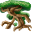

# { .sprite } Broxwood

| Stat | Value |
|---|---|
| Class | construct |
| HP | 225 |
| Max AP | 10 |
| Attack cost | 5 |
| Move cost | 7 |
| Damage | 20 to 25 |
| Attack chance | 170 |
| Block chance | 229 |
| Damage resistance | 10 |
| Critical skill | 10 |
| Critical multiplier | 3.0 |

!!! note "Immune to critical hits"
    Monsters of this class cannot be critically hit.

## Drops

| Item | Chance | Qty |
|---|---|---|
| [Small tree branch](../items/small_tree_branch.md) | 65% | 1 |
| [Gold coins](../items/gold.md) | 166.667% | 5 to 7 |
| [Rotten apple](../items/rotten_apple.md) | 300% | 1 to 2 |

## Found on

- [sullengard_woods10](../maps/sullengard_woods10.md)
- [sullengard_woods11](../maps/sullengard_woods11.md)
- [sullengard_woods12](../maps/sullengard_woods12.md)
- [sullengard_woods13](../maps/sullengard_woods13.md)
- [sullengard_woods14](../maps/sullengard_woods14.md)
- [sullengard_woods2](../maps/sullengard_woods2.md)
- [sullengard_woods3](../maps/sullengard_woods3.md)
- [sullengard_woods4](../maps/sullengard_woods4.md)
- [sullengard_woods5](../maps/sullengard_woods5.md)
- [sullengard_woods6](../maps/sullengard_woods6.md)
- [sullengard_woods7](../maps/sullengard_woods7.md)
- [sullengard_woods9](../maps/sullengard_woods9.md)

<small>Monster ID: `broxwood` · Data from v0.8.18</small>
