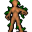

# { .sprite } Ancient branchtender

**Found in:** [Lodar 15](../maps/lodar15.md)

<div class="infobox" markdown>

<p class="ib-img"></p>

| | |
|---|---|
| **Type** | Enemy (hostile on sight) |
| **Found in** | Lodar 15 |
| **Class** | Humanoid |
| **HP** | 253 |
| **XP when defeated** | 490 |
| **Introduced** | v0.7.0 or earlier |

</div>

## Combat

| | |
|---|---|
| Class | Humanoid |
| HP | 253 |
| XP when defeated | 490 |
| Damage | 7 to 11 |
| AC | 155 |
| BC | 90 |
| DR | 7 |
| Attacks per turn | 2 (5 AP each, 10 AP) |
| Crit chance | none |

**Its hits:** On target: [Bleeding wound](../conditions/bleeding_wound.md) (magnitude 1, 5 rounds, 20% chance)


<p class="verified">Verified against v0.8.18 monster data.</p>

## Drops

| Item | Chance | Qty |
|---|---|---|
| [Oegyth crystal](../items/oegyth.md) | 100% | 1 |

## Locations

| Map | Region | Up to | Notes |
|---|---|---|---|
| [Lodar 15](../maps/lodar15.md) | – | 1 | – |


## Version history

| Version | Change |
|---|---|
| [v0.7.0](../versions/0.7.0.md) | Present in v0.7.0 (earliest release tracked) |
| [v0.7.2](../versions/0.7.2.md) | On hit, condition on target: [Bleeding wound](../conditions/bleeding_wound.md) (magnitude 1, 5 rounds, 20% chance) → (magnitude 1, 5 rounds, 20% chance) |

<p class="verified">Verified against v0.8.18 and every earlier release back to v0.7.0 (game data compared release by release).</p>


## Behind the scenes

*How the game data handles this character. Not needed for playing.*

??? info "How the XP value is calculated"

    The game computes each enemy's experience value when it loads the data (`MonsterTypeParser.java`):

    XP = ⌈(attacks per turn × attack chance × average damage × (1 + critical skill × critical multiplier) × 3 + HP × (1 + block chance) + 9 × damage resistance) × 0.7⌉

    Percentages are used as fractions (e.g. 60% = 0.6). Enemies whose attacks inflict a condition are worth 50 XP more. The More Exp skill adds a percentage on top.

??? info "Technical information"

    | | |
    |---|---|
    | Entry ID | `brtender_cr` |
    | Type (wiki) | Enemy |
    | Spawn group | `brtender_cr` |
    | Loot table | `oegyth1` |
    | Conversation | – |
    | Faction | – |
    | Movement | – |
    | Icon | `monsters_ld2:153` |
    | Defined in | `res/raw/monsterlist_v070_lodarmaze.json` |

    Raw data:

    ```json
    {
     "id": "brtender_cr",
     "name": "Ancient branchtender",
     "iconID": "monsters_ld2:153",
     "maxHP": 253,
     "moveCost": 5,
     "unique": 1,
     "attackDamage": {
      "min": 7,
      "max": 11
     },
     "droplistID": "oegyth1",
     "attackCost": 5,
     "attackChance": 155,
     "blockChance": 90,
     "damageResistance": 7,
     "hitEffect": {
      "conditionsTarget": [
       {
        "condition": "bleeding_wound",
        "magnitude": 1,
        "duration": 5,
        "chance": "20"
       }
      ]
     }
    }
    ```


## Community notes

<small>Written by players, not generated from game data. **Observations**: what players notice in-game · **Lore**: the in-world story · **Trivia**: real-world facts, references, development history · **Theory / speculation**: unconfirmed ideas; may just be unfinished content</small>

### Observations

*No notes yet. Contributions are welcome: [add a note](https://github.com/asdfghjkl628/Andor-s-Trail-Wikiiii/new/main/notes/monsters?filename=brtender_cr.md&value=%23%23%20Observations%0A%0A%3C%21--%20what%20players%20notice%20in-game%20--%3E%0A%0A%23%23%20Lore%0A%0A%3C%21--%20the%20in-world%20story%20--%3E%0A%0A%23%23%20Trivia%0A%0A%3C%21--%20real-world%20facts%2C%20references%2C%20development%20history%20--%3E%0A%0A%23%23%20Theory%20/%20speculation%0A%0A%3C%21--%20unconfirmed%20ideas%3B%20may%20just%20be%20unfinished%20content%20--%3E%0A).*

### Lore

*No notes yet. Contributions are welcome: [add a note](https://github.com/asdfghjkl628/Andor-s-Trail-Wikiiii/new/main/notes/monsters?filename=brtender_cr.md&value=%23%23%20Observations%0A%0A%3C%21--%20what%20players%20notice%20in-game%20--%3E%0A%0A%23%23%20Lore%0A%0A%3C%21--%20the%20in-world%20story%20--%3E%0A%0A%23%23%20Trivia%0A%0A%3C%21--%20real-world%20facts%2C%20references%2C%20development%20history%20--%3E%0A%0A%23%23%20Theory%20/%20speculation%0A%0A%3C%21--%20unconfirmed%20ideas%3B%20may%20just%20be%20unfinished%20content%20--%3E%0A).*

### Trivia

*No notes yet. Contributions are welcome: [add a note](https://github.com/asdfghjkl628/Andor-s-Trail-Wikiiii/new/main/notes/monsters?filename=brtender_cr.md&value=%23%23%20Observations%0A%0A%3C%21--%20what%20players%20notice%20in-game%20--%3E%0A%0A%23%23%20Lore%0A%0A%3C%21--%20the%20in-world%20story%20--%3E%0A%0A%23%23%20Trivia%0A%0A%3C%21--%20real-world%20facts%2C%20references%2C%20development%20history%20--%3E%0A%0A%23%23%20Theory%20/%20speculation%0A%0A%3C%21--%20unconfirmed%20ideas%3B%20may%20just%20be%20unfinished%20content%20--%3E%0A).*

### Theory / speculation

*No notes yet. Contributions are welcome: [add a note](https://github.com/asdfghjkl628/Andor-s-Trail-Wikiiii/new/main/notes/monsters?filename=brtender_cr.md&value=%23%23%20Observations%0A%0A%3C%21--%20what%20players%20notice%20in-game%20--%3E%0A%0A%23%23%20Lore%0A%0A%3C%21--%20the%20in-world%20story%20--%3E%0A%0A%23%23%20Trivia%0A%0A%3C%21--%20real-world%20facts%2C%20references%2C%20development%20history%20--%3E%0A%0A%23%23%20Theory%20/%20speculation%0A%0A%3C%21--%20unconfirmed%20ideas%3B%20may%20just%20be%20unfinished%20content%20--%3E%0A).*


<small>Data from v0.8.18</small>
