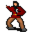

# { .sprite } Os

<div class="infobox" markdown>

<p class="ib-img">{ .sprite }</p>

| | |
|---|---|
| **Monster ID** | `brute_creator` |
| **Type** | NPC |
| **Class** | ? |
| **HP** | 1 |
| **Found in** | mountainlake8_cave |
| **Introduced** | [v0.8.11](../versions/0.8.11.md) |

</div>

## Combat stats

| Stat | Value |
|---|---|
| HP | 1 |
| Damage | 0 |
| Attack chance | 0 |
| Block chance | 0 |
| Damage resistance | 0 |
| Max AP | 10 |
| Attack cost | 10 AP |
| Attacks per turn | 1 |
| Move cost | 10 AP |
| Critical skill | 0 |
| Critical multiplier | – |
| Crit chance | none (needs critical skill and a multiplier) |

**XP formula** (from the game's loader): ⌈(attacks per turn × attack chance × average damage × (1 + critical skill × multiplier) × 3 + HP × (1 + block chance) + 9 × damage resistance) × 0.7⌉, +50 if its hits inflict a condition. More Exp adds a percentage on top.

<p class="verified">Verified against v0.8.18 monster data and game code (`MonsterTypeParser.java`).</p>


## Locations

| Map | Region | Up to | Notes |
|---|---|---|---|
| [mountainlake8_cave](../maps/mountainlake8_cave.md) | – | 1 | – |


## Quests

- [Brutes](../quests/brute_creator.md): stages 40

## Dialogue simulator

Set up your situation (quest stages, items, kills…), then talk to Os. The simulator follows the game's own rules: it takes the same silent checks, offers only the options you'd really see, and applies their effects (quest stages, items handed over, rewards) as you go.

<div class="dlg-sim" data-src="../../assets/dialogue/brute_creator.json" data-npc="Os" markdown="0"><noscript>The simulator needs JavaScript. The full dialogue is listed below.</noscript></div>

<p class="verified">Rules verified against v0.8.18 game code (ConversationController.java) and dialogue data.</p>

??? quote "Dialogue (14 lines)"

    *What the dialogue says, exactly as in the game files. Lines are listed once; links jump to the line a choice leads to.*

    <span id="d-brute_creator"></span>**`brute_creator`** Os: “Oh, a visitor. How unusual. Come in, come in. I am Os.”

    - “Hi, I am $playername. Glad to meet you.” → [brute_creator_2](#d-brute_creator_2)

    <span id="d-brute_creator_2"></span>**`brute_creator_2`** Os: “You certainly want to know everything about these brutes outside.”

    - “Do I?” → [brute_creator_10](#d-brute_creator_10)
    - “Well, if you say so ...” → [brute_creator_10](#d-brute_creator_10)
    - “Yes. Fascinating beings they are.” → [brute_creator_4](#d-brute_creator_4)

    <span id="d-brute_creator_10"></span>**`brute_creator_10`** Os: “Here in my laboratory you can see the latest research on brutes.”

    - “You are exploring brutes?” → [brute_creator_20](#d-brute_creator_20)

    <span id="d-brute_creator_4"></span>**`brute_creator_4`** Os: “Indeed. And you are talking to the leading expert in these matters who is still alive.”

    - “These 'matters' tend to run around and get in my way.” → [brute_creator_6](#d-brute_creator_6)

    <span id="d-brute_creator_20"></span>**`brute_creator_20`** Os: “Exploring? Well, no. I am far more gone already.”

    - Next → [brute_creator_22](#d-brute_creator_22)

    <span id="d-brute_creator_6"></span>**`brute_creator_6`** Os: “Yes, they love to do so. Aren't they adorable?”

    - “Ehh ...” → [brute_creator_10](#d-brute_creator_10)

    <span id="d-brute_creator_22"></span>**`brute_creator_22`** Os: “'Creating' fits better. Best I'll show you.”

    - “Oh dear!” → [brute_creator_24](#d-brute_creator_24)

    <span id="d-brute_creator_24"></span>**`brute_creator_24`** Os: “Of course I can't explain too much to you. Otherwise my ideas would soon be stolen.”

    - “That is understandable.” → [brute_creator_30](#d-brute_creator_30)
    - “Do I look like a thief?” *(if NOT reached stage 40 of [Night visit](../quests/farrik.md#stage-40))* → [brute_creator_26](#d-brute_creator_26)
    - “Do I look like a thief?” *(if reached stage 40 of [Night visit](../quests/farrik.md#stage-40))* → [brute_creator_28](#d-brute_creator_28)

    <span id="d-brute_creator_30"></span>**`brute_creator_30`** Os: “I'll just say that my brutes evolve from rats. There are too many of them anyway.” — **effects:** sets stage 40 of [Brutes](../quests/brute_creator.md#stage-40)

    - “That's true.” → [brute_creator_32](#d-brute_creator_32)

    <span id="d-brute_creator_26"></span>**`brute_creator_26`** Os: “Honestly? Yes you do.”

    - “Hmph.” → [brute_creator_30](#d-brute_creator_30)

    <span id="d-brute_creator_28"></span>**`brute_creator_28`** Os: “Indeed no. But better safe than sorry.”

    - “Right.” → [brute_creator_30](#d-brute_creator_30)

    <span id="d-brute_creator_32"></span>**`brute_creator_32`** Os: “This was a triumph, a huge success!”

    - “Thank you for telling me all this.” → [brute_creator_40](#d-brute_creator_40)

    <span id="d-brute_creator_40"></span>**`brute_creator_40`** Os: “Now I have to work again.”

    - “Be glad. May I visit your laboratory?” → [brute_creator_42](#d-brute_creator_42)

    <span id="d-brute_creator_42"></span>**`brute_creator_42`** Os: “You're welcome to look around a little. But don't enter the Brute Bake rooms.”

    - “Sure, I want to stay alive after all.” → *conversation ends*


## Version history

| Version | Change |
|---|---|
| [v0.8.11](../versions/0.8.11.md) | Added<br>Dialogue: 14 lines added |

<p class="verified">Verified against v0.8.18 and every earlier release back to v0.7.0 (game data compared release by release).</p>


## Community notes

<small>Written by players, not generated from game data. **Observations**: what players notice in-game · **Lore**: the in-world story · **Trivia**: real-world facts, references, development history · **Theory / speculation**: unconfirmed ideas; may just be unfinished content</small>

### Observations

*Nothing here yet. Know something? [Add it](https://github.com/asdfghjkl628/Andor-s-Trail-Wikiiii/new/main/notes/monsters?filename=brute_creator.md&value=%23%23%20Observations%0A%0A%3C%21--%20what%20players%20notice%20in-game%20--%3E%0A%0A%23%23%20Lore%0A%0A%3C%21--%20the%20in-world%20story%20--%3E%0A%0A%23%23%20Trivia%0A%0A%3C%21--%20real-world%20facts%2C%20references%2C%20development%20history%20--%3E%0A%0A%23%23%20Theory%20/%20speculation%0A%0A%3C%21--%20unconfirmed%20ideas%3B%20may%20just%20be%20unfinished%20content%20--%3E%0A).*

### Lore

*Nothing here yet. Know something? [Add it](https://github.com/asdfghjkl628/Andor-s-Trail-Wikiiii/new/main/notes/monsters?filename=brute_creator.md&value=%23%23%20Observations%0A%0A%3C%21--%20what%20players%20notice%20in-game%20--%3E%0A%0A%23%23%20Lore%0A%0A%3C%21--%20the%20in-world%20story%20--%3E%0A%0A%23%23%20Trivia%0A%0A%3C%21--%20real-world%20facts%2C%20references%2C%20development%20history%20--%3E%0A%0A%23%23%20Theory%20/%20speculation%0A%0A%3C%21--%20unconfirmed%20ideas%3B%20may%20just%20be%20unfinished%20content%20--%3E%0A).*

### Trivia

*Nothing here yet. Know something? [Add it](https://github.com/asdfghjkl628/Andor-s-Trail-Wikiiii/new/main/notes/monsters?filename=brute_creator.md&value=%23%23%20Observations%0A%0A%3C%21--%20what%20players%20notice%20in-game%20--%3E%0A%0A%23%23%20Lore%0A%0A%3C%21--%20the%20in-world%20story%20--%3E%0A%0A%23%23%20Trivia%0A%0A%3C%21--%20real-world%20facts%2C%20references%2C%20development%20history%20--%3E%0A%0A%23%23%20Theory%20/%20speculation%0A%0A%3C%21--%20unconfirmed%20ideas%3B%20may%20just%20be%20unfinished%20content%20--%3E%0A).*

### Theory / speculation

*Nothing here yet. Know something? [Add it](https://github.com/asdfghjkl628/Andor-s-Trail-Wikiiii/new/main/notes/monsters?filename=brute_creator.md&value=%23%23%20Observations%0A%0A%3C%21--%20what%20players%20notice%20in-game%20--%3E%0A%0A%23%23%20Lore%0A%0A%3C%21--%20the%20in-world%20story%20--%3E%0A%0A%23%23%20Trivia%0A%0A%3C%21--%20real-world%20facts%2C%20references%2C%20development%20history%20--%3E%0A%0A%23%23%20Theory%20/%20speculation%0A%0A%3C%21--%20unconfirmed%20ideas%3B%20may%20just%20be%20unfinished%20content%20--%3E%0A).*


??? info "Technical information"

    | | |
    |---|---|
    | Monster ID | `brute_creator` |
    | Spawn group | `brute_creator` |
    | Loot table | – |
    | Conversation | `brute_creator` |
    | Faction | – |
    | Movement | – |
    | Icon | `monsters_ld1:113` |
    | Defined in | `res/raw/monsterlist_laeroth.json` |

    Raw data:

    ```json
    {
     "id": "brute_creator",
     "name": "Os",
     "iconID": "monsters_ld1:113",
     "spawnGroup": "brute_creator",
     "phraseID": "brute_creator"
    }
    ```


<small>Data from v0.8.18</small>
