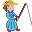

# { .sprite } Bidro

**Where to find Bidro:** [Mountainlake 11](../maps/mountainlake11.md#pin-npc-brute_fisherman)

<div class="infobox" markdown>

<p class="ib-img">{ .sprite }</p>

| | |
|---|---|
| **Type** | NPC (can be spoken to; cannot be attacked) |
| **Role** | Starts [Brutes](../quests/brute_creator.md) |
| **Found in** | Mountainlake 11 |
| **Entry ID** | `brute_fisherman` |
| **Introduced** | [v0.8.11](../versions/0.8.11.md) |

</div>

## Quests

- [Brutes](../quests/brute_creator.md): stages 10, 20, 35, 90

## Dialogue simulator

Set your quest stages and items, then talk to Bidro. Same rules as the game: same checks, same options, same effects.

<div class="dlg-sim" data-src="../../assets/dialogue/brute_fisherman.json" data-npc="Bidro" markdown="0"><noscript>The simulator needs JavaScript. The full dialogue is listed below.</noscript></div>

<p class="verified">Rules verified against v0.8.18 game code (ConversationController.java) and dialogue data.</p>

??? quote "Dialogue (27 lines)"

    *Exactly as in the game files. Each line appears once; links jump to where a choice leads.*

    <span id="d-brute_fisherman"></span>**`brute_fisherman`** Bidro: “Hush.”

    - “[low voice] Oh hi, caught anything already?” → [brute_fisherman](#d-brute_fisherman)
    - “You don't seem to be used to people coming over here.” *(if NOT reached stage 10 of [Brutes](../quests/brute_creator.md#stage-10))* → [brute_fisherman_2](#d-brute_fisherman_2)
    - “About the few people who come this way ...” *(if reached stage 10 of [Brutes](../quests/brute_creator.md#stage-10); NOT reached stage 30 of [Brutes](../quests/brute_creator.md#stage-30))* → [brute_fisherman_10](#d-brute_fisherman_10)
    - “About the monsters along the way here ...” *(if reached stage 20 of [Brutes](../quests/brute_creator.md#stage-20); NOT reached stage 30 of [Brutes](../quests/brute_creator.md#stage-30))* → [brute_fisherman_20](#d-brute_fisherman_20)
    - “I saw something extremely strange.” *(if reached stage 30 of [Brutes](../quests/brute_creator.md#stage-30); NOT reached stage 35 of [Brutes](../quests/brute_creator.md#stage-35))* → [brute_fisherman_30](#d-brute_fisherman_30)
    - “Hi again. Any news?” *(if reached stage 35 of [Brutes](../quests/brute_creator.md#stage-35); NOT reached stage 40 of [Brutes](../quests/brute_creator.md#stage-40))* → [brute_fisherman_35](#d-brute_fisherman_35)
    - “Hi again. Any news?” *(if reached stage 35 of [Brutes](../quests/brute_creator.md#stage-35); reached stage 40 of [Brutes](../quests/brute_creator.md#stage-40); NOT reached stage 90 of [Brutes](../quests/brute_creator.md#stage-90))* → [brute_fisherman_40](#d-brute_fisherman_40)
    - “Hi Bidro.” *(if reached stage 90 of [Brutes](../quests/brute_creator.md#stage-90))* → [brute_fisherman_90](#d-brute_fisherman_90)

    <span id="d-brute_fisherman_2"></span>**`brute_fisherman_2`** Bidro: “Sigh. OK, let's talk. The fish have already fled anyway.”

    - Next → [brute_fisherman_4](#d-brute_fisherman_4)

    <span id="d-brute_fisherman_10"></span>**`brute_fisherman_10`** Bidro: “So what's stopping people from using the route?” — **effects:** sets stage 10 of [Brutes](../quests/brute_creator.md#stage-10)

    - “I will find out and tell you.” → *conversation ends*
    - “That's easy to say. I went that route recently after all.” → [brute_fisherman_20](#d-brute_fisherman_20)
    - “That's none of my concern.” → *conversation ends*
    - “Did you see my brother Andor lately? He looks a bit like me.” → [brute_fisherman_12](#d-brute_fisherman_12)

    <span id="d-brute_fisherman_20"></span>**`brute_fisherman_20`** Bidro: “Have you been able to find out why the path is rarely used anymore?” — **effects:** sets stage 20 of [Brutes](../quests/brute_creator.md#stage-20)

    - “Yes. There are many vicious monsters such as wolves or poisonous spiders. But Arulir and different brutes in…” → [brute_fisherman_24](#d-brute_fisherman_24)
    - “It's a long and boring road. Simply because of that.” → [brute_fisherman_22](#d-brute_fisherman_22)

    <span id="d-brute_fisherman_30"></span>**`brute_fisherman_30`** Bidro: “Ohh! Do not keep me in suspense.”

    - “I have discovered a cave where brutes seem to pour out.” → [brute_fisherman_32](#d-brute_fisherman_32)
    - “I have discovered a cave, but I don't know what's inside.” → [brute_fisherman_24](#d-brute_fisherman_24)

    <span id="d-brute_fisherman_35"></span>**`brute_fisherman_35`** Bidro: “Please find out what's in the cave. Then I can tell my wife a good story in the evening.”


    <span id="d-brute_fisherman_40"></span>**`brute_fisherman_40`** Bidro: “Finally tell - what was so exciting in the cave?”

    - “All the brutes along the coast actually come from this cave.” → [brute_fisherman_41](#d-brute_fisherman_41)

    <span id="d-brute_fisherman_90"></span>**`brute_fisherman_90`** Bidro: “Now I know where these brutes suddenly come from.”

    - Next → [brute_fisherman_92](#d-brute_fisherman_92)

    <span id="d-brute_fisherman_4"></span>**`brute_fisherman_4`** Bidro: “Well yes, you're right. There was a time when this path was almost crowded.”

    - “Really?” → [brute_fisherman_5](#d-brute_fisherman_5)

    <span id="d-brute_fisherman_12"></span>**`brute_fisherman_12`** Bidro: “Well, yes indeed.”

    - “Great - when was it?” → [brute_fisherman_14](#d-brute_fisherman_14)

    <span id="d-brute_fisherman_24"></span>**`brute_fisherman_24`** Bidro: “Please go and take a closer look. There must be more to it.”


    <span id="d-brute_fisherman_22"></span>**`brute_fisherman_22`** Bidro: “Yes, it has always been long.”

    - Next → [brute_fisherman_24](#d-brute_fisherman_24)

    <span id="d-brute_fisherman_32"></span>**`brute_fisherman_32`** Bidro: “Oh interesting. What did you find in the cave?” — **effects:** sets stage 35 of [Brutes](../quests/brute_creator.md#stage-35)

    - “It was full of monsters. I didn't dare go in deeper.” *(if NOT reached stage 40 of [Brutes](../quests/brute_creator.md#stage-40))* → [brute_fisherman_35](#d-brute_fisherman_35)
    - “It was full of monsters. But that wasn't everything.” *(if reached stage 40 of [Brutes](../quests/brute_creator.md#stage-40))* → [brute_fisherman_40](#d-brute_fisherman_40)
    - “Nothing special, why?” → [brute_fisherman_24](#d-brute_fisherman_24)

    <span id="d-brute_fisherman_41"></span>**`brute_fisherman_41`** Bidro: “No!”

    - “Yes, I saw it with my own eyes.” → [brute_fisherman_42](#d-brute_fisherman_42)

    <span id="d-brute_fisherman_92"></span>**`brute_fisherman_92`** Bidro: “My wife will love this story!”

    - Next → [brute_fisherman_94](#d-brute_fisherman_94)

    <span id="d-brute_fisherman_5"></span>**`brute_fisherman_5`** Bidro: “It's hard to imagine now. I'm not used to people coming here anymore.”

    - Next → [brute_fisherman_6](#d-brute_fisherman_6)

    <span id="d-brute_fisherman_14"></span>**`brute_fisherman_14`** Bidro: “I don't know. Here it is one day like another.”

    - “Doesn't help me much.” → [brute_fisherman_16](#d-brute_fisherman_16)

    <span id="d-brute_fisherman_42"></span>**`brute_fisherman_42`** Bidro: “But how can that be?”

    - “I have talked to Os. He claims to be a researcher who turns rats into these brutes to study them.” → [brute_fisherman_44](#d-brute_fisherman_44)

    <span id="d-brute_fisherman_94"></span>**`brute_fisherman_94`** Bidro: “... and won't believe a word I say.”


    <span id="d-brute_fisherman_6"></span>**`brute_fisherman_6`** Bidro: “But I want to introduce myself first. My name is Bidro, I live in Remgard.”

    - “Nice to meet you. I am $playername. Ehm, may I ask you a question?” → [brute_fisherman_7](#d-brute_fisherman_7)

    <span id="d-brute_fisherman_16"></span>**`brute_fisherman_16`** Bidro: “If he comes by again, I'll tell him that you asked about him.”

    - “Fine.” → [brute_fisherman_10](#d-brute_fisherman_10)

    <span id="d-brute_fisherman_44"></span>**`brute_fisherman_44`** Bidro: “Really? Very amazing!”

    - “I don't understand how he does it exactly, but the rats become these brutes in several stages.” → [brute_fisherman_46](#d-brute_fisherman_46)

    <span id="d-brute_fisherman_7"></span>**`brute_fisherman_7`** Bidro: “Sure, just ask.”

    - “From a distance I would have thought you were a woman. Why are you wearing women's clothes?” → [brute_fisherman_7b](#d-brute_fisherman_7b)

    <span id="d-brute_fisherman_46"></span>**`brute_fisherman_46`** Bidro: “Stages? What do you mean?”

    - “There are several bake rooms where the animals take on an even more hideous appearance. Until they finally come out of…” → [brute_fisherman_50](#d-brute_fisherman_50)

    <span id="d-brute_fisherman_7b"></span>**`brute_fisherman_7b`** Bidro: “Because I can. Period, no discussion.”

    - “Oh, your sensitive spot, sorry. Let us talk about something else.” → [brute_fisherman_8](#d-brute_fisherman_8)

    <span id="d-brute_fisherman_50"></span>**`brute_fisherman_50`** Bidro: “Wow, what a great story!” — **effects:** sets stage 90 of [Brutes](../quests/brute_creator.md#stage-90)

    - Next → [brute_fisherman_90](#d-brute_fisherman_90)

    <span id="d-brute_fisherman_8"></span>**`brute_fisherman_8`** Bidro: “You just came using this path. Do you know why it's been used so little lately?”

    - “Well, yes, I think so.” → [brute_fisherman_10](#d-brute_fisherman_10)


## Version history

| Version | Change |
|---|---|
| [v0.8.11](../versions/0.8.11.md) | Added<br>Dialogue: 27 lines added |
| [v0.8.12.1](../versions/0.8.12.1.md) | Dialogue: 1 line changed<br>· text: “You just came this path. Do you know why it's been used so little lat…” → “You just came using this path. Do you know why it's been used so litt…” |

<p class="verified">Verified against v0.8.18 and every earlier release back to v0.7.0 (game data compared release by release).</p>


??? info "Technical information"

    | | |
    |---|---|
    | Entry ID | `brute_fisherman` |
    | Spawn group | `brute_fisherman` |
    | Loot table | – |
    | Conversation | `brute_fisherman` |
    | Faction | – |
    | Movement | – |
    | Icon | `monsters_phoenix01:3` |
    | Defined in | `res/raw/monsterlist_laeroth.json` |

    Raw data:

    ```json
    {
     "id": "brute_fisherman",
     "name": "Bidro",
     "iconID": "monsters_phoenix01:3",
     "monsterClass": "humanoid",
     "spawnGroup": "brute_fisherman",
     "phraseID": "brute_fisherman"
    }
    ```


## Community notes

<small>Written by players, not generated from game data. **Observations**: what players notice in-game · **Lore**: the in-world story · **Trivia**: real-world facts, references, development history · **Theory / speculation**: unconfirmed ideas; may just be unfinished content</small>

### Observations

*No notes yet. Contributions are welcome: [add a note](https://github.com/asdfghjkl628/Andor-s-Trail-Wikiiii/new/main/notes/monsters?filename=brute_fisherman.md&value=%23%23%20Observations%0A%0A%3C%21--%20what%20players%20notice%20in-game%20--%3E%0A%0A%23%23%20Lore%0A%0A%3C%21--%20the%20in-world%20story%20--%3E%0A%0A%23%23%20Trivia%0A%0A%3C%21--%20real-world%20facts%2C%20references%2C%20development%20history%20--%3E%0A%0A%23%23%20Theory%20/%20speculation%0A%0A%3C%21--%20unconfirmed%20ideas%3B%20may%20just%20be%20unfinished%20content%20--%3E%0A).*

### Lore

*No notes yet. Contributions are welcome: [add a note](https://github.com/asdfghjkl628/Andor-s-Trail-Wikiiii/new/main/notes/monsters?filename=brute_fisherman.md&value=%23%23%20Observations%0A%0A%3C%21--%20what%20players%20notice%20in-game%20--%3E%0A%0A%23%23%20Lore%0A%0A%3C%21--%20the%20in-world%20story%20--%3E%0A%0A%23%23%20Trivia%0A%0A%3C%21--%20real-world%20facts%2C%20references%2C%20development%20history%20--%3E%0A%0A%23%23%20Theory%20/%20speculation%0A%0A%3C%21--%20unconfirmed%20ideas%3B%20may%20just%20be%20unfinished%20content%20--%3E%0A).*

### Trivia

*No notes yet. Contributions are welcome: [add a note](https://github.com/asdfghjkl628/Andor-s-Trail-Wikiiii/new/main/notes/monsters?filename=brute_fisherman.md&value=%23%23%20Observations%0A%0A%3C%21--%20what%20players%20notice%20in-game%20--%3E%0A%0A%23%23%20Lore%0A%0A%3C%21--%20the%20in-world%20story%20--%3E%0A%0A%23%23%20Trivia%0A%0A%3C%21--%20real-world%20facts%2C%20references%2C%20development%20history%20--%3E%0A%0A%23%23%20Theory%20/%20speculation%0A%0A%3C%21--%20unconfirmed%20ideas%3B%20may%20just%20be%20unfinished%20content%20--%3E%0A).*

### Theory / speculation

*No notes yet. Contributions are welcome: [add a note](https://github.com/asdfghjkl628/Andor-s-Trail-Wikiiii/new/main/notes/monsters?filename=brute_fisherman.md&value=%23%23%20Observations%0A%0A%3C%21--%20what%20players%20notice%20in-game%20--%3E%0A%0A%23%23%20Lore%0A%0A%3C%21--%20the%20in-world%20story%20--%3E%0A%0A%23%23%20Trivia%0A%0A%3C%21--%20real-world%20facts%2C%20references%2C%20development%20history%20--%3E%0A%0A%23%23%20Theory%20/%20speculation%0A%0A%3C%21--%20unconfirmed%20ideas%3B%20may%20just%20be%20unfinished%20content%20--%3E%0A).*


<small>Data from v0.8.18</small>
