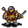

# { .sprite } Alvies

**Where to find Alvies:** Brimhaven: [Brimhaven brother 1 to 2](../maps/brimhaven_brother1_to_2.md#pin-npc-brv_alvies)

<div class="infobox" markdown>

<p class="ib-img">{ .sprite }</p>

| | |
|---|---|
| **Type** | NPC/Enemy (can be spoken to, but can also be fought) |
| **Found in** | Brimhaven |
| **Class** | Humanoid |
| **HP** | 60 |
| **XP when defeated** | 95 |
| **Entry ID** | `brv_alvies` |
| **Introduced** | [v0.7.11](../versions/0.7.11.md) |

</div>

!!! warning "Can be fought"
    This entry can be talked to, but it can also become an opponent: a conversation with this character can end in combat (a dialogue branch leads to a fight).

## Combat statistics

| Statistic | Value |
|---|---|
| Class | Humanoid |
| HP | 60 |
| XP when defeated | 95 |
| Damage | 2 to 12 |
| Attack chance | 80 |
| Block chance | 40 |
| Damage resistance | 2 |
| Max AP | 10 |
| Attack cost | 5 AP |
| Attacks per turn | 2 |
| Move cost | 5 AP |
| Critical skill | 0 |
| Critical multiplier | – |
| Critical hit chance | None (requires both critical skill and a critical multiplier) |


<p class="verified">Verified against v0.8.18 monster data and game code (`MonsterTypeParser.java`).</p>

## Drops

| Item | Chance | Qty |
|---|---|---|
| [Gold coins](../items/gold.md) | 100% | 10 to 100 |
| [Coin bag (with the name "Alkapoan" on it)](../items/brv_richmans_coin_bag.md) | 100% | 1 |

## Locations

| Map | Region | Up to | Notes |
|---|---|---|---|
| [Brimhaven brother 1 to 2](../maps/brimhaven_brother1_to_2.md) | Brimhaven | 1 | – |

## Quests

- [Much water](../quests/brv_flood.md): stages 20, 30, 50, 52, 70, 72, 120

## Dialogue simulator

Set your quest stages and items, then talk to Alvies. Same rules as the game: same checks, same options, same effects.

<div class="dlg-sim" data-src="../../assets/dialogue/brv_brothers_select.json" data-npc="Alvies" markdown="0"><noscript>The simulator needs JavaScript. The full dialogue is listed below.</noscript></div>

<p class="verified">Rules verified against v0.8.18 game code (ConversationController.java) and dialogue data.</p>

??? quote "Dialogue (11 lines)"

    *Exactly as in the game files. Each line appears once; links jump to where a choice leads.*

    <span id="d-brv_brothers_select"></span>**`brv_brothers_select`** *(silent check: the first matching branch below is taken)*

    - branch 1 *(if reached stage 56 of [Much water](../quests/brv_flood.md#stage-56))* → [brv_brothers_14](#d-brv_brothers_14)
    - branch 2 *(if reached stage 50 of [Much water](../quests/brv_flood.md#stage-50))* → [brv_brothers_13](#d-brv_brothers_13)
    - branch 3 *(if reached stage 30 of [Much water](../quests/brv_flood.md#stage-30))* → [brv_brothers_10](#d-brv_brothers_10)
    - branch 4 *(if reached stage 20 of [Much water](../quests/brv_flood.md#stage-20))* → [brv_brothers_8](#d-brv_brothers_8)
    - branch 5 → [brv_brothers_6](#d-brv_brothers_6)

    <span id="d-brv_brothers_14"></span>**`brv_brothers_14`** Alvies: “It's great how you destroyed the dam!”

    - “Can you tell me who is your boss?” *(if reached stage 110 of [Much water](../quests/brv_flood.md#stage-110))* → [brv_brothers_15](#d-brv_brothers_15)

    <span id="d-brv_brothers_13"></span>**`brv_brothers_13`** Alvies: “Go and destroy the dam.”


    <span id="d-brv_brothers_10"></span>**`brv_brothers_10`** Alvies: “Would you assist us in destroying the dam?” — **effects:** sets stage 30 of [Much water](../quests/brv_flood.md#stage-30), removes monsters from brimhaven1

    - “OK, I would like to help you destroy the dam.” → [brv_brothers_12](#d-brv_brothers_12)
    - “No, I will never do that!” → [brv_brothers_11](#d-brv_brothers_11)

    <span id="d-brv_brothers_8"></span>**`brv_brothers_8`** [Attohead](../monsters/brv_attohead.md): “[You accidently make a noise and they turn their heads towards you] Hey, what are you doing down here? No matter, we have to shut their mouth.”

    - Next → [brv_brothers_9](#d-brv_brothers_9)

    <span id="d-brv_brothers_6"></span>**`brv_brothers_6`** [Alvies](../monsters/brv_alvies.md): “[It seems they still have not seen you, because they have their backs turned to you.] Your way of destroying the dam will not work. Better that we use my idea.” — **effects:** sets stage 20 of [Much water](../quests/brv_flood.md#stage-20)

    - Next → [brv_brothers_7](#d-brv_brothers_7)

    <span id="d-brv_brothers_15"></span>**`brv_brothers_15`** Alvies: “We don't know him by name. He looked very rich and I think he lives in the western town alone in a big house.” — **effects:** sets stage 120 of [Much water](../quests/brv_flood.md#stage-120)


    <span id="d-brv_brothers_12"></span>**`brv_brothers_12`** Alvies: “To not attract attention the best way to destroy the dam would be to take this small axe. Use it at the weak point of the dam in the dry river bed.” — **effects:** sets stage 50 of [Much water](../quests/brv_flood.md#stage-50), sets stage 52 of [Much water](../quests/brv_flood.md#stage-52), gives 1× [Hand Axe](../items/hand_axe.md)


    <span id="d-brv_brothers_11"></span>**`brv_brothers_11`** Alvies: “Then we have to shut you up and do it ourselves.” — **effects:** faction “brv_brothers” set to -1, sets stage 70 of [Much water](../quests/brv_flood.md#stage-70), sets stage 72 of [Much water](../quests/brv_flood.md#stage-72)

    - “Let's fight!” → *fight starts*

    <span id="d-brv_brothers_9"></span>**`brv_brothers_9`** [Alvies](../monsters/brv_alvies.md): “Since they are already here, we could ask them to help us, if they want to save their life.”

    - Next → [brv_brothers_10](#d-brv_brothers_10)

    <span id="d-brv_brothers_7"></span>**`brv_brothers_7`** [Attohead](../monsters/brv_attohead.md): “Your idea to destroy the great Brimhaven dam? Are you kidding?”

    - Next → [brv_brothers_8](#d-brv_brothers_8)


## Version history

| Version | Change |
|---|---|
| [v0.7.11](../versions/0.7.11.md) | Added<br>Dialogue: 11 lines added |
| [v0.8.18](../versions/0.8.18.md) | Dialogue: 2 lines changed<br>· text: “Since he is already here, we could ask him if he will help us for sav…” → “Since they are already here, we could ask them to help us, if they wa…”<br>· text: “[You accidently make a noise and they turn their heads towards you] H…” → “[You accidently make a noise and they turn their heads towards you] H…” |

<p class="verified">Verified against v0.8.18 and every earlier release back to v0.7.0 (game data compared release by release).</p>


??? info "Technical information"

    | | |
    |---|---|
    | Entry ID | `brv_alvies` |
    | Spawn group | `brv_alvies` |
    | Loot table | `brv_brothers` |
    | Conversation | `brv_brothers_select` |
    | Faction | `brv_brothers` |
    | Movement | – |
    | Icon | `monsters_tometik7:47` |
    | Defined in | `res/raw/monsterlist_brimhaven.json` |

    Raw data:

    ```json
    {
     "id": "brv_alvies",
     "name": "Alvies",
     "iconID": "monsters_tometik7:47",
     "maxHP": 60,
     "moveCost": 5,
     "unique": 1,
     "monsterClass": "humanoid",
     "attackDamage": {
      "min": 2,
      "max": 12
     },
     "faction": "brv_brothers",
     "phraseID": "brv_brothers_select",
     "droplistID": "brv_brothers",
     "attackCost": 5,
     "attackChance": 80,
     "blockChance": 40,
     "damageResistance": 2
    }
    ```


??? info "How the XP value is calculated"

    The game computes each enemy's experience value when it loads the data (`MonsterTypeParser.java`):

    XP = ⌈(attacks per turn × attack chance × average damage × (1 + critical skill × critical multiplier) × 3 + HP × (1 + block chance) + 9 × damage resistance) × 0.7⌉

    Percentages are used as fractions (e.g. 60% = 0.6). Enemies whose attacks inflict a condition are worth 50 XP more. The More Exp skill adds a percentage on top.


## Community notes

<small>Written by players, not generated from game data. **Observations**: what players notice in-game · **Lore**: the in-world story · **Trivia**: real-world facts, references, development history · **Theory / speculation**: unconfirmed ideas; may just be unfinished content</small>

### Observations

*No notes yet. Contributions are welcome: [add a note](https://github.com/asdfghjkl628/Andor-s-Trail-Wikiiii/new/main/notes/monsters?filename=brv_alvies.md&value=%23%23%20Observations%0A%0A%3C%21--%20what%20players%20notice%20in-game%20--%3E%0A%0A%23%23%20Lore%0A%0A%3C%21--%20the%20in-world%20story%20--%3E%0A%0A%23%23%20Trivia%0A%0A%3C%21--%20real-world%20facts%2C%20references%2C%20development%20history%20--%3E%0A%0A%23%23%20Theory%20/%20speculation%0A%0A%3C%21--%20unconfirmed%20ideas%3B%20may%20just%20be%20unfinished%20content%20--%3E%0A).*

### Lore

*No notes yet. Contributions are welcome: [add a note](https://github.com/asdfghjkl628/Andor-s-Trail-Wikiiii/new/main/notes/monsters?filename=brv_alvies.md&value=%23%23%20Observations%0A%0A%3C%21--%20what%20players%20notice%20in-game%20--%3E%0A%0A%23%23%20Lore%0A%0A%3C%21--%20the%20in-world%20story%20--%3E%0A%0A%23%23%20Trivia%0A%0A%3C%21--%20real-world%20facts%2C%20references%2C%20development%20history%20--%3E%0A%0A%23%23%20Theory%20/%20speculation%0A%0A%3C%21--%20unconfirmed%20ideas%3B%20may%20just%20be%20unfinished%20content%20--%3E%0A).*

### Trivia

*No notes yet. Contributions are welcome: [add a note](https://github.com/asdfghjkl628/Andor-s-Trail-Wikiiii/new/main/notes/monsters?filename=brv_alvies.md&value=%23%23%20Observations%0A%0A%3C%21--%20what%20players%20notice%20in-game%20--%3E%0A%0A%23%23%20Lore%0A%0A%3C%21--%20the%20in-world%20story%20--%3E%0A%0A%23%23%20Trivia%0A%0A%3C%21--%20real-world%20facts%2C%20references%2C%20development%20history%20--%3E%0A%0A%23%23%20Theory%20/%20speculation%0A%0A%3C%21--%20unconfirmed%20ideas%3B%20may%20just%20be%20unfinished%20content%20--%3E%0A).*

### Theory / speculation

*No notes yet. Contributions are welcome: [add a note](https://github.com/asdfghjkl628/Andor-s-Trail-Wikiiii/new/main/notes/monsters?filename=brv_alvies.md&value=%23%23%20Observations%0A%0A%3C%21--%20what%20players%20notice%20in-game%20--%3E%0A%0A%23%23%20Lore%0A%0A%3C%21--%20the%20in-world%20story%20--%3E%0A%0A%23%23%20Trivia%0A%0A%3C%21--%20real-world%20facts%2C%20references%2C%20development%20history%20--%3E%0A%0A%23%23%20Theory%20/%20speculation%0A%0A%3C%21--%20unconfirmed%20ideas%3B%20may%20just%20be%20unfinished%20content%20--%3E%0A).*


<small>Data from v0.8.18</small>
