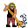

# { .sprite } Room service

<div class="infobox" markdown>

<p class="ib-img">{ .sprite }</p>

| | |
|---|---|
| **Monster ID** | `brv_cleaning` |
| **Type** | NPC |
| **Class** | ? |
| **HP** | 1 |
| **Found in** | Brimhaven |
| **Introduced** | [v0.7.11](../versions/0.7.11.md) |

</div>

## Combat stats

| Stat | Value |
|---|---|
| HP | 1 |
| Damage | 0 |
| Attack chance | 0 |
| Block chance | 0 |
| Damage resistance | 0 |
| Max AP | 10 |
| Attack cost | 10 AP |
| Attacks per turn | 1 |
| Move cost | 10 AP |
| Critical skill | 0 |
| Critical multiplier | – |
| Crit chance | none (needs critical skill and a multiplier) |

**XP formula** (from the game's loader): ⌈(attacks per turn × attack chance × average damage × (1 + critical skill × multiplier) × 3 + HP × (1 + block chance) + 9 × damage resistance) × 0.7⌉, +50 if its hits inflict a condition. More Exp adds a percentage on top.

<p class="verified">Verified against v0.8.18 monster data and game code (`MonsterTypeParser.java`).</p>


## Locations

| Map | Region | Up to | Notes |
|---|---|---|---|
| [brimhaven_inn_east](../maps/brimhaven_inn_east.md) | Brimhaven | 1 | – |


## Dialogue simulator

Set up your situation (quest stages, items, kills…), then talk to Room service. The simulator follows the game's own rules: it takes the same silent checks, offers only the options you'd really see, and applies their effects (quest stages, items handed over, rewards) as you go.

<div class="dlg-sim" data-src="../../assets/dialogue/brv_cleaning.json" data-npc="Room service" markdown="0"><noscript>The simulator needs JavaScript. The full dialogue is listed below.</noscript></div>

<p class="verified">Rules verified against v0.8.18 game code (ConversationController.java) and dialogue data.</p>

??? quote "Dialogue (7 lines)"

    *What the dialogue says, exactly as in the game files. Lines are listed once; links jump to the line a choice leads to.*

    <span id="d-brv_cleaning"></span>**`brv_cleaning`** *(silent check: the first matching branch below is taken)*

    - branch 1 *(if random chance (20%))* → [brv_cleaning_10](#d-brv_cleaning_10)
    - branch 2 *(if random chance (25%))* → [brv_cleaning_20](#d-brv_cleaning_20)
    - branch 3 *(if random chance (33%))* → [brv_cleaning_30](#d-brv_cleaning_30)
    - branch 4 *(if random chance (50%))* → [brv_cleaning_40](#d-brv_cleaning_40)
    - branch 5 → [brv_cleaning_50](#d-brv_cleaning_50)

    <span id="d-brv_cleaning_10"></span>**`brv_cleaning_10`** Room service: “Wipe your feet!”


    <span id="d-brv_cleaning_20"></span>**`brv_cleaning_20`** Room service: “[Muttering] Someday I will kill her ...”

    - “Whom do you want to kill?” → [brv_cleaning_22](#d-brv_cleaning_22)

    <span id="d-brv_cleaning_30"></span>**`brv_cleaning_30`** Room service: “Go away, I have work to do!”


    <span id="d-brv_cleaning_40"></span>**`brv_cleaning_40`** Room service: “All these guests are so very untidy!”


    <span id="d-brv_cleaning_50"></span>**`brv_cleaning_50`** Room service: “Only one more bed ...”


    <span id="d-brv_cleaning_22"></span>**`brv_cleaning_22`** Room service: “Oh, nothing - nothing at all.”


## Version history

| Version | Change |
|---|---|
| [v0.7.11](../versions/0.7.11.md) | Added<br>Dialogue: 7 lines added |

<p class="verified">Verified against v0.8.18 and every earlier release back to v0.7.0 (game data compared release by release).</p>


## Community notes

<small>Written by players, not generated from game data. **Observations**: what players notice in-game · **Lore**: the in-world story · **Trivia**: real-world facts, references, development history · **Theory / speculation**: unconfirmed ideas; may just be unfinished content</small>

### Observations

*Nothing here yet. Know something? [Add it](https://github.com/asdfghjkl628/Andor-s-Trail-Wikiiii/new/main/notes/monsters?filename=brv_cleaning.md&value=%23%23%20Observations%0A%0A%3C%21--%20what%20players%20notice%20in-game%20--%3E%0A%0A%23%23%20Lore%0A%0A%3C%21--%20the%20in-world%20story%20--%3E%0A%0A%23%23%20Trivia%0A%0A%3C%21--%20real-world%20facts%2C%20references%2C%20development%20history%20--%3E%0A%0A%23%23%20Theory%20/%20speculation%0A%0A%3C%21--%20unconfirmed%20ideas%3B%20may%20just%20be%20unfinished%20content%20--%3E%0A).*

### Lore

*Nothing here yet. Know something? [Add it](https://github.com/asdfghjkl628/Andor-s-Trail-Wikiiii/new/main/notes/monsters?filename=brv_cleaning.md&value=%23%23%20Observations%0A%0A%3C%21--%20what%20players%20notice%20in-game%20--%3E%0A%0A%23%23%20Lore%0A%0A%3C%21--%20the%20in-world%20story%20--%3E%0A%0A%23%23%20Trivia%0A%0A%3C%21--%20real-world%20facts%2C%20references%2C%20development%20history%20--%3E%0A%0A%23%23%20Theory%20/%20speculation%0A%0A%3C%21--%20unconfirmed%20ideas%3B%20may%20just%20be%20unfinished%20content%20--%3E%0A).*

### Trivia

*Nothing here yet. Know something? [Add it](https://github.com/asdfghjkl628/Andor-s-Trail-Wikiiii/new/main/notes/monsters?filename=brv_cleaning.md&value=%23%23%20Observations%0A%0A%3C%21--%20what%20players%20notice%20in-game%20--%3E%0A%0A%23%23%20Lore%0A%0A%3C%21--%20the%20in-world%20story%20--%3E%0A%0A%23%23%20Trivia%0A%0A%3C%21--%20real-world%20facts%2C%20references%2C%20development%20history%20--%3E%0A%0A%23%23%20Theory%20/%20speculation%0A%0A%3C%21--%20unconfirmed%20ideas%3B%20may%20just%20be%20unfinished%20content%20--%3E%0A).*

### Theory / speculation

*Nothing here yet. Know something? [Add it](https://github.com/asdfghjkl628/Andor-s-Trail-Wikiiii/new/main/notes/monsters?filename=brv_cleaning.md&value=%23%23%20Observations%0A%0A%3C%21--%20what%20players%20notice%20in-game%20--%3E%0A%0A%23%23%20Lore%0A%0A%3C%21--%20the%20in-world%20story%20--%3E%0A%0A%23%23%20Trivia%0A%0A%3C%21--%20real-world%20facts%2C%20references%2C%20development%20history%20--%3E%0A%0A%23%23%20Theory%20/%20speculation%0A%0A%3C%21--%20unconfirmed%20ideas%3B%20may%20just%20be%20unfinished%20content%20--%3E%0A).*


??? info "Technical information"

    | | |
    |---|---|
    | Monster ID | `brv_cleaning` |
    | Spawn group | `brv_cleaning` |
    | Loot table | – |
    | Conversation | `brv_cleaning` |
    | Faction | – |
    | Movement | – |
    | Icon | `monsters_fatboy73:6` |
    | Defined in | `res/raw/monsterlist_brimhaven.json` |

    Raw data:

    ```json
    {
     "id": "brv_cleaning",
     "name": "Room service",
     "iconID": "monsters_fatboy73:6",
     "phraseID": "brv_cleaning"
    }
    ```


<small>Data from v0.8.18</small>
