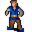

# { .sprite } Guest

**Where to find Guest:** [Brimhaven, Brimhaven inn east](#v-brv_inn_guest), [Brimhaven, Brimhaven tavern west](#v-brv_tavern_west_guest)

<div class="infobox" markdown>

<p class="ib-img">{ .sprite }</p>

| | |
|---|---|
| **Type** | NPC (talk only; never fought) |
| **Found in** | Brimhaven |
| **Introduced** | [v0.7.11](../versions/0.7.11.md) |

</div>

## Brimhaven, Brimhaven inn east { #v-brv_inn_guest }

**Where:** Brimhaven: [Brimhaven inn east](../maps/brimhaven_inn_east.md#pin-npc-brv_inn_guest)

### Dialogue simulator

Set your quest stages and items, then talk to Guest. Same rules as the game: same checks, same options, same effects.

<div class="dlg-sim" data-src="../../assets/dialogue/brv_inn_guest_0.json" data-npc="Guest" markdown="0"><noscript>The simulator needs JavaScript. The full dialogue is listed below.</noscript></div>

<p class="verified">Rules verified against v0.8.18 game code (ConversationController.java) and dialogue data.</p>

??? quote "Dialogue (1 lines)"

    *Exactly as in the game files. Each line appears once; links jump to where a choice leads.*

    <span id="d-brv_inn_guest-brv_inn_guest_0"></span>**`brv_inn_guest_0`** Guest: “Do you mind not bumping into me, kid. I've had a long day, and I don't need rude little children bumping into me.”

    - “Sorry.” → *conversation ends*
    - “Maybe it was you that bumped into me!” → *conversation ends*
    - “I'm a heavily armed little child, so maybe it's you that should not be rude to me!” → *conversation ends*


### Version history

| Version | Change |
|---|---|
| [v0.7.11](../versions/0.7.11.md) | Added<br>Dialogue: 1 line added |

<p class="verified">Verified against v0.8.18 and every earlier release back to v0.7.0 (game data compared release by release).</p>


## Brimhaven, Brimhaven tavern west { #v-brv_tavern_west_guest }

**Where:** Brimhaven: [Brimhaven tavern west](../maps/brimhaven_tavern_west.md#pin-npc-brv_tavern_west_guest)

### Dialogue simulator

Set your quest stages and items, then talk to Guest. Same rules as the game: same checks, same options, same effects.

<div class="dlg-sim" data-src="../../assets/dialogue/brv_tavern_west_guest.json" data-npc="Guest" markdown="0"><noscript>The simulator needs JavaScript. The full dialogue is listed below.</noscript></div>

<p class="verified">Rules verified against v0.8.18 game code (ConversationController.java) and dialogue data.</p>

??? quote "Dialogue (2 lines)"

    *Exactly as in the game files. Each line appears once; links jump to where a choice leads.*

    <span id="d-brv_tavern_west_guest-brv_tavern_west_guest"></span>**`brv_tavern_west_guest`** Guest: “Go away and let me eat.”

    - “I'm wondering, do you know anything about Lawellyn's death?” *(if reached stage 130 of [A strange looking dagger](../quests/brv_dagger.md#stage-130); NOT reached stage 200 of [A strange looking dagger](../quests/brv_dagger.md#stage-200); NOT reached stage 230 of [A strange looking dagger](../quests/brv_dagger.md#stage-230))* → [brv_tavern_west_guest_asd_inquiry_10](#d-brv_tavern_west_guest-brv_tavern_west_guest_asd_inquiry_10)

    <span id="d-brv_tavern_west_guest-brv_tavern_west_guest_asd_inquiry_10"></span>**`brv_tavern_west_guest_asd_inquiry_10`** Guest: “Lawellyn? I don't know any 'Lawellyn'. I'm just passing through town.”


### Version history

| Version | Change |
|---|---|
| [v0.7.11](../versions/0.7.11.md) | Added<br>Dialogue: 1 line added |
| [v0.7.12](../versions/0.7.12.md) | Dialogue: 1 line added, 1 line changed |

<p class="verified">Verified against v0.8.18 and every earlier release back to v0.7.0 (game data compared release by release).</p>


## Behind the scenes

*How the game data handles this character. Not needed for playing.*

**2 entries.** The game data defines 2 separate characters named Guest. The game makes a new entry whenever a character needs different behaviour (another conversation later in a quest, another place, other stats). Some are the same person at different points in the story; others just share a generic name. Here they differ in: conversation, location, appearance.

| Entry | Type | Section |
|---|---|---|
| `brv_inn_guest` | NPC | [Brimhaven, Brimhaven inn east](#v-brv_inn_guest) |
| `brv_tavern_west_guest` | NPC | [Brimhaven, Brimhaven tavern west](#v-brv_tavern_west_guest) |

??? info "Technical information: brv_inn_guest"

    | | |
    |---|---|
    | Entry ID | `brv_inn_guest` |
    | Type (wiki) | NPC |
    | Spawn group | `brv_inn_guest` |
    | Loot table | – |
    | Conversation | `brv_inn_guest_0` |
    | Faction | – |
    | Movement | – |
    | Icon | `monsters_ld1:132` |
    | Defined in | `res/raw/monsterlist_brimhaven.json` |

    Raw data:

    ```json
    {
     "id": "brv_inn_guest",
     "name": "Guest",
     "iconID": "monsters_ld1:132",
     "phraseID": "brv_inn_guest_0"
    }
    ```

??? info "Technical information: brv_tavern_west_guest"

    | | |
    |---|---|
    | Entry ID | `brv_tavern_west_guest` |
    | Type (wiki) | NPC |
    | Spawn group | `brv_tavern_west_guest` |
    | Loot table | – |
    | Conversation | `brv_tavern_west_guest` |
    | Faction | – |
    | Movement | – |
    | Icon | `monsters_ld1:231` |
    | Defined in | `res/raw/monsterlist_brimhaven.json` |

    Raw data:

    ```json
    {
     "id": "brv_tavern_west_guest",
     "name": "Guest",
     "iconID": "monsters_ld1:231",
     "unique": 1,
     "monsterClass": "humanoid",
     "spawnGroup": "brv_tavern_west_guest",
     "phraseID": "brv_tavern_west_guest"
    }
    ```


## Community notes

<small>Written by players, not generated from game data. **Observations**: what players notice in-game · **Lore**: the in-world story · **Trivia**: real-world facts, references, development history · **Theory / speculation**: unconfirmed ideas; may just be unfinished content</small>

### Observations

*No notes yet. Contributions are welcome: [add a note](https://github.com/asdfghjkl628/Andor-s-Trail-Wikiiii/new/main/notes/monsters?filename=brv_inn_guest.md&value=%23%23%20Observations%0A%0A%3C%21--%20what%20players%20notice%20in-game%20--%3E%0A%0A%23%23%20Lore%0A%0A%3C%21--%20the%20in-world%20story%20--%3E%0A%0A%23%23%20Trivia%0A%0A%3C%21--%20real-world%20facts%2C%20references%2C%20development%20history%20--%3E%0A%0A%23%23%20Theory%20/%20speculation%0A%0A%3C%21--%20unconfirmed%20ideas%3B%20may%20just%20be%20unfinished%20content%20--%3E%0A).*

### Lore

*No notes yet. Contributions are welcome: [add a note](https://github.com/asdfghjkl628/Andor-s-Trail-Wikiiii/new/main/notes/monsters?filename=brv_inn_guest.md&value=%23%23%20Observations%0A%0A%3C%21--%20what%20players%20notice%20in-game%20--%3E%0A%0A%23%23%20Lore%0A%0A%3C%21--%20the%20in-world%20story%20--%3E%0A%0A%23%23%20Trivia%0A%0A%3C%21--%20real-world%20facts%2C%20references%2C%20development%20history%20--%3E%0A%0A%23%23%20Theory%20/%20speculation%0A%0A%3C%21--%20unconfirmed%20ideas%3B%20may%20just%20be%20unfinished%20content%20--%3E%0A).*

### Trivia

*No notes yet. Contributions are welcome: [add a note](https://github.com/asdfghjkl628/Andor-s-Trail-Wikiiii/new/main/notes/monsters?filename=brv_inn_guest.md&value=%23%23%20Observations%0A%0A%3C%21--%20what%20players%20notice%20in-game%20--%3E%0A%0A%23%23%20Lore%0A%0A%3C%21--%20the%20in-world%20story%20--%3E%0A%0A%23%23%20Trivia%0A%0A%3C%21--%20real-world%20facts%2C%20references%2C%20development%20history%20--%3E%0A%0A%23%23%20Theory%20/%20speculation%0A%0A%3C%21--%20unconfirmed%20ideas%3B%20may%20just%20be%20unfinished%20content%20--%3E%0A).*

### Theory / speculation

*No notes yet. Contributions are welcome: [add a note](https://github.com/asdfghjkl628/Andor-s-Trail-Wikiiii/new/main/notes/monsters?filename=brv_inn_guest.md&value=%23%23%20Observations%0A%0A%3C%21--%20what%20players%20notice%20in-game%20--%3E%0A%0A%23%23%20Lore%0A%0A%3C%21--%20the%20in-world%20story%20--%3E%0A%0A%23%23%20Trivia%0A%0A%3C%21--%20real-world%20facts%2C%20references%2C%20development%20history%20--%3E%0A%0A%23%23%20Theory%20/%20speculation%0A%0A%3C%21--%20unconfirmed%20ideas%3B%20may%20just%20be%20unfinished%20content%20--%3E%0A).*


<small>Data from v0.8.18</small>
