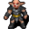

# { .sprite } Statue

**Where to find Statue:** [Brimhaven, Brimhaven school](#v-brv_school_statue), [Brimhaven, Brimhaven school](#v-brv_school_statue2)

<div class="infobox" markdown>

<p class="ib-img"></p>

| | |
|---|---|
| **Type** | NPC/Enemy (talks, but can also be fought) |
| **Found in** | Brimhaven |
| **Class** | Humanoid |
| **HP** | 320 |
| **XP when defeated** | 635 |
| **Introduced** | [v0.7.11](../versions/0.7.11.md) |

</div>

## Brimhaven, Brimhaven school { #v-brv_school_statue }

**Where:** Brimhaven: [Brimhaven school](../maps/brimhaven_school.md#pin-npc-brv_school_statue)

!!! note "A fight can start here"
    Answering “Now that's a worthy dueling partner at last!” starts a fight with [Statue](../monsters/brv_school_statue.md#v-brv_school_statue2).

### Quests

- [Lessons learned](../quests/brv_school2.md): stage 150
- [Brimhaven story flags 2 (hidden flag)](../quests/brv_nondisplay2.md): stage 30

### Dialogue simulator

Talk to Statue as you would in the game. When the conversation depends on your progress (a quest, an item, a dice roll…), the simulator asks you. Try another answer with **Undo**.

<div class="dlg-sim" data-src="../../assets/dialogue/brv_school_statue.json" data-npc="Statue" markdown="0"><noscript>The simulator needs JavaScript. The full dialogue is listed below.</noscript></div>

<p class="verified">Follows the game's own conversation rules (v0.8.18).</p>

??? quote "Dialogue (14 lines)"

    *Exactly as in the game files. Each line appears once; links jump to where a choice leads.*

    <span id="d-brv_school_statue-brv_school_statue"></span>**`brv_school_statue`** *(silent check: the first matching branch below is taken)*

    - branch 1 *(if reached stage 30 of [Brimhaven story flags 2 (hidden flag)](../quests/brv_nondisplay2.md#stage-30); NOT reached stage 100 of [Lessons learned](../quests/brv_school2.md#stage-100); NOT reached stage 102 of [Lessons learned](../quests/brv_school2.md#stage-102); NOT reached stage 104 of [Lessons learned](../quests/brv_school2.md#stage-104); NOT reached stage 120 of [Lessons learned](../quests/brv_school2.md#stage-120); NOT reached stage 122 of [Lessons learned](../quests/brv_school2.md#stage-122); NOT reached stage 124 of [Lessons learned](../quests/brv_school2.md#stage-124))* → [brv_school_statue_20](#d-brv_school_statue-brv_school_statue_20)
    - branch 2 → [brv_school_statue_10](#d-brv_school_statue-brv_school_statue_10)

    <span id="d-brv_school_statue-brv_school_statue_20"></span>**`brv_school_statue_20`** [Statue](../monsters/brv_school_statue.md): “Leave me alone! What do you want of me?” — **effects:** sets stage 30 of [Brimhaven story flags 2 (hidden flag)](../quests/brv_nondisplay2.md#stage-30)

    - “Oh, you can talk?” → [brv_school_statue_30](#d-brv_school_statue-brv_school_statue_30)

    <span id="d-brv_school_statue-brv_school_statue_10"></span>**`brv_school_statue_10`** [Dummy NPC](../monsters/none.md): “Who on earth puts such an ugly, hideous thing in a school?”

    - “Hey, I saw that! Your eyes sparkled!” *(if latest stage of [Lessons learned](../quests/brv_school2.md#stage-60) is 60)* → [brv_school_statue_12](#d-brv_school_statue-brv_school_statue_12)
    - “Am I mistaken or does the statue seem to be grinning?” *(if killed 1× [Teacher](../monsters/brv_teacher.md); killed 1× [Golin](../monsters/golin.md))* → *conversation ends*
    - “I had better leave it alone.” → *conversation ends*

    <span id="d-brv_school_statue-brv_school_statue_30"></span>**`brv_school_statue_30`** Statue: “Of course I can talk. Why should I not? I am at school after all.”

    - “I have no time for you now. I have to find a partner for dueling. Bye” → *conversation ends*
    - “What can you tell me about this school?” → [brv_school_statue_40](#d-brv_school_statue-brv_school_statue_40)

    <span id="d-brv_school_statue-brv_school_statue_12"></span>**`brv_school_statue_12`** Statue: “The statue shows no signs of movement.”

    - “I will keep an eye on you!” → *conversation ends*
    - “[Poke your finger in the belly of the statue]” → [brv_school_statue_20](#d-brv_school_statue-brv_school_statue_20)

    <span id="d-brv_school_statue-brv_school_statue_40"></span>**`brv_school_statue_40`** Statue: “I like it here. It is warm and the students love me. I am their mascot.”

    - Next → [brv_school_statue_42](#d-brv_school_statue-brv_school_statue_42)

    <span id="d-brv_school_statue-brv_school_statue_42"></span>**`brv_school_statue_42`** Statue: “I learn much about the Shadow, all very exciting.”

    - Next → [brv_school_statue_50](#d-brv_school_statue-brv_school_statue_50)

    <span id="d-brv_school_statue-brv_school_statue_50"></span>**`brv_school_statue_50`** Statue: “But you heard the teacher: You must go now and fight your duel.”

    - “You are right. Bye.” → *conversation ends*
    - “Which dueling partner would you recommend?” → [brv_school_statue_52](#d-brv_school_statue-brv_school_statue_52)

    <span id="d-brv_school_statue-brv_school_statue_52"></span>**`brv_school_statue_52`** Statue: “Take that cheeky boy in the front row. The others would be no match for you.”

    - “OK, it is Golin then.” → *conversation ends*
    - “Why not an easy prey? I will take one of the little ones.” → *conversation ends*
    - “Maybe I should try the teacher?” → *conversation ends*
    - “What about you?” → [brv_school_statue_60](#d-brv_school_statue-brv_school_statue_60)

    <span id="d-brv_school_statue-brv_school_statue_60"></span>**`brv_school_statue_60`** Statue: “Me?? NO! That'd be unfair! I have done no harm! You're nasty! [The statue begins to weep]”

    - “OK, OK, I was only joking.” → [brv_school_statue_62](#d-brv_school_statue-brv_school_statue_62)
    - “Um, yes. Let's try, and see how long you might be able to defend yourself.” → [brv_school_statue_70](#d-brv_school_statue-brv_school_statue_70)
    - “I'll take Golin. Shadow be with you!” → *conversation ends*

    <span id="d-brv_school_statue-brv_school_statue_62"></span>**`brv_school_statue_62`** Statue: “Do not scare me like that again! *sob*”

    - “Well, I had better go now.” → *conversation ends*
    - “You are much too sensitive. That was just fun.” → *conversation ends*
    - “Maybe I should go and try the teacher?” → *conversation ends*

    <span id="d-brv_school_statue-brv_school_statue_70"></span>**`brv_school_statue_70`** Statue: “YOU! I HAVE HAD ENOUGH NOW!”

    - Next → [brv_school_statue_80](#d-brv_school_statue-brv_school_statue_80)

    <span id="d-brv_school_statue-brv_school_statue_80"></span>**`brv_school_statue_80`** [Dummy NPC](../monsters/none.md): “Suddenly the small ugly figure begins to grow! Bigger and bigger, until it seems to almost fill the whole room.” — **effects:** removes monsters from brimhaven_school, spawns monsters on brimhaven_school, sets stage 150 of [Lessons learned](../quests/brv_school2.md#stage-150)

    - “Oops, what's that?” → [brv_school_statue_82](#d-brv_school_statue-brv_school_statue_82)

    <span id="d-brv_school_statue-brv_school_statue_82"></span>**`brv_school_statue_82`** [Statue](../monsters/brv_school_statue.md#v-brv_school_statue2): “YOU FILTHY WORM! KNEEL IN THE DUST BEFORE YOUR MASTER!”

    - “Now that's a worthy dueling partner at last!” → *fight starts*
    - “Eh, it was nice to have met you. I have to leave now... Bye.” → *conversation ends*


### Version history

| Version | Change |
|---|---|
| [v0.7.11](../versions/0.7.11.md) | Added<br>Dialogue: 14 lines added |

<p class="verified">Verified against v0.8.18 and every earlier release back to v0.7.0 (game data compared release by release).</p>


## Brimhaven, Brimhaven school (2) { #v-brv_school_statue2 }

**Where:** Brimhaven: [Brimhaven school](../maps/brimhaven_school.md)

### Combat

| | |
|---|---|
| Class | Humanoid |
| HP | 320 |
| XP when defeated | 635 |
| Damage | 5 to 14 |
| AC | 60 |
| BC | 150 |
| DR | 8 |
| Attacks per turn | 2 (4 AP each, 10 AP) |
| Crit chance | none |


<p class="verified">Verified against v0.8.18 monster data.</p>

### Locations

| Map | Region | Up to | Notes |
|---|---|---|---|
| [Brimhaven school](../maps/brimhaven_school.md) | Brimhaven | 1 | Appears later, during a quest |

### Quests that count defeats

- [Lessons learned](../quests/brv_school2.md#stage-152) with stepping on a trigger on [Brimhaven school](../maps/brimhaven_school.md) checks that this enemy has been defeated.


### Version history

| Version | Change |
|---|---|
| [v0.7.11](../versions/0.7.11.md) | Added |

<p class="verified">Verified against v0.8.18 and every earlier release back to v0.7.0 (game data compared release by release).</p>


## Behind the scenes

*How the game data handles this character. Not needed for playing.*

**2 entries.** The game data defines 2 separate characters named Statue. The game makes a new entry whenever a character needs different behaviour (another conversation later in a quest, another place, other stats). Some are the same person at different points in the story; others just share a generic name. Here they differ in: conversation, appearance, movement.

| Entry | Type | Section |
|---|---|---|
| `brv_school_statue` | NPC | [Brimhaven, Brimhaven school](#v-brv_school_statue) |
| `brv_school_statue2` | Enemy | [Brimhaven, Brimhaven school](#v-brv_school_statue2) |

??? info "How the XP value is calculated"

    The game computes each enemy's experience value when it loads the data (`MonsterTypeParser.java`):

    XP = ⌈(attacks per turn × attack chance × average damage × (1 + critical skill × critical multiplier) × 3 + HP × (1 + block chance) + 9 × damage resistance) × 0.7⌉

    Percentages are used as fractions (e.g. 60% = 0.6). Enemies whose attacks inflict a condition are worth 50 XP more. The More Exp skill adds a percentage on top.

??? info "Technical information: brv_school_statue"

    | | |
    |---|---|
    | Entry ID | `brv_school_statue` |
    | Type (wiki) | NPC |
    | Spawn group | `brv_school_statue` |
    | Loot table | – |
    | Conversation | `brv_school_statue` |
    | Faction | – |
    | Movement | – |
    | Icon | `monsters_rltiles2:130` |
    | Defined in | `res/raw/monsterlist_brimhaven2.json` |

    Raw data:

    ```json
    {
     "id": "brv_school_statue",
     "name": "Statue",
     "iconID": "monsters_rltiles2:130",
     "maxHP": 320,
     "maxAP": 10,
     "moveCost": 5,
     "unique": 1,
     "monsterClass": "humanoid",
     "attackDamage": {
      "min": 5,
      "max": 14
     },
     "spawnGroup": "brv_school_statue",
     "phraseID": "brv_school_statue",
     "attackCost": 4,
     "attackChance": 60,
     "blockChance": 150,
     "damageResistance": 8
    }
    ```

??? info "Technical information: brv_school_statue2"

    | | |
    |---|---|
    | Entry ID | `brv_school_statue2` |
    | Type (wiki) | Enemy |
    | Spawn group | `brv_school_statue2` |
    | Loot table | – |
    | Conversation | – |
    | Faction | – |
    | Movement | wholeMap |
    | Icon | `monsters_demon2:0` |
    | Defined in | `res/raw/monsterlist_brimhaven2.json` |

    Raw data:

    ```json
    {
     "id": "brv_school_statue2",
     "name": "Statue",
     "iconID": "monsters_demon2:0",
     "maxHP": 320,
     "maxAP": 10,
     "moveCost": 5,
     "unique": 1,
     "monsterClass": "humanoid",
     "movementAggressionType": "wholeMap",
     "attackDamage": {
      "min": 5,
      "max": 14
     },
     "spawnGroup": "brv_school_statue2",
     "attackCost": 4,
     "attackChance": 60,
     "blockChance": 150,
     "damageResistance": 8
    }
    ```


## Community notes

<small>Written by players, not generated from game data. **Observations**: what players notice in-game · **Lore**: the in-world story · **Trivia**: real-world facts, references, development history · **Theory / speculation**: unconfirmed ideas; may just be unfinished content</small>

### Observations

*No notes yet. Contributions are welcome: [add a note](https://github.com/asdfghjkl628/Andor-s-Trail-Wikiiii/new/main/notes/monsters?filename=brv_school_statue.md&value=%23%23%20Observations%0A%0A%3C%21--%20what%20players%20notice%20in-game%20--%3E%0A%0A%23%23%20Lore%0A%0A%3C%21--%20the%20in-world%20story%20--%3E%0A%0A%23%23%20Trivia%0A%0A%3C%21--%20real-world%20facts%2C%20references%2C%20development%20history%20--%3E%0A%0A%23%23%20Theory%20/%20speculation%0A%0A%3C%21--%20unconfirmed%20ideas%3B%20may%20just%20be%20unfinished%20content%20--%3E%0A).*

### Lore

*No notes yet. Contributions are welcome: [add a note](https://github.com/asdfghjkl628/Andor-s-Trail-Wikiiii/new/main/notes/monsters?filename=brv_school_statue.md&value=%23%23%20Observations%0A%0A%3C%21--%20what%20players%20notice%20in-game%20--%3E%0A%0A%23%23%20Lore%0A%0A%3C%21--%20the%20in-world%20story%20--%3E%0A%0A%23%23%20Trivia%0A%0A%3C%21--%20real-world%20facts%2C%20references%2C%20development%20history%20--%3E%0A%0A%23%23%20Theory%20/%20speculation%0A%0A%3C%21--%20unconfirmed%20ideas%3B%20may%20just%20be%20unfinished%20content%20--%3E%0A).*

### Trivia

*No notes yet. Contributions are welcome: [add a note](https://github.com/asdfghjkl628/Andor-s-Trail-Wikiiii/new/main/notes/monsters?filename=brv_school_statue.md&value=%23%23%20Observations%0A%0A%3C%21--%20what%20players%20notice%20in-game%20--%3E%0A%0A%23%23%20Lore%0A%0A%3C%21--%20the%20in-world%20story%20--%3E%0A%0A%23%23%20Trivia%0A%0A%3C%21--%20real-world%20facts%2C%20references%2C%20development%20history%20--%3E%0A%0A%23%23%20Theory%20/%20speculation%0A%0A%3C%21--%20unconfirmed%20ideas%3B%20may%20just%20be%20unfinished%20content%20--%3E%0A).*

### Theory / speculation

*No notes yet. Contributions are welcome: [add a note](https://github.com/asdfghjkl628/Andor-s-Trail-Wikiiii/new/main/notes/monsters?filename=brv_school_statue.md&value=%23%23%20Observations%0A%0A%3C%21--%20what%20players%20notice%20in-game%20--%3E%0A%0A%23%23%20Lore%0A%0A%3C%21--%20the%20in-world%20story%20--%3E%0A%0A%23%23%20Trivia%0A%0A%3C%21--%20real-world%20facts%2C%20references%2C%20development%20history%20--%3E%0A%0A%23%23%20Theory%20/%20speculation%0A%0A%3C%21--%20unconfirmed%20ideas%3B%20may%20just%20be%20unfinished%20content%20--%3E%0A).*


<small>Data from v0.8.18</small>
