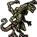

# { .sprite } Statue

<div class="infobox" markdown>

<p class="ib-img">{ .sprite }</p>

| | |
|---|---|
| **Monster ID** | `brv_school_statue2` |
| **Type** | Enemy |
| **Class** | Humanoid |
| **HP** | 320 |
| **XP when killed** | 635 |
| **Found in** | Brimhaven |
| **Introduced** | [v0.7.11](../versions/0.7.11.md) |

</div>

## Combat stats

| Stat | Value |
|---|---|
| HP | 320 |
| Damage | 5 to 14 |
| Attack chance | 60 |
| Block chance | 150 |
| Damage resistance | 8 |
| Max AP | 10 |
| Attack cost | 4 AP |
| Attacks per turn | 2 |
| Move cost | 5 AP |
| Critical skill | 0 |
| Critical multiplier | – |
| Crit chance | none (needs critical skill and a multiplier) |

**XP formula** (from the game's loader): ⌈(attacks per turn × attack chance × average damage × (1 + critical skill × multiplier) × 3 + HP × (1 + block chance) + 9 × damage resistance) × 0.7⌉, +50 if its hits inflict a condition. More Exp adds a percentage on top.

<p class="verified">Verified against v0.8.18 monster data and game code (`MonsterTypeParser.java`).</p>


## Locations

| Map | Region | Up to | Notes |
|---|---|---|---|
| [brimhaven_school](../maps/brimhaven_school.md) | Brimhaven | 1 | appears later in a quest |


## Quests that count kills

- [Lessons learned](../quests/brv_school2.md#stage-152) with stepping on a trigger on [brimhaven_school](../maps/brimhaven_school.md) checks that you've killed at least 1


## Version history

| Version | Change |
|---|---|
| [v0.7.11](../versions/0.7.11.md) | Added |

<p class="verified">Verified against v0.8.18 and every earlier release back to v0.7.0 (game data compared release by release).</p>


## Community notes

<small>Written by players, not generated from game data. **Observations**: what players notice in-game · **Lore**: the in-world story · **Trivia**: real-world facts, references, development history · **Theory / speculation**: unconfirmed ideas; may just be unfinished content</small>

### Observations

*Nothing here yet. Know something? [Add it](https://github.com/asdfghjkl628/Andor-s-Trail-Wikiiii/new/main/notes/monsters?filename=brv_school_statue2.md&value=%23%23%20Observations%0A%0A%3C%21--%20what%20players%20notice%20in-game%20--%3E%0A%0A%23%23%20Lore%0A%0A%3C%21--%20the%20in-world%20story%20--%3E%0A%0A%23%23%20Trivia%0A%0A%3C%21--%20real-world%20facts%2C%20references%2C%20development%20history%20--%3E%0A%0A%23%23%20Theory%20/%20speculation%0A%0A%3C%21--%20unconfirmed%20ideas%3B%20may%20just%20be%20unfinished%20content%20--%3E%0A).*

### Lore

*Nothing here yet. Know something? [Add it](https://github.com/asdfghjkl628/Andor-s-Trail-Wikiiii/new/main/notes/monsters?filename=brv_school_statue2.md&value=%23%23%20Observations%0A%0A%3C%21--%20what%20players%20notice%20in-game%20--%3E%0A%0A%23%23%20Lore%0A%0A%3C%21--%20the%20in-world%20story%20--%3E%0A%0A%23%23%20Trivia%0A%0A%3C%21--%20real-world%20facts%2C%20references%2C%20development%20history%20--%3E%0A%0A%23%23%20Theory%20/%20speculation%0A%0A%3C%21--%20unconfirmed%20ideas%3B%20may%20just%20be%20unfinished%20content%20--%3E%0A).*

### Trivia

*Nothing here yet. Know something? [Add it](https://github.com/asdfghjkl628/Andor-s-Trail-Wikiiii/new/main/notes/monsters?filename=brv_school_statue2.md&value=%23%23%20Observations%0A%0A%3C%21--%20what%20players%20notice%20in-game%20--%3E%0A%0A%23%23%20Lore%0A%0A%3C%21--%20the%20in-world%20story%20--%3E%0A%0A%23%23%20Trivia%0A%0A%3C%21--%20real-world%20facts%2C%20references%2C%20development%20history%20--%3E%0A%0A%23%23%20Theory%20/%20speculation%0A%0A%3C%21--%20unconfirmed%20ideas%3B%20may%20just%20be%20unfinished%20content%20--%3E%0A).*

### Theory / speculation

*Nothing here yet. Know something? [Add it](https://github.com/asdfghjkl628/Andor-s-Trail-Wikiiii/new/main/notes/monsters?filename=brv_school_statue2.md&value=%23%23%20Observations%0A%0A%3C%21--%20what%20players%20notice%20in-game%20--%3E%0A%0A%23%23%20Lore%0A%0A%3C%21--%20the%20in-world%20story%20--%3E%0A%0A%23%23%20Trivia%0A%0A%3C%21--%20real-world%20facts%2C%20references%2C%20development%20history%20--%3E%0A%0A%23%23%20Theory%20/%20speculation%0A%0A%3C%21--%20unconfirmed%20ideas%3B%20may%20just%20be%20unfinished%20content%20--%3E%0A).*


??? info "Technical information"

    | | |
    |---|---|
    | Monster ID | `brv_school_statue2` |
    | Spawn group | `brv_school_statue2` |
    | Loot table | – |
    | Conversation | – |
    | Faction | – |
    | Movement | wholeMap |
    | Icon | `monsters_demon2:0` |
    | Defined in | `res/raw/monsterlist_brimhaven2.json` |

    Raw data:

    ```json
    {
     "id": "brv_school_statue2",
     "name": "Statue",
     "iconID": "monsters_demon2:0",
     "maxHP": 320,
     "maxAP": 10,
     "moveCost": 5,
     "unique": 1,
     "monsterClass": "humanoid",
     "movementAggressionType": "wholeMap",
     "attackDamage": {
      "min": 5,
      "max": 14
     },
     "spawnGroup": "brv_school_statue2",
     "attackCost": 4,
     "attackChance": 60,
     "blockChance": 150,
     "damageResistance": 8
    }
    ```


<small>Data from v0.8.18</small>
