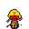

# { .sprite } Child

**Where to find Child:** Brimhaven: [brimhaven1](../maps/brimhaven1.md#pin-npc-brv_villager13)

<div class="infobox" markdown>

<p class="ib-img">{ .sprite }</p>

| | |
|---|---|
| **Type** | NPC (can be spoken to; cannot be attacked) |
| **Found in** | Brimhaven |
| **Entry ID** | `brv_villager13` |
| **Introduced** | [v0.7.11](../versions/0.7.11.md) |

</div>

## Dialogue simulator

Set the quest stages, items and other conditions that apply to your game, then start the conversation with Child. The simulator applies the game's own rules: it performs the same silent checks, offers only the options that would be shown in the game, and applies their effects (quest stages, items handed over, rewards) as the conversation proceeds.

<div class="dlg-sim" data-src="../../assets/dialogue/brv_villager13.json" data-npc="Child" markdown="0"><noscript>The simulator needs JavaScript. The full dialogue is listed below.</noscript></div>

<p class="verified">Rules verified against v0.8.18 game code (ConversationController.java) and dialogue data.</p>

??? quote "Dialogue (3 lines)"

    *What the dialogue says, exactly as in the game files. Lines are listed once; links jump to the line a choice leads to.*

    <span id="d-brv_villager13"></span>**`brv_villager13`** Child: “Mama!”

    - Next → [brv_villager12b](#d-brv_villager12b)

    <span id="d-brv_villager12b"></span>**`brv_villager12b`** [Mother](../monsters/brv_villager12.md): “Stop talking to my daughter!”

    - “I am sorry.” → [brv_villager_12a](#d-brv_villager_12a)

    <span id="d-brv_villager_12a"></span>**`brv_villager_12a`** Child: “I have to take my daughter to school. I can't let her cross this dangerous area on her own, and those people from the west side of town don't care at all.”


## Version history

| Version | Change |
|---|---|
| [v0.7.11](../versions/0.7.11.md) | Added<br>Dialogue: 3 lines added |

<p class="verified">Verified against v0.8.18 and every earlier release back to v0.7.0 (game data compared release by release).</p>


??? info "Technical information"

    | | |
    |---|---|
    | Entry ID | `brv_villager13` |
    | Spawn group | `brv_villager13` |
    | Loot table | – |
    | Conversation | `brv_villager13` |
    | Faction | – |
    | Movement | – |
    | Icon | `monsters_ld1:156` |
    | Defined in | `res/raw/monsterlist_brimhaven.json` |

    Raw data:

    ```json
    {
     "id": "brv_villager13",
     "name": "Child",
     "iconID": "monsters_ld1:156",
     "phraseID": "brv_villager13"
    }
    ```


## Community notes

<small>Written by players, not generated from game data. **Observations**: what players notice in-game · **Lore**: the in-world story · **Trivia**: real-world facts, references, development history · **Theory / speculation**: unconfirmed ideas; may just be unfinished content</small>

### Observations

*No notes yet. Contributions are welcome: [add a note](https://github.com/asdfghjkl628/Andor-s-Trail-Wikiiii/new/main/notes/monsters?filename=brv_villager13.md&value=%23%23%20Observations%0A%0A%3C%21--%20what%20players%20notice%20in-game%20--%3E%0A%0A%23%23%20Lore%0A%0A%3C%21--%20the%20in-world%20story%20--%3E%0A%0A%23%23%20Trivia%0A%0A%3C%21--%20real-world%20facts%2C%20references%2C%20development%20history%20--%3E%0A%0A%23%23%20Theory%20/%20speculation%0A%0A%3C%21--%20unconfirmed%20ideas%3B%20may%20just%20be%20unfinished%20content%20--%3E%0A).*

### Lore

*No notes yet. Contributions are welcome: [add a note](https://github.com/asdfghjkl628/Andor-s-Trail-Wikiiii/new/main/notes/monsters?filename=brv_villager13.md&value=%23%23%20Observations%0A%0A%3C%21--%20what%20players%20notice%20in-game%20--%3E%0A%0A%23%23%20Lore%0A%0A%3C%21--%20the%20in-world%20story%20--%3E%0A%0A%23%23%20Trivia%0A%0A%3C%21--%20real-world%20facts%2C%20references%2C%20development%20history%20--%3E%0A%0A%23%23%20Theory%20/%20speculation%0A%0A%3C%21--%20unconfirmed%20ideas%3B%20may%20just%20be%20unfinished%20content%20--%3E%0A).*

### Trivia

*No notes yet. Contributions are welcome: [add a note](https://github.com/asdfghjkl628/Andor-s-Trail-Wikiiii/new/main/notes/monsters?filename=brv_villager13.md&value=%23%23%20Observations%0A%0A%3C%21--%20what%20players%20notice%20in-game%20--%3E%0A%0A%23%23%20Lore%0A%0A%3C%21--%20the%20in-world%20story%20--%3E%0A%0A%23%23%20Trivia%0A%0A%3C%21--%20real-world%20facts%2C%20references%2C%20development%20history%20--%3E%0A%0A%23%23%20Theory%20/%20speculation%0A%0A%3C%21--%20unconfirmed%20ideas%3B%20may%20just%20be%20unfinished%20content%20--%3E%0A).*

### Theory / speculation

*No notes yet. Contributions are welcome: [add a note](https://github.com/asdfghjkl628/Andor-s-Trail-Wikiiii/new/main/notes/monsters?filename=brv_villager13.md&value=%23%23%20Observations%0A%0A%3C%21--%20what%20players%20notice%20in-game%20--%3E%0A%0A%23%23%20Lore%0A%0A%3C%21--%20the%20in-world%20story%20--%3E%0A%0A%23%23%20Trivia%0A%0A%3C%21--%20real-world%20facts%2C%20references%2C%20development%20history%20--%3E%0A%0A%23%23%20Theory%20/%20speculation%0A%0A%3C%21--%20unconfirmed%20ideas%3B%20may%20just%20be%20unfinished%20content%20--%3E%0A).*


<small>Data from v0.8.18</small>
