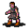

# { .sprite } Ogea

**Where to find Ogea:** Brimhaven: [Brimhaven 4](../maps/brimhaven4.md#pin-npc-brv_villager3), Brimhaven: [Brimhaven prison](../maps/brimhaven_prison.md#pin-npc-brv_villager3)

<div class="infobox" markdown>

<p class="ib-img">{ .sprite }</p>

| | |
|---|---|
| **Type** | NPC (talk only; never fought) |
| **Found in** | Brimhaven |
| **Introduced** | [v0.7.11](../versions/0.7.11.md) |

</div>

## Locations

| Map | Region | Up to | Notes |
|---|---|---|---|
| [Brimhaven 4](../maps/brimhaven4.md) | Brimhaven | 1 | – |
| [Brimhaven prison](../maps/brimhaven_prison.md) | Brimhaven | 1 | Appears later, during a quest |

## Quests

- [A strange looking dagger](../quests/brv_dagger.md): stages 190, 210

## Dialogue simulator

Set your quest stages and items, then talk to Ogea. Same rules as the game: same checks, same options, same effects.

<div class="dlg-sim" data-src="../../assets/dialogue/brv_villager3.json" data-npc="Ogea" markdown="0"><noscript>The simulator needs JavaScript. The full dialogue is listed below.</noscript></div>

<p class="verified">Rules verified against v0.8.18 game code (ConversationController.java) and dialogue data.</p>

??? quote "Dialogue (11 lines)"

    *Exactly as in the game files. Each line appears once; links jump to where a choice leads.*

    <span id="d-brv_villager3"></span>**`brv_villager3`** Ogea: “You are not from Brimhaven, are you? If you need a place to stay, visit the inn in the eastern part of the town. There are beds available for rent. But it is a bit untidy there.”

    - “I suspect that you killed Lawellyn or that you were at the very least at the scene of the murder at the time of his…” *(if reached stage 180 of [A strange looking dagger](../quests/brv_dagger.md#stage-180); carry 1× [Suspect's glove](../items/ogea_glove.md); NOT reached stage 190 of [A strange looking dagger](../quests/brv_dagger.md#stage-190); NOT reached stage 210 of [A strange looking dagger](../quests/brv_dagger.md#stage-210))* → [brv_villager3_asd_10](#d-brv_villager3_asd_10)
    - “No need to pretend we've never met. I do believe you are innocent.” *(if reached stage 190 of [A strange looking dagger](../quests/brv_dagger.md#stage-190))* → *conversation ends*
    - “Don't pretend we've never met. Soon you will be in jail.” *(if reached stage 210 of [A strange looking dagger](../quests/brv_dagger.md#stage-210))* → *conversation ends*

    <span id="d-brv_villager3_asd_10"></span>**`brv_villager3_asd_10`** Ogea: “I'm sure you think that, but do you have any proof?”

    - “In fact, I do! I have physical evidence that puts you at the scene of Lawellyn's death.” → [brv_villager3_asd_20](#d-brv_villager3_asd_20)

    <span id="d-brv_villager3_asd_20"></span>**`brv_villager3_asd_20`** Ogea: “What?! What do you have on me that would even make the authorities listen to you?”

    - “I have a blood-stained glove and a witness stating that it was indeed your glove. [Show Ogea his glove.]” → [brv_villager3_asd_30](#d-brv_villager3_asd_30)

    <span id="d-brv_villager3_asd_30"></span>**`brv_villager3_asd_30`** Ogea: “What can I say? You have me.”

    - “Well, you can start by explaining what happened.” → [brv_villager3_asd_40](#d-brv_villager3_asd_40)

    <span id="d-brv_villager3_asd_40"></span>**`brv_villager3_asd_40`** Ogea: “Yes, I'd like to.”

    - Next → [brv_villager3_asd_50](#d-brv_villager3_asd_50)

    <span id="d-brv_villager3_asd_50"></span>**`brv_villager3_asd_50`** Ogea: “The story starts many years ago. I was a struggling woodcutter in need of land to build my home on.”

    - Next → [brv_villager3_asd_60](#d-brv_villager3_asd_60)

    <span id="d-brv_villager3_asd_60"></span>**`brv_villager3_asd_60`** Ogea: “I approached Lawellyn about it because he was responsible for land deeds, so I asked him about acquiring some empty land where Alkapoan's house now stands. He informed me that he was giving it to Alkapoan.”

    - Next → [brv_villager3_asd_70](#d-brv_villager3_asd_70)

    <span id="d-brv_villager3_asd_70"></span>**`brv_villager3_asd_70`** Ogea: “I thought that that land was too large for just one house, but Lawellyn said 'no'. We argued about it for many months, until one day our paths crossed just outside of town.”

    - “Get to the point where you killed the man and left his daughter without a father.” → [brv_villager3_asd_80](#d-brv_villager3_asd_80)

    <span id="d-brv_villager3_asd_80"></span>**`brv_villager3_asd_80`** Ogea: “In another attempt to change Lawellyn's mind on giving me land to build my house, things got real ugly real fast. I don't know why he reached for his dagger, but I saw this and drew my weapon in self-defense. I had no intention of killing…”

    - “Yes” → [brv_villager3_asd_90](#d-brv_villager3_asd_90)
    - “No. In fact, I want to know more. Like, what did you do with Lawellyn's dagger?” → [brv_villager3_asd_100](#d-brv_villager3_asd_100)

    <span id="d-brv_villager3_asd_90"></span>**`brv_villager3_asd_90`** Ogea: “I'm glad to hear it. Thank you.” — **effects:** sets stage 190 of [A strange looking dagger](../quests/brv_dagger.md#stage-190)


    <span id="d-brv_villager3_asd_100"></span>**`brv_villager3_asd_100`** Ogea: “Well, after the fight, I noticed that the gem broke off of it. I took both the gem and the dagger and sold them to a thief. So all I'm guilty of is selling stolen property.” — **effects:** sets stage 210 of [A strange looking dagger](../quests/brv_dagger.md#stage-210)

    - “I don't think so. You should expect a visit from Mustura real soon.” → *conversation ends*


## Version history

| Version | Change |
|---|---|
| [v0.7.11](../versions/0.7.11.md) | Added<br>Dialogue: 1 line added |
| [v0.7.12](../versions/0.7.12.md) | Renamed “Commoner” → “Ogea”<br>Dialogue: 10 lines added, 1 line changed<br>· text: “You are not from Brimhaven, are you? If you need a place to stay, vis…” → “You are not from Brimhaven, are you? If you need a place to stay, vis…” |

<p class="verified">Verified against v0.8.18 and every earlier release back to v0.7.0 (game data compared release by release).</p>


## Behind the scenes

*How the game data handles this character. Not needed for playing.*

??? info "Technical information"

    | | |
    |---|---|
    | Entry ID | `brv_villager3` |
    | Type (wiki) | NPC |
    | Spawn group | `brv_villager3` |
    | Loot table | – |
    | Conversation | `brv_villager3` |
    | Faction | – |
    | Movement | – |
    | Icon | `monsters_tometik2:63` |
    | Defined in | `res/raw/monsterlist_brimhaven.json` |

    Raw data:

    ```json
    {
     "id": "brv_villager3",
     "name": "Ogea",
     "iconID": "monsters_tometik2:63",
     "monsterClass": "humanoid",
     "spawnGroup": "brv_villager3",
     "phraseID": "brv_villager3"
    }
    ```


## Community notes

<small>Written by players, not generated from game data. **Observations**: what players notice in-game · **Lore**: the in-world story · **Trivia**: real-world facts, references, development history · **Theory / speculation**: unconfirmed ideas; may just be unfinished content</small>

### Observations

*No notes yet. Contributions are welcome: [add a note](https://github.com/asdfghjkl628/Andor-s-Trail-Wikiiii/new/main/notes/monsters?filename=brv_villager3.md&value=%23%23%20Observations%0A%0A%3C%21--%20what%20players%20notice%20in-game%20--%3E%0A%0A%23%23%20Lore%0A%0A%3C%21--%20the%20in-world%20story%20--%3E%0A%0A%23%23%20Trivia%0A%0A%3C%21--%20real-world%20facts%2C%20references%2C%20development%20history%20--%3E%0A%0A%23%23%20Theory%20/%20speculation%0A%0A%3C%21--%20unconfirmed%20ideas%3B%20may%20just%20be%20unfinished%20content%20--%3E%0A).*

### Lore

*No notes yet. Contributions are welcome: [add a note](https://github.com/asdfghjkl628/Andor-s-Trail-Wikiiii/new/main/notes/monsters?filename=brv_villager3.md&value=%23%23%20Observations%0A%0A%3C%21--%20what%20players%20notice%20in-game%20--%3E%0A%0A%23%23%20Lore%0A%0A%3C%21--%20the%20in-world%20story%20--%3E%0A%0A%23%23%20Trivia%0A%0A%3C%21--%20real-world%20facts%2C%20references%2C%20development%20history%20--%3E%0A%0A%23%23%20Theory%20/%20speculation%0A%0A%3C%21--%20unconfirmed%20ideas%3B%20may%20just%20be%20unfinished%20content%20--%3E%0A).*

### Trivia

*No notes yet. Contributions are welcome: [add a note](https://github.com/asdfghjkl628/Andor-s-Trail-Wikiiii/new/main/notes/monsters?filename=brv_villager3.md&value=%23%23%20Observations%0A%0A%3C%21--%20what%20players%20notice%20in-game%20--%3E%0A%0A%23%23%20Lore%0A%0A%3C%21--%20the%20in-world%20story%20--%3E%0A%0A%23%23%20Trivia%0A%0A%3C%21--%20real-world%20facts%2C%20references%2C%20development%20history%20--%3E%0A%0A%23%23%20Theory%20/%20speculation%0A%0A%3C%21--%20unconfirmed%20ideas%3B%20may%20just%20be%20unfinished%20content%20--%3E%0A).*

### Theory / speculation

*No notes yet. Contributions are welcome: [add a note](https://github.com/asdfghjkl628/Andor-s-Trail-Wikiiii/new/main/notes/monsters?filename=brv_villager3.md&value=%23%23%20Observations%0A%0A%3C%21--%20what%20players%20notice%20in-game%20--%3E%0A%0A%23%23%20Lore%0A%0A%3C%21--%20the%20in-world%20story%20--%3E%0A%0A%23%23%20Trivia%0A%0A%3C%21--%20real-world%20facts%2C%20references%2C%20development%20history%20--%3E%0A%0A%23%23%20Theory%20/%20speculation%0A%0A%3C%21--%20unconfirmed%20ideas%3B%20may%20just%20be%20unfinished%20content%20--%3E%0A).*


<small>Data from v0.8.18</small>
