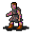

# { .sprite } Wood craftsman

| Stat | Value |
|---|---|
| Class | ? |
| HP | 0 |
| Max AP | 10 |
| Attack cost | 10 |
| Move cost | 10 |
| Damage | 0 |
| Attack chance | 0 |
| Block chance | 0 |
| Damage resistance | 0 |
| Critical skill | 0 |
| Critical multiplier | 0 |

## Shop stock

| Item | Chance | Qty |
|---|---|---|
| [Woodcutter's axe](../items/axe1.md) | 100% | 1 |
| [Woodcutter's hatchet](../items/woodcutter_hatchet.md) | 100% | 2 |
| [Wooden buckler](../items/shield1.md) | 100% | 5 |
| [Wooden shield](../items/shield_wooden.md) | 100% | 2 |
| [Woodcutter's gloves](../items/gloves_woodcutter.md) | 100% | 1 |
| [Woodcutter's boots](../items/woodcutter_boots.md) | 100% | 1 |

## Found on

- [brimhaven2_woodcutter](../maps/brimhaven2_woodcutter.md)

<small>Monster ID: `brv_woodcraftsman` · Data from v0.8.18</small>
