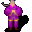

# { .sprite } Buceth

| Stat | Value |
|---|---|
| Class | humanoid |
| HP | 75 |
| Max AP | 10 |
| Attack cost | 3 |
| Move cost | 5 |
| Damage | 3 to 9 |
| Attack chance | 80 |
| Block chance | 120 |
| Damage resistance | 4 |
| Critical skill | 200 |
| Critical multiplier | 2.0 |

## Drops

| Item | Chance | Qty |
|---|---|---|
| [Gold coins](../items/gold.md) | 70% | 0 to 20 |
| [Buceth's vial of green liquid](../items/buceth_vial.md) | 100% | 1 |
| [Minor vial of health](../items/health_minor.md) | 100% | 1 to 4 |
| [Empty vial](../items/vial_empty2.md) | 100% | 1 to 3 |
| [Ring of life force](../items/ring_life.md) | 100% | 1 |

## Quests

- [Flows through the veins](../quests/loneford.md): stages 41, 42, 45, 50, 60

??? quote "Dialogue (56 lines)"

    *What the dialogue says, exactly as in the game files. Lines are listed once; links jump to the line a choice leads to.*

    **`buceth`** *(silent check: the first matching branch below is taken)*

    - branch 1 *(if reached stage 60 of [Flows through the veins](../quests/loneford.md#stage-60))* → [buceth_complete_1](#d-buceth_complete_1)
    - branch 2 *(if reached stage 50 of [Flows through the veins](../quests/loneford.md#stage-50))* → [buceth_fight_1](#d-buceth_fight_1)
    - branch 3 *(if reached stage 45 of [Flows through the veins](../quests/loneford.md#stage-45))* → [buceth_story_3](#d-buceth_story_3)
    - branch 4 *(if reached stage 42 of [Flows through the veins](../quests/loneford.md#stage-42))* → [buceth_follow_1](#d-buceth_follow_1)
    - branch 5 *(if reached stage 41 of [Flows through the veins](../quests/loneford.md#stage-41))* → [buceth_bribed_1](#d-buceth_bribed_1)
    - branch 6 → [buceth_1](#d-buceth_1)

    **`buceth_complete_1`** Buceth: “Welcome back my friend. May you bask in the glow of the Shadow.”

    - Next → [buceth_story_15](#d-buceth_story_15)

    **`buceth_fight_1`** Buceth: “Infidel, you will not defeat me! For the Shadow!” — **effects:** sets stage 50 of [Flows through the veins](../quests/loneford.md#stage-50)

    - “Fight!” → *fight starts*

    **`buceth_story_3`** Buceth: “I am appointed by the priests of Nor City to help guide the people of Loneford towards the Shadow. Our mission is to see that the Shadow casts its glow over Loneford as well as other settlements around here.”

    - Next → [buceth_story_4](#d-buceth_story_4)

    **`buceth_follow_1`** Buceth: “Welcome back my friend. Walk with the Shadow.”

    - Next → [buceth_story_1](#d-buceth_story_1)

    **`buceth_bribed_1`** Buceth: “You again. Thank you for the gold earlier.”

    - Next → [buceth_story_1](#d-buceth_story_1)

    **`buceth_1`** Buceth: “Shadow be with you.”

    - “I know of your business at the well the night after the illness broke out.” *(if reached stage 35 of [Flows through the veins](../quests/loneford.md#stage-35))* → [buceth_2](#d-buceth_2)
    - “Can you tell me more about the Shadow?” → [priest_shadow_1](#d-priest_shadow_1)

    **`buceth_story_15`** Buceth: “If you want to learn more about the Shadow, please visit the chapel custodian in Nor City. Tell them I sent you, and they will surely extend their gratitude towards you.” — **effects:** sets stage 60 of [Flows through the veins](../quests/loneford.md#stage-60)

    **`buceth_story_4`** Buceth: “Most folk in these northern parts seem too occupied with obeying the will of Feygard and Lord Geomyr. We want to help people see the light of the wrongdoings that Feygard advocates, and to point out the errors in their ways.”

    - Next → [buceth_story_5](#d-buceth_story_5)

    **`buceth_story_1`** Buceth: “You wanted to ask me something?”

    - “What were you doing at the well during the night?” → [buceth_story_2](#d-buceth_story_2)

    **`buceth_2`** Buceth: “Oh, I am sure you do. But what proof do you have, eh? Anything the guards would believe?”

    - Next → [buceth_3](#d-buceth_3)

    **`priest_shadow_1`** Buceth: “The Shadow protects us. It keeps us safe and comforts us when we sleep.”

    - Next → [priest_shadow_2](#d-priest_shadow_2)

    **`buceth_story_5`** Buceth: “That's my mission here. To see that the Shadow casts its glow over Loneford.”

    - “How does this relate to what you were doing at the well?” → [buceth_story_6](#d-buceth_story_6)

    **`buceth_story_2`** Buceth: “Let me first tell you my background.”

    - “Great. Another endless story.” → [buceth_story_3](#d-buceth_story_3)
    - “Please go ahead.” → [buceth_story_3](#d-buceth_story_3)

    **`buceth_3`** Buceth: “Let me ask you something first, and we might talk after that.”

    - “OK, what?” → [buceth_4](#d-buceth_4)
    - “How about some gold, would that make you talk?” → [buceth_gold_1](#d-buceth_gold_1)

    **`priest_shadow_2`** Buceth: “It follows us wherever we go. Go with the Shadow my child.”

    - “Shadow be with you.” → *conversation ends*
    - “Whatever, bye.” → *conversation ends*

    **`buceth_story_6`** Buceth: “Nor City sent word to me that something was about to happen here in Loneford. Something that would help our cause.”

    - Next → [buceth_story_7](#d-buceth_story_7)

    **`buceth_4`** Buceth: “Let me start by telling you a story.”

    - “Go ahead.” → [buceth_5](#d-buceth_5)
    - “Let me guess, this story is going to take forever to listen to. How about I give you some gold, and instead we can…” → [buceth_gold_1](#d-buceth_gold_1)

    **`buceth_gold_1`** Buceth: “Hmm, that might be an interesting proposal. How much gold are you suggesting?”

    - “Here's 10 gold, take it.” *(if pay 10 gold)* → [buceth_gold_no](#d-buceth_gold_no)
    - “Here's 100 gold, take it.” *(if pay 100 gold)* → [buceth_gold_no](#d-buceth_gold_no)
    - “Here's 250 gold, take it.” *(if pay 250 gold)* → [buceth_gold_no](#d-buceth_gold_no)
    - “Here's 500 gold, take it.” *(if pay 500 gold)* → [buceth_gold_no](#d-buceth_gold_no)
    - “Here's 1,000 gold, take it.” *(if pay 1,000 gold)* → [buceth_gold_yes](#d-buceth_gold_yes)
    - “Here's 2,000 gold, take it.” *(if pay 2,000 gold)* → [buceth_gold_yes](#d-buceth_gold_yes)

    **`buceth_story_7`** Buceth: “They were sending a boy to do some business here, and I was assigned to make sure that the mission was successful.” — **effects:** sets stage 61 of [andor (hidden flag)](../quests/andor.md#stage-61)

    - “Do you know where he went after he left Loneford?” → [buceth_story_7_1](#d-buceth_story_7_1)

    **`buceth_5`** Buceth: “Let's assume you live in a village that, for the most part, keeps to itself. Your village is self-sustainable and the crops have been good for some years.”

    - Next → [buceth_6](#d-buceth_6)

    **`buceth_gold_no`** Buceth: “Hrmpf. Thanks for the gold, but I am not interested in talking to you. Now, please leave.”

    **`buceth_gold_yes`** Buceth: “You seem to realize the true value of the Shadow. Yes, this will do fine, thank you.” — **effects:** sets stage 41 of [Flows through the veins](../quests/loneford.md#stage-41)

    - Next → [buceth_story_1](#d-buceth_story_1)

    **`buceth_story_7_1`** Buceth: “The boy told me he had some business with a rich man in Brimhaven. Maybe he went there.” — **effects:** sets stage 62 of [andor (hidden flag)](../quests/andor.md#stage-62)

    - Next → [buceth_story_8](#d-buceth_story_8)

    **`buceth_6`** Buceth: “With the few exceptions of some fights here and there between villagers because of misunderstandings, on the whole, your village is a friendly, peaceful village.”

    - Next → [buceth_7](#d-buceth_7)

    **`buceth_story_8`** Buceth: “I was tasked with gathering samples from the water in the well and from the ground around the well. Also, I was given some vials whose contents should be poured into the well.”

    - Next → [buceth_story_9](#d-buceth_story_9)

    **`buceth_7`** Buceth: “You work in the same profession as your parents, which in turn worked in the same professions as their parents.”

    - Next → [buceth_8](#d-buceth_8)

    **`buceth_story_9`** Buceth: “Apparently, the boy they sent was successful in his mission. The task that I did was also successful, if I may say so myself.” — **effects:** sets stage 45 of [Flows through the veins](../quests/loneford.md#stage-45)

    - Next → [buceth_story_10](#d-buceth_story_10)

    **`buceth_8`** Buceth: “Let's also assume that the way you conduct your business is the same way that the people in the village have been conducting their business for generations past.”

    - Next → [buceth_9](#d-buceth_9)

    **`buceth_story_10`** Buceth: “So, currently, that's where we stand now. The deed is done, and the Shadow will look favorably upon us.”

    - “So, the well was poisoned, that's horrible. How could you?” → [buceth_story_11](#d-buceth_story_11)
    - “Thank you for telling me.” → [buceth_story_12](#d-buceth_story_12)

    **`buceth_9`** Buceth: “Everyone respects one another in the village, and your appointed leader does a good job at keeping everyone's interests satisfied, while at the same time being reasonably fair.”

    - Next → [buceth_10](#d-buceth_10)

    **`buceth_story_11`** Buceth: “Horrible!? What is horrible? What those people from Feygard are doing - that's what's horrible!”

    - Next → [buceth_story_12](#d-buceth_story_12)

    **`buceth_story_12`** Buceth: “Now, I ask you to keep this story just between us two. You understand that, right?”

    - “Absolutely. Walk with the Shadow.” → [buceth_story_14](#d-buceth_story_14)
    - “I promise not to tell anyone.” → [buceth_story_14](#d-buceth_story_14)
    - “No, I will report you to the guard.” → [buceth_story_13](#d-buceth_story_13)

    **`buceth_10`** Buceth: “Then, one day, a group of men come walking into the village. Shining armor, white teeth, combed hair, trimmed beards.”

    - Next → [buceth_11](#d-buceth_11)

    **`buceth_story_14`** Buceth: “Thank you, my friend.” — **effects:** sets stage 60 of [Flows through the veins](../quests/loneford.md#stage-60)

    - Next → [buceth_story_15](#d-buceth_story_15)

    **`buceth_story_13`** Buceth: “I urge you to rethink your reasoning. The way of the Shadow is the righteous way.”

    - “Very well. I promise not to tell anyone.” → [buceth_story_14](#d-buceth_story_14)
    - “No. Your crimes will be punished!” → [buceth_fight_1](#d-buceth_fight_1)

    **`buceth_11`** Buceth: “The men claim that their lord owns this land, including your village.”

    - Next → [buceth_12](#d-buceth_12)

    **`buceth_12`** Buceth: “They claim that they keep the land safe of wrongdoers and evil creatures.”

    - Next → [buceth_13](#d-buceth_13)

    **`buceth_13`** Buceth: “For their help in protecting your village, they ask that the village compensate them with a share of the harvest.”

    - Next → [buceth_14](#d-buceth_14)

    **`buceth_14`** Buceth: “Now, tell me. Would you support those men by agreeing to their terms?”

    - “Yes” → [buceth_15](#d-buceth_15)
    - “No” → [buceth_15](#d-buceth_15)
    - “I don't know.” → [buceth_dontknow](#d-buceth_dontknow)

    **`buceth_15`** Buceth: “How interesting.”

    - Next → [buceth_16](#d-buceth_16)

    **`buceth_dontknow`** Buceth: “I am sorry to hear that. You should make up your mind and return to me once you have done so. Then we might be able to talk more.”

    - “OK, goodbye.” → *conversation ends*
    - “How about I give you some gold instead?” → [buceth_gold_1](#d-buceth_gold_1)

    **`buceth_16`** Buceth: “Let me continue the story of our hypothetical case.”

    - Next → [buceth_17](#d-buceth_17)

    **`buceth_17`** Buceth: “A while later, the men return. They explain that some of the ways things are done in the village have now been prohibited across the whole land.”

    - Next → [buceth_18](#d-buceth_18)

    **`buceth_18`** Buceth: “Without going into specifics, let's say that these are ways that have been used for past generations in your village.”

    - Next → [buceth_19](#d-buceth_19)

    **`buceth_19`** Buceth: “Changing the way things are done will require quite an effort for people to adjust. A lot of people in the village are upset because of this news from the men.”

    - Next → [buceth_20](#d-buceth_20)

    **`buceth_20`** Buceth: “Now, tell me. Would you in secret continue using the old ways your past generations have used, or would you instead convert to the ways that the men are advocating?”

    - “I would continue using the old ways in secret.” → [buceth_21_1](#d-buceth_21_1)
    - “I would continue using the old ways, and fight the ruling that prohibited them in the first place.” → [buceth_21_2](#d-buceth_21_2)
    - “I would only use the ways that are allowed.” → [buceth_22](#d-buceth_22)
    - “I would follow the law.” → [buceth_22](#d-buceth_22)
    - “I can't decide without knowing the specifics.” → [buceth_dontknow](#d-buceth_dontknow)

    **`buceth_21_1`** Buceth: “How interesting.”

    - Next → [buceth_25](#d-buceth_25)

    **`buceth_21_2`** Buceth: “I am glad to hear that there are people still around that are willing to stand up for what is right.”

    - Next → [buceth_25](#d-buceth_25)

    **`buceth_22`** Buceth: “How interesting. You have a different view of the world than what I and the priests of Nor City have.”

    - Next → [buceth_23](#d-buceth_23)

    **`buceth_25`** Buceth: “Your views match those that I and the other priests from Nor City believe in. Tell me, would you be interested in following the glow of the Shadow?”

    - “I am ready to follow the Shadow.” → [buceth_27](#d-buceth_27)
    - “How can I agree to something without knowing what it entails?” → [buceth_26](#d-buceth_26)
    - “No, I will go my own way.” → [buceth_decline](#d-buceth_decline)
    - “No, I will go my own way. Your stupid Shadow is nothing but talk and fancy words.” → [buceth_decline](#d-buceth_decline)
    - “(Lie) I am ready to follow the Shadow.” → [buceth_27](#d-buceth_27)

    **`buceth_23`** Buceth: “You are of course entitled to your opinion, but you should know that your opinion might conflict with the Shadow.”

    - Next → [buceth_24](#d-buceth_24)

    **`buceth_27`** Buceth: “I am glad to hear that, but then again, I had a feeling all along that you would say that.” — **effects:** sets stage 42 of [Flows through the veins](../quests/loneford.md#stage-42)

    - Next → [buceth_story_1](#d-buceth_story_1)

    **`buceth_26`** Buceth: “If the answers you gave previously were indeed your views, then I can assure you that the path that is guided by the Shadow is the right one.”

    - “I am ready to follow the Shadow.” → [buceth_27](#d-buceth_27)
    - “No, I will go my own way.” → [buceth_decline](#d-buceth_decline)
    - “No, I will go my own way. Your stupid Shadow is nothing but talk and fancy words.” → [buceth_decline](#d-buceth_decline)
    - “(Lie) I am ready to follow the Shadow.” → [buceth_27](#d-buceth_27)

    **`buceth_decline`** Buceth: “I am sorry to hear that. I guess we do not share views after all.”

    - Next → [buceth_24](#d-buceth_24)

    **`buceth_24`** Buceth: “You wanted to know about some business that you accuse me of. Since you have no proof, I will claim innocence. I know that my conscience is clean.”

    - “OK, goodbye.” → *conversation ends*
    - “Fine. How about I give you some gold instead, would that make you talk?” → [buceth_gold_1](#d-buceth_gold_1)

## Community notes

<small>Written by players, not generated from game data. **Observations**: what players notice in-game · **Lore**: the in-world story · **Trivia**: real-world facts, references, development history · **Theory / speculation**: unconfirmed ideas; may just be unfinished content</small>

### Observations

*Nothing here yet. Know something? [Add it](https://github.com/asdfghjkl628/Andor-s-Trail-Wikiiii/new/main/notes/monsters?filename=buceth.md&value=%23%23%20Observations%0A%0A%3C%21--%20what%20players%20notice%20in-game%20--%3E%0A%0A%23%23%20Lore%0A%0A%3C%21--%20the%20in-world%20story%20--%3E%0A%0A%23%23%20Trivia%0A%0A%3C%21--%20real-world%20facts%2C%20references%2C%20development%20history%20--%3E%0A%0A%23%23%20Theory%20/%20speculation%0A%0A%3C%21--%20unconfirmed%20ideas%3B%20may%20just%20be%20unfinished%20content%20--%3E%0A).*

### Lore

*Nothing here yet. Know something? [Add it](https://github.com/asdfghjkl628/Andor-s-Trail-Wikiiii/new/main/notes/monsters?filename=buceth.md&value=%23%23%20Observations%0A%0A%3C%21--%20what%20players%20notice%20in-game%20--%3E%0A%0A%23%23%20Lore%0A%0A%3C%21--%20the%20in-world%20story%20--%3E%0A%0A%23%23%20Trivia%0A%0A%3C%21--%20real-world%20facts%2C%20references%2C%20development%20history%20--%3E%0A%0A%23%23%20Theory%20/%20speculation%0A%0A%3C%21--%20unconfirmed%20ideas%3B%20may%20just%20be%20unfinished%20content%20--%3E%0A).*

### Trivia

*Nothing here yet. Know something? [Add it](https://github.com/asdfghjkl628/Andor-s-Trail-Wikiiii/new/main/notes/monsters?filename=buceth.md&value=%23%23%20Observations%0A%0A%3C%21--%20what%20players%20notice%20in-game%20--%3E%0A%0A%23%23%20Lore%0A%0A%3C%21--%20the%20in-world%20story%20--%3E%0A%0A%23%23%20Trivia%0A%0A%3C%21--%20real-world%20facts%2C%20references%2C%20development%20history%20--%3E%0A%0A%23%23%20Theory%20/%20speculation%0A%0A%3C%21--%20unconfirmed%20ideas%3B%20may%20just%20be%20unfinished%20content%20--%3E%0A).*

### Theory / speculation

*Nothing here yet. Know something? [Add it](https://github.com/asdfghjkl628/Andor-s-Trail-Wikiiii/new/main/notes/monsters?filename=buceth.md&value=%23%23%20Observations%0A%0A%3C%21--%20what%20players%20notice%20in-game%20--%3E%0A%0A%23%23%20Lore%0A%0A%3C%21--%20the%20in-world%20story%20--%3E%0A%0A%23%23%20Trivia%0A%0A%3C%21--%20real-world%20facts%2C%20references%2C%20development%20history%20--%3E%0A%0A%23%23%20Theory%20/%20speculation%0A%0A%3C%21--%20unconfirmed%20ideas%3B%20may%20just%20be%20unfinished%20content%20--%3E%0A).*

<small>Monster ID: `buceth` · Data from v0.8.18</small>
