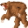

# { .sprite } Aggressive bear

| Stat | Value |
|---|---|
| Class | animal |
| HP | 297 |
| Max AP | 10 |
| Attack cost | 4 |
| Move cost | 3 |
| Damage | 14 to 20 |
| Attack chance | 165 |
| Block chance | 127 |
| Damage resistance | 0 |
| Critical skill | 3 |
| Critical multiplier | 3.0 |

## Drops

| Item | Chance | Qty |
|---|---|---|
| [Raw inkyfish](../items/bwm_fish.md) | 100% | 5 to 7 |
| [Claws](../items/claws.md) | 35% | 1 to 2 |
| [Wild red berries](../items/wild_berry3.md) | 100% | 2 to 3 |

## Found on

- [korhald_cave_bear](../maps/korhald_cave_bear.md)

<small>Monster ID: `cave_bear` · Data from v0.8.18</small>
