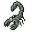

# { .sprite } Cave scorpion

| Stat | Value |
|---|---|
| Class | insect |
| HP | 30 |
| Max AP | 10 |
| Attack cost | 3 |
| Move cost | 5 |
| Damage | 3 to 6 |
| Attack chance | 80 |
| Block chance | 100 |
| Damage resistance | 1 |
| Critical skill | 0 |
| Critical multiplier | 0 |

## On hit

- **On target:** Minor sting (magnitude 1, 3 rounds, 20% chance)

## Drops

| Item | Chance | Qty |
|---|---|---|
| [Gold coins](../items/gold.md) | 70% | 1 to 3 |
| [Scorpion sting](../items/scorpion_sting.md) | 20% | 1 |

## Found on

- [laerothcave3](../maps/laerothcave3.md)
- [lakecave0](../maps/lakecave0.md)
- [lakecave2](../maps/lakecave2.md)
- [secretpassage0](../maps/secretpassage0.md)

<small>Monster ID: `cave_scorpion_0` · Data from v0.8.18</small>
