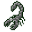

# { .sprite } Cave scorpion

<div class="infobox" markdown>

<p class="ib-img">{ .sprite }</p>

| | |
|---|---|
| **Type** | Enemy (hostile on sight) |
| **Found in** | laerothcave3, lakecave0, lakecave2, Burial cave, Buried citadel |
| **Class** | Insect |
| **HP** | 30–150 |
| **XP when defeated** | 121–544 |
| **Entries in game data** | 2 |
| **Introduced** | [v0.7.2](../versions/0.7.2.md) |

</div>

!!! info "2 entries in the game data"
    The game's data files define 2 separate characters named Cave scorpion. Andor's Trail stores a character as a new entry whenever it needs different behaviour, for example a different conversation at a later stage of a quest, a different location, or different combat statistics. Some entries represent the same person at different points in the story; others are different people who share a generic name. Here the entries differ in: location, combat statistics, loot or shop stock, faction, appearance, movement. This page combines them; each entry is described in its own section below.

| Entry | Type | Location | Role | HP |
|---|---|---|---|---|
| [`cave_scorpion_0`](#v-cave_scorpion_0) | Enemy | [laerothcave3](../maps/laerothcave3.md), [lakecave0](../maps/lakecave0.md) (+2 more) | – | 30 |
| [`brightport_scorpion`](#v-brightport_scorpion) | Enemy | Burial cave: [brightport_cave10](../maps/brightport_cave10.md), Burial cave: [brightport_cave11](../maps/brightport_cave11.md) (+10 more) | – | 150 |

## Laerothcave3 and 3 more (cave_scorpion_0) { #v-cave_scorpion_0 }

**Entry ID:** `cave_scorpion_0` · **Type:** Enemy

**Location:** [laerothcave3](../maps/laerothcave3.md), [lakecave0](../maps/lakecave0.md), [lakecave2](../maps/lakecave2.md), [secretpassage0](../maps/secretpassage0.md)

### Combat statistics

| Statistic | Value |
|---|---|
| Class | Insect |
| HP | 30 |
| XP when defeated | 121 |
| Damage | 3 to 6 |
| Attack chance | 80 |
| Block chance | 100 |
| Damage resistance | 1 |
| Max AP | 10 |
| Attack cost | 3 AP |
| Attacks per turn | 3 |
| Move cost | 5 AP |
| Critical skill | 0 |
| Critical multiplier | – |
| Critical hit chance | None (requires both critical skill and a critical multiplier) |

**On hit:** On target: Minor sting (magnitude 1, 3 rounds, 20% chance)


<p class="verified">Verified against v0.8.18 monster data and game code (`MonsterTypeParser.java`).</p>

### Drops

| Item | Chance | Qty |
|---|---|---|
| [Gold coins](../items/gold.md) | 70% | 1 to 3 |
| [Scorpion sting](../items/scorpion_sting.md) | 20% | 1 |

### Locations

| Map | Region | Up to | Notes |
|---|---|---|---|
| [laerothcave3](../maps/laerothcave3.md) | – | 4 | – |
| [lakecave0](../maps/lakecave0.md) | – | 6 | – |
| [lakecave2](../maps/lakecave2.md) | – | 2 | – |
| [secretpassage0](../maps/secretpassage0.md) | – | 2 | – |


### Version history

| Version | Change |
|---|---|
| [v0.7.2](../versions/0.7.2.md) | Added |

<p class="verified">Verified against v0.8.18 and every earlier release back to v0.7.0 (game data compared release by release).</p>


??? info "Technical information (cave_scorpion_0)"

    | | |
    |---|---|
    | Entry ID | `cave_scorpion_0` |
    | Spawn group | `scorpion_1` |
    | Loot table | `cave_scorpion` |
    | Conversation | – |
    | Faction | – |
    | Movement | none |
    | Icon | `monsters_tometik3:74` |
    | Defined in | `res/raw/monsterlist_stoutford_combined.json` |

    Raw data:

    ```json
    {
     "id": "cave_scorpion_0",
     "name": "Cave scorpion",
     "iconID": "monsters_tometik3:74",
     "maxHP": 30,
     "maxAP": 10,
     "moveCost": 5,
     "monsterClass": "insect",
     "movementAggressionType": "none",
     "attackDamage": {
      "min": 3,
      "max": 6
     },
     "spawnGroup": "scorpion_1",
     "droplistID": "cave_scorpion",
     "attackCost": 3,
     "attackChance": 80,
     "blockChance": 100,
     "damageResistance": 1,
     "hitEffect": {
      "conditionsTarget": [
       {
        "condition": "sting_minor",
        "magnitude": 1,
        "duration": 3,
        "chance": "20"
       }
      ]
     }
    }
    ```


## Burial cave, Brightport cave10 and 11 more (brightport_scorpion) { #v-brightport_scorpion }

**Entry ID:** `brightport_scorpion` · **Type:** Enemy

**Location:** Burial cave: [brightport_cave10](../maps/brightport_cave10.md), Burial cave: [brightport_cave11](../maps/brightport_cave11.md), Burial cave: [brightport_cave12](../maps/brightport_cave12.md), Burial cave: [brightport_cave13](../maps/brightport_cave13.md), Burial cave: [brightport_cave9](../maps/brightport_cave9.md), Buried citadel: [brightport_cave18](../maps/brightport_cave18.md) (+6 more)

### Combat statistics

| Statistic | Value |
|---|---|
| Class | Insect |
| HP | 150 |
| XP when defeated | 544 |
| Damage | 16 to 30 |
| Attack chance | 230 |
| Block chance | 150 |
| Damage resistance | 4 |
| Max AP | 12 |
| Attack cost | 6 AP |
| Attacks per turn | 2 |
| Move cost | 6 AP |
| Critical skill | 15 |
| Critical multiplier | 1.0 |
| Critical hit chance | None (requires both critical skill and a critical multiplier) |


<p class="verified">Verified against v0.8.18 monster data and game code (`MonsterTypeParser.java`).</p>

### Locations

| Map | Region | Up to | Notes |
|---|---|---|---|
| [brightport_cave1](../maps/brightport_cave1.md) | – | 2 | – |
| [brightport_cave10](../maps/brightport_cave10.md) | Burial cave | 1 | – |
| [brightport_cave11](../maps/brightport_cave11.md) | Burial cave | 2 | – |
| [brightport_cave12](../maps/brightport_cave12.md) | Burial cave | 3 | – |
| [brightport_cave13](../maps/brightport_cave13.md) | Burial cave | 2 | – |
| [brightport_cave14](../maps/brightport_cave14.md) | – | 1 | – |
| [brightport_cave15](../maps/brightport_cave15.md) | – | 2 | – |
| [brightport_cave18](../maps/brightport_cave18.md) | Buried citadel | 2 | – |
| [brightport_cave3](../maps/brightport_cave3.md) | Buried citadel | 3 | – |
| [brightport_cave4](../maps/brightport_cave4.md) | Buried citadel | 1 | – |
| [brightport_cave9](../maps/brightport_cave9.md) | Burial cave | 5 | – |
| [brightport_smugglercave1](../maps/brightport_smugglercave1.md) | – | 1 | – |


### Version history

| Version | Change |
|---|---|
| [v0.8.16.1](../versions/0.8.16.1.md) | Added |

<p class="verified">Verified against v0.8.18 and every earlier release back to v0.7.0 (game data compared release by release).</p>


??? info "Technical information (brightport_scorpion)"

    | | |
    |---|---|
    | Entry ID | `brightport_scorpion` |
    | Spawn group | `` |
    | Loot table | – |
    | Conversation | – |
    | Faction | – |
    | Movement | – |
    | Icon | `monsters_tometik3:76` |
    | Defined in | `res/raw/monsterlist_brightport.json` |

    Raw data:

    ```json
    {
     "id": "brightport_scorpion",
     "name": "Cave scorpion",
     "iconID": "monsters_tometik3:76",
     "maxHP": 150,
     "maxAP": 12,
     "moveCost": 6,
     "monsterClass": "insect",
     "attackDamage": {
      "min": 16,
      "max": 30
     },
     "spawnGroup": "",
     "faction": "",
     "attackCost": 6,
     "attackChance": 230,
     "criticalSkill": 15,
     "criticalMultiplier": 1.0,
     "blockChance": 150,
     "damageResistance": 4
    }
    ```


??? info "How the XP value is calculated"

    The game computes each enemy's experience value when it loads the data (`MonsterTypeParser.java`):

    XP = ⌈(attacks per turn × attack chance × average damage × (1 + critical skill × critical multiplier) × 3 + HP × (1 + block chance) + 9 × damage resistance) × 0.7⌉

    Percentages are used as fractions (e.g. 60% = 0.6). Enemies whose attacks inflict a condition are worth 50 XP more. The More Exp skill adds a percentage on top.


## Community notes

<small>Written by players, not generated from game data. **Observations**: what players notice in-game · **Lore**: the in-world story · **Trivia**: real-world facts, references, development history · **Theory / speculation**: unconfirmed ideas; may just be unfinished content</small>

### Observations

*No notes yet. Contributions are welcome: [add a note](https://github.com/asdfghjkl628/Andor-s-Trail-Wikiiii/new/main/notes/monsters?filename=cave_scorpion_0.md&value=%23%23%20Observations%0A%0A%3C%21--%20what%20players%20notice%20in-game%20--%3E%0A%0A%23%23%20Lore%0A%0A%3C%21--%20the%20in-world%20story%20--%3E%0A%0A%23%23%20Trivia%0A%0A%3C%21--%20real-world%20facts%2C%20references%2C%20development%20history%20--%3E%0A%0A%23%23%20Theory%20/%20speculation%0A%0A%3C%21--%20unconfirmed%20ideas%3B%20may%20just%20be%20unfinished%20content%20--%3E%0A).*

### Lore

*No notes yet. Contributions are welcome: [add a note](https://github.com/asdfghjkl628/Andor-s-Trail-Wikiiii/new/main/notes/monsters?filename=cave_scorpion_0.md&value=%23%23%20Observations%0A%0A%3C%21--%20what%20players%20notice%20in-game%20--%3E%0A%0A%23%23%20Lore%0A%0A%3C%21--%20the%20in-world%20story%20--%3E%0A%0A%23%23%20Trivia%0A%0A%3C%21--%20real-world%20facts%2C%20references%2C%20development%20history%20--%3E%0A%0A%23%23%20Theory%20/%20speculation%0A%0A%3C%21--%20unconfirmed%20ideas%3B%20may%20just%20be%20unfinished%20content%20--%3E%0A).*

### Trivia

*No notes yet. Contributions are welcome: [add a note](https://github.com/asdfghjkl628/Andor-s-Trail-Wikiiii/new/main/notes/monsters?filename=cave_scorpion_0.md&value=%23%23%20Observations%0A%0A%3C%21--%20what%20players%20notice%20in-game%20--%3E%0A%0A%23%23%20Lore%0A%0A%3C%21--%20the%20in-world%20story%20--%3E%0A%0A%23%23%20Trivia%0A%0A%3C%21--%20real-world%20facts%2C%20references%2C%20development%20history%20--%3E%0A%0A%23%23%20Theory%20/%20speculation%0A%0A%3C%21--%20unconfirmed%20ideas%3B%20may%20just%20be%20unfinished%20content%20--%3E%0A).*

### Theory / speculation

*No notes yet. Contributions are welcome: [add a note](https://github.com/asdfghjkl628/Andor-s-Trail-Wikiiii/new/main/notes/monsters?filename=cave_scorpion_0.md&value=%23%23%20Observations%0A%0A%3C%21--%20what%20players%20notice%20in-game%20--%3E%0A%0A%23%23%20Lore%0A%0A%3C%21--%20the%20in-world%20story%20--%3E%0A%0A%23%23%20Trivia%0A%0A%3C%21--%20real-world%20facts%2C%20references%2C%20development%20history%20--%3E%0A%0A%23%23%20Theory%20/%20speculation%0A%0A%3C%21--%20unconfirmed%20ideas%3B%20may%20just%20be%20unfinished%20content%20--%3E%0A).*


<small>Data from v0.8.18</small>
