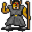

# { .sprite } Cave troll shaman

| Stat | Value |
|---|---|
| Class | giant |
| HP | 300 |
| Max AP | 10 |
| Attack cost | 5 |
| Move cost | 5 |
| Damage | 1 to 15 |
| Attack chance | 60 |
| Block chance | 40 |
| Damage resistance | 0 |
| Critical skill | 0 |
| Critical multiplier | 0 |

## On hit

- **On target:** Stunned (magnitude 1, 2 rounds, 15% chance); Dazed (magnitude 1, 3 rounds, 10% chance); Minor fatigue (magnitude 1, 4 rounds, 10% chance)

## Drops

| Item | Chance | Qty |
|---|---|---|
| [Gold coins](../items/gold.md) | 70% | 1 to 8 |
| [Helm of Foreseeing](../items/Helm_foreseeing.md) | 0.01% | 1 |
| [Polished gem](../items/gem3.md) | 5% | 1 |
| [Iron club](../items/club3.md) | 5% | 1 |

## Found on

- [lakecave0](../maps/lakecave0.md)
- [lakecave2](../maps/lakecave2.md)

<small>Monster ID: `cave_troll_4` · Data from v0.8.18</small>
