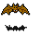

# { .sprite } Cave bat

| Stat | Value |
|---|---|
| Class | animal |
| HP | 39 |
| Max AP | 10 |
| Attack cost | 2 |
| Move cost | 5 |
| Damage | 1 to 7 |
| Attack chance | 64 |
| Block chance | 27 |
| Damage resistance | 0 |
| Critical skill | 80 |
| Critical multiplier | 3.0 |

## Drops

| Item | Chance | Qty |
|---|---|---|
| [Bat wing](../items/bat_wing.md) | 20% | 1 |

## Found on

- [final_cave_labyrinth](../maps/final_cave_labyrinth.md)
- [island2_cave](../maps/island2_cave.md)
- [island_4_cave2](../maps/island_4_cave2.md)
- [island_underground2](../maps/island_underground2.md)
- [island_underground3](../maps/island_underground3.md)
- [island_underground4](../maps/island_underground4.md)
- [island_underground4a](../maps/island_underground4a.md)
- [island_underground4b](../maps/island_underground4b.md)
- [island_underground4c](../maps/island_underground4c.md)
- [island_underground5](../maps/island_underground5.md)
- [laerothbasement1](../maps/laerothbasement1.md)
- [laerothcave2](../maps/laerothcave2.md)
- [lodar5cave1](../maps/lodar5cave1.md)
- [lodar5cave2](../maps/lodar5cave2.md)
- [lodarcave4a](../maps/lodarcave4a.md)
- [secretpassage1](../maps/secretpassage1.md)
- [shortcut_lodar0](../maps/shortcut_lodar0.md)
- [shortcut_lodar1](../maps/shortcut_lodar1.md)
- [shortcut_lodar2](../maps/shortcut_lodar2.md)
- [shortcut_lodar3](../maps/shortcut_lodar3.md)

<small>Monster ID: `cavebat4` · Data from v0.8.18</small>
