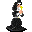

# { .sprite } Mourning woman

| Stat | Value |
|---|---|
| Class | humanoid |
| HP | 0 |
| Max AP | 10 |
| Attack cost | 10 |
| Move cost | 10 |
| Damage | 0 |
| Attack chance | 0 |
| Block chance | 0 |
| Damage resistance | 0 |
| Critical skill | 0 |
| Critical multiplier | 0 |

## Found on

- [brimhaven_church](../maps/brimhaven_church.md)
- [fallhaven_church](../maps/fallhaven_church.md)
- [loneford4](../maps/loneford4.md)
- [remgard_church](../maps/remgard_church.md)
- [vilegard_chapel](../maps/vilegard_chapel.md)

<small>Monster ID: `chapelgoer` · Data from v0.8.18</small>
