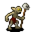

# { .sprite } Charwood goblin

| Stat | Value |
|---|---|
| Class | ? |
| HP | 81 |
| Max AP | 10 |
| Attack cost | 6 |
| Move cost | 5 |
| Damage | 7 to 9 |
| Attack chance | 147 |
| Block chance | 65 |
| Damage resistance | 4 |
| Critical skill | 25 |
| Critical multiplier | 3.0 |

## Drops

| Item | Chance | Qty |
|---|---|---|
| [Gold coins](../items/gold.md) | 30% | 1 to 20 |
| [Iron mace](../items/mace_iron.md) | 1% | 1 |
| [Broken wooden buckler](../items/broken_buckler.md) | 1% | 1 |
| [Ointment of bleeding wounds](../items/pot_bleeding_ointment.md) | 5% | 1 |
| [Raw perch](../items/rawperch.md) | 10% | 1 |

## Found on

- [waytolostmine0](../maps/waytolostmine0.md)

<small>Monster ID: `charwdgg` · Data from v0.8.18</small>
