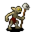

# { .sprite } Charwood goblin

| Stat | Value |
|---|---|
| Class | ? |
| HP | 81 |
| Max AP | 10 |
| Attack cost | 6 |
| Move cost | 5 |
| Damage | 7 to 9 |
| Attack chance | 147 |
| Block chance | 65 |
| Damage resistance | 4 |
| Critical skill | 25 |
| Critical multiplier | 3.0 |

## Drops

| Item | Chance | Qty |
|---|---|---|
| [Gold coins](../items/gold.md) | 30% | 1 to 20 |
| [Iron mace](../items/mace_iron.md) | 1% | 1 |
| [Broken wooden buckler](../items/broken_buckler.md) | 1% | 1 |
| [Ointment of bleeding wounds](../items/pot_bleeding_ointment.md) | 5% | 1 |
| [Raw perch](../items/rawperch.md) | 10% | 1 |

## Found on

- [waytolostmine0](../maps/waytolostmine0.md)

## Quests

- [Destined for great things](../quests/charwood1.md): stages 40

## Dialogue simulator

Set up your situation (quest stages, items, kills…), then talk to Charwood goblin. The simulator follows the game's own rules: it takes the same silent checks, offers only the options you'd really see, and applies their effects (quest stages, items handed over, rewards) as you go.

<noscript>The simulator needs JavaScript. The full dialogue is listed below.</noscript>

Rules verified against v0.8.18 game code (ConversationController.java) and dialogue data.

??? quote "Dialogue (1 lines)"

    *What the dialogue says, exactly as in the game files. Lines are listed once; links jump to the line a choice leads to.*

    **`charwoodm`** Charwood goblin: “Bow before the might of the Thukuzun!” — **effects:** sets stage 40 of [Destined for great things](../quests/charwood1.md#stage-40)

    - “I bow to no one.” → *fight starts*
    - “Bow down to your own death!” → *fight starts*
    - “Fight!” → *fight starts*

## Version history

| Version | Change |
|---|---|
| [v0.7.0](../versions/0.7.0.md) | Present in v0.7.0 (earliest release tracked) |
| [v0.7.2](../versions/0.7.2.md) | minor data change |

Verified against v0.8.18 and every earlier release back to v0.7.0 (game data compared release by release).

## Community notes

<small>Written by players, not generated from game data. **Observations**: what players notice in-game · **Lore**: the in-world story · **Trivia**: real-world facts, references, development history · **Theory / speculation**: unconfirmed ideas; may just be unfinished content</small>

### Observations

*Nothing here yet. Know something? [Add it](https://github.com/asdfghjkl628/Andor-s-Trail-Wikiiii/new/main/notes/monsters?filename=charwdgg.md&value=%23%23%20Observations%0A%0A%3C%21--%20what%20players%20notice%20in-game%20--%3E%0A%0A%23%23%20Lore%0A%0A%3C%21--%20the%20in-world%20story%20--%3E%0A%0A%23%23%20Trivia%0A%0A%3C%21--%20real-world%20facts%2C%20references%2C%20development%20history%20--%3E%0A%0A%23%23%20Theory%20/%20speculation%0A%0A%3C%21--%20unconfirmed%20ideas%3B%20may%20just%20be%20unfinished%20content%20--%3E%0A).*

### Lore

*Nothing here yet. Know something? [Add it](https://github.com/asdfghjkl628/Andor-s-Trail-Wikiiii/new/main/notes/monsters?filename=charwdgg.md&value=%23%23%20Observations%0A%0A%3C%21--%20what%20players%20notice%20in-game%20--%3E%0A%0A%23%23%20Lore%0A%0A%3C%21--%20the%20in-world%20story%20--%3E%0A%0A%23%23%20Trivia%0A%0A%3C%21--%20real-world%20facts%2C%20references%2C%20development%20history%20--%3E%0A%0A%23%23%20Theory%20/%20speculation%0A%0A%3C%21--%20unconfirmed%20ideas%3B%20may%20just%20be%20unfinished%20content%20--%3E%0A).*

### Trivia

*Nothing here yet. Know something? [Add it](https://github.com/asdfghjkl628/Andor-s-Trail-Wikiiii/new/main/notes/monsters?filename=charwdgg.md&value=%23%23%20Observations%0A%0A%3C%21--%20what%20players%20notice%20in-game%20--%3E%0A%0A%23%23%20Lore%0A%0A%3C%21--%20the%20in-world%20story%20--%3E%0A%0A%23%23%20Trivia%0A%0A%3C%21--%20real-world%20facts%2C%20references%2C%20development%20history%20--%3E%0A%0A%23%23%20Theory%20/%20speculation%0A%0A%3C%21--%20unconfirmed%20ideas%3B%20may%20just%20be%20unfinished%20content%20--%3E%0A).*

### Theory / speculation

*Nothing here yet. Know something? [Add it](https://github.com/asdfghjkl628/Andor-s-Trail-Wikiiii/new/main/notes/monsters?filename=charwdgg.md&value=%23%23%20Observations%0A%0A%3C%21--%20what%20players%20notice%20in-game%20--%3E%0A%0A%23%23%20Lore%0A%0A%3C%21--%20the%20in-world%20story%20--%3E%0A%0A%23%23%20Trivia%0A%0A%3C%21--%20real-world%20facts%2C%20references%2C%20development%20history%20--%3E%0A%0A%23%23%20Theory%20/%20speculation%0A%0A%3C%21--%20unconfirmed%20ideas%3B%20may%20just%20be%20unfinished%20content%20--%3E%0A).*

<small>Monster ID: `charwdgg` · Data from v0.8.18</small>
