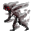

# { .sprite } Dark spirit

<div class="infobox" markdown>

<p class="ib-img">{ .sprite }</p>

| | |
|---|---|
| **Monster ID** | `crossglen_dark_spirit` |
| **Type** | Enemy |
| **Class** | Demon |
| **HP** | 470 |
| **XP when killed** | 851 |
| **Found in** | Crossglen |
| **Immune to crits** | Yes |
| **Introduced** | [v0.8.14](../versions/0.8.14.md) |

</div>

## Combat stats

| Stat | Value |
|---|---|
| HP | 470 |
| Damage | 7 to 10 |
| Attack chance | 135 |
| Block chance | 130 |
| Damage resistance | 3 |
| Max AP | 10 |
| Attack cost | 3 AP |
| Attacks per turn | 3 |
| Move cost | 2 AP |
| Critical skill | 2 |
| Critical multiplier | 2.0 |
| Crit chance | 1% |

!!! note "Immune to critical hits"
    Ghosts, constructs and demons can't be critically hit. Your crit build will have to sit this one out.

**On hit:** Heal HP: 1 to 3

**When hit:** Heal HP: 3 to 6

**XP formula** (from the game's loader): ⌈(attacks per turn × attack chance × average damage × (1 + critical skill × multiplier) × 3 + HP × (1 + block chance) + 9 × damage resistance) × 0.7⌉, +50 if its hits inflict a condition. More Exp adds a percentage on top.

<p class="verified">Verified against v0.8.18 monster data and game code (`MonsterTypeParser.java`).</p>


## Drops

| Item | Chance | Qty |
|---|---|---|
| [Tonic of blood](../items/tonic_of_blood.md) | 100% | 3 to 4 |
| [Gold coins](../items/gold.md) | 100% | 65 to 100 |
| [Spiritbane potion](../items/spiritbane_potion.md) | 100% | 1 |

## Locations

| Map | Region | Up to | Notes |
|---|---|---|---|
| [crossglen_farmhouse](../maps/crossglen_farmhouse.md) | Crossglen | 1 | appears later in a quest |


## Quests that count kills

- [A familiar shadow](../quests/familiar_shadow.md#stage-50) with stepping on a trigger on [crossglen](../maps/crossglen.md) checks that you've killed at least 1


## Version history

| Version | Change |
|---|---|
| [v0.8.14](../versions/0.8.14.md) | Added |

<p class="verified">Verified against v0.8.18 and every earlier release back to v0.7.0 (game data compared release by release).</p>


## Community notes

<small>Written by players, not generated from game data. **Observations**: what players notice in-game · **Lore**: the in-world story · **Trivia**: real-world facts, references, development history · **Theory / speculation**: unconfirmed ideas; may just be unfinished content</small>

### Observations

*Nothing here yet. Know something? [Add it](https://github.com/asdfghjkl628/Andor-s-Trail-Wikiiii/new/main/notes/monsters?filename=crossglen_dark_spirit.md&value=%23%23%20Observations%0A%0A%3C%21--%20what%20players%20notice%20in-game%20--%3E%0A%0A%23%23%20Lore%0A%0A%3C%21--%20the%20in-world%20story%20--%3E%0A%0A%23%23%20Trivia%0A%0A%3C%21--%20real-world%20facts%2C%20references%2C%20development%20history%20--%3E%0A%0A%23%23%20Theory%20/%20speculation%0A%0A%3C%21--%20unconfirmed%20ideas%3B%20may%20just%20be%20unfinished%20content%20--%3E%0A).*

### Lore

*Nothing here yet. Know something? [Add it](https://github.com/asdfghjkl628/Andor-s-Trail-Wikiiii/new/main/notes/monsters?filename=crossglen_dark_spirit.md&value=%23%23%20Observations%0A%0A%3C%21--%20what%20players%20notice%20in-game%20--%3E%0A%0A%23%23%20Lore%0A%0A%3C%21--%20the%20in-world%20story%20--%3E%0A%0A%23%23%20Trivia%0A%0A%3C%21--%20real-world%20facts%2C%20references%2C%20development%20history%20--%3E%0A%0A%23%23%20Theory%20/%20speculation%0A%0A%3C%21--%20unconfirmed%20ideas%3B%20may%20just%20be%20unfinished%20content%20--%3E%0A).*

### Trivia

*Nothing here yet. Know something? [Add it](https://github.com/asdfghjkl628/Andor-s-Trail-Wikiiii/new/main/notes/monsters?filename=crossglen_dark_spirit.md&value=%23%23%20Observations%0A%0A%3C%21--%20what%20players%20notice%20in-game%20--%3E%0A%0A%23%23%20Lore%0A%0A%3C%21--%20the%20in-world%20story%20--%3E%0A%0A%23%23%20Trivia%0A%0A%3C%21--%20real-world%20facts%2C%20references%2C%20development%20history%20--%3E%0A%0A%23%23%20Theory%20/%20speculation%0A%0A%3C%21--%20unconfirmed%20ideas%3B%20may%20just%20be%20unfinished%20content%20--%3E%0A).*

### Theory / speculation

*Nothing here yet. Know something? [Add it](https://github.com/asdfghjkl628/Andor-s-Trail-Wikiiii/new/main/notes/monsters?filename=crossglen_dark_spirit.md&value=%23%23%20Observations%0A%0A%3C%21--%20what%20players%20notice%20in-game%20--%3E%0A%0A%23%23%20Lore%0A%0A%3C%21--%20the%20in-world%20story%20--%3E%0A%0A%23%23%20Trivia%0A%0A%3C%21--%20real-world%20facts%2C%20references%2C%20development%20history%20--%3E%0A%0A%23%23%20Theory%20/%20speculation%0A%0A%3C%21--%20unconfirmed%20ideas%3B%20may%20just%20be%20unfinished%20content%20--%3E%0A).*


??? info "Technical information"

    | | |
    |---|---|
    | Monster ID | `crossglen_dark_spirit` |
    | Spawn group | `crossglen_dark_spirit` |
    | Loot table | `crossglen_dark_spirit_dl` |
    | Conversation | – |
    | Faction | – |
    | Movement | wholeMap |
    | Icon | `monsters_newb_1:686` |
    | Defined in | `res/raw/monsterlist_mt_galmore2.json` |

    Raw data:

    ```json
    {
     "id": "crossglen_dark_spirit",
     "name": "Dark spirit",
     "iconID": "monsters_newb_1:686",
     "maxHP": 470,
     "moveCost": 2,
     "unique": 1,
     "monsterClass": "demon",
     "movementAggressionType": "wholeMap",
     "attackDamage": {
      "min": 7,
      "max": 10
     },
     "droplistID": "crossglen_dark_spirit_dl",
     "attackCost": 3,
     "attackChance": 135,
     "criticalSkill": 2,
     "criticalMultiplier": 2.0,
     "blockChance": 130,
     "damageResistance": 3,
     "hitEffect": {
      "increaseCurrentHP": {
       "min": 1,
       "max": 3
      }
     },
     "hitReceivedEffect": {
      "increaseCurrentHP": {
       "min": 3,
       "max": 6
      }
     }
    }
    ```


<small>Data from v0.8.18</small>
