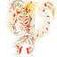

# { .sprite } Dark priest

<div class="infobox" markdown>

<p class="ib-img">{ .sprite }</p>

| | |
|---|---|
| **Monster ID** | `dds_dark_priest_monster` |
| **Type** | Enemy |
| **Class** | Demon |
| **HP** | 330 |
| **XP when killed** | 1,128 |
| **Found in** | galmore_41 |
| **Immune to crits** | Yes |
| **Introduced** | [v0.8.14](../versions/0.8.14.md) |

</div>

## Combat stats

| Stat | Value |
|---|---|
| HP | 330 |
| Damage | 18 to 30 |
| Attack chance | 301 |
| Block chance | 138 |
| Damage resistance | 5 |
| Max AP | 10 |
| Attack cost | 5 AP |
| Attacks per turn | 2 |
| Move cost | 5 AP |
| Critical skill | 40 |
| Critical multiplier | 2.0 |
| Crit chance | 23% |

!!! note "Immune to critical hits"
    Ghosts, constructs and demons can't be critically hit. Your crit build will have to sit this one out.

**When hit:** On target: Cinder rage (magnitude 2, 2 rounds, 100% chance)

**XP formula** (from the game's loader): ⌈(attacks per turn × attack chance × average damage × (1 + critical skill × multiplier) × 3 + HP × (1 + block chance) + 9 × damage resistance) × 0.7⌉, +50 if its hits inflict a condition. More Exp adds a percentage on top.

<p class="verified">Verified against v0.8.18 monster data and game code (`MonsterTypeParser.java`).</p>


## Drops

| Item | Chance | Qty |
|---|---|---|
| [Judicar](../items/judicar.md) | 100% | 1 |

## Locations

| Map | Region | Up to | Notes |
|---|---|---|---|
| [galmore_41](../maps/galmore_41.md) | – | 1 | appears later in a quest |


## Quests that count kills

- [Shadows](../quests/shadows.md#stage-250) with [Borvis](../monsters/dds_borvis.md) ([galmore_41](../maps/galmore_41.md)) checks that you've killed at least 1
- [Darkness in the Daylight](../quests/darkness_in_daylight.md#stage-270) with [Miri](../monsters/dds_miri.md) ([galmore_41](../maps/galmore_41.md)) checks that you've killed at least 1


## Version history

| Version | Change |
|---|---|
| [v0.8.14](../versions/0.8.14.md) | Added |

<p class="verified">Verified against v0.8.18 and every earlier release back to v0.7.0 (game data compared release by release).</p>


## Community notes

<small>Written by players, not generated from game data. **Observations**: what players notice in-game · **Lore**: the in-world story · **Trivia**: real-world facts, references, development history · **Theory / speculation**: unconfirmed ideas; may just be unfinished content</small>

### Observations

*Nothing here yet. Know something? [Add it](https://github.com/asdfghjkl628/Andor-s-Trail-Wikiiii/new/main/notes/monsters?filename=dds_dark_priest_monster.md&value=%23%23%20Observations%0A%0A%3C%21--%20what%20players%20notice%20in-game%20--%3E%0A%0A%23%23%20Lore%0A%0A%3C%21--%20the%20in-world%20story%20--%3E%0A%0A%23%23%20Trivia%0A%0A%3C%21--%20real-world%20facts%2C%20references%2C%20development%20history%20--%3E%0A%0A%23%23%20Theory%20/%20speculation%0A%0A%3C%21--%20unconfirmed%20ideas%3B%20may%20just%20be%20unfinished%20content%20--%3E%0A).*

### Lore

*Nothing here yet. Know something? [Add it](https://github.com/asdfghjkl628/Andor-s-Trail-Wikiiii/new/main/notes/monsters?filename=dds_dark_priest_monster.md&value=%23%23%20Observations%0A%0A%3C%21--%20what%20players%20notice%20in-game%20--%3E%0A%0A%23%23%20Lore%0A%0A%3C%21--%20the%20in-world%20story%20--%3E%0A%0A%23%23%20Trivia%0A%0A%3C%21--%20real-world%20facts%2C%20references%2C%20development%20history%20--%3E%0A%0A%23%23%20Theory%20/%20speculation%0A%0A%3C%21--%20unconfirmed%20ideas%3B%20may%20just%20be%20unfinished%20content%20--%3E%0A).*

### Trivia

*Nothing here yet. Know something? [Add it](https://github.com/asdfghjkl628/Andor-s-Trail-Wikiiii/new/main/notes/monsters?filename=dds_dark_priest_monster.md&value=%23%23%20Observations%0A%0A%3C%21--%20what%20players%20notice%20in-game%20--%3E%0A%0A%23%23%20Lore%0A%0A%3C%21--%20the%20in-world%20story%20--%3E%0A%0A%23%23%20Trivia%0A%0A%3C%21--%20real-world%20facts%2C%20references%2C%20development%20history%20--%3E%0A%0A%23%23%20Theory%20/%20speculation%0A%0A%3C%21--%20unconfirmed%20ideas%3B%20may%20just%20be%20unfinished%20content%20--%3E%0A).*

### Theory / speculation

*Nothing here yet. Know something? [Add it](https://github.com/asdfghjkl628/Andor-s-Trail-Wikiiii/new/main/notes/monsters?filename=dds_dark_priest_monster.md&value=%23%23%20Observations%0A%0A%3C%21--%20what%20players%20notice%20in-game%20--%3E%0A%0A%23%23%20Lore%0A%0A%3C%21--%20the%20in-world%20story%20--%3E%0A%0A%23%23%20Trivia%0A%0A%3C%21--%20real-world%20facts%2C%20references%2C%20development%20history%20--%3E%0A%0A%23%23%20Theory%20/%20speculation%0A%0A%3C%21--%20unconfirmed%20ideas%3B%20may%20just%20be%20unfinished%20content%20--%3E%0A).*


??? info "Technical information"

    | | |
    |---|---|
    | Monster ID | `dds_dark_priest_monster` |
    | Spawn group | `dds_dark_priest_monster` |
    | Loot table | `dds_dark_priest_monster_dl` |
    | Conversation | – |
    | Faction | – |
    | Movement | – |
    | Icon | `monsters_newb_3:4` |
    | Defined in | `res/raw/monsterlist_darknessanddaylight.json` |

    Raw data:

    ```json
    {
     "id": "dds_dark_priest_monster",
     "name": "Dark priest",
     "iconID": "monsters_newb_3:4",
     "maxHP": 330,
     "maxAP": 10,
     "moveCost": 5,
     "unique": 1,
     "monsterClass": "demon",
     "attackDamage": {
      "min": 18,
      "max": 30
     },
     "spawnGroup": "dds_dark_priest_monster",
     "droplistID": "dds_dark_priest_monster_dl",
     "attackCost": 5,
     "attackChance": 301,
     "criticalSkill": 40,
     "criticalMultiplier": 2.0,
     "blockChance": 138,
     "damageResistance": 5,
     "hitReceivedEffect": {
      "conditionsTarget": [
       {
        "condition": "cinder_rage",
        "magnitude": 2,
        "duration": 2,
        "chance": "100"
       }
      ]
     }
    }
    ```


<small>Data from v0.8.18</small>
