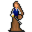

# { .sprite } Miri

**Where to find Miri:** Crossroads Guardhouse: [houseatcrossroads0](../maps/houseatcrossroads0.md#pin-npc-dds_miri), Mt. Galmore: [galmore_45](../maps/galmore_45.md#pin-npc-dds_miri), [galmore_41](../maps/galmore_41.md#pin-npc-dds_miri)

<div class="infobox" markdown>

<p class="ib-img">{ .sprite }</p>

| | |
|---|---|
| **Type** | NPC (can be spoken to; cannot be attacked) |
| **Role** | Starts [Darkness in the Daylight](../quests/darkness_in_daylight.md) |
| **Found in** | Mt. Galmore, Crossroads Guardhouse |
| **Entry ID** | `dds_miri` |
| **Introduced** | [v0.8.14](../versions/0.8.14.md) |

</div>

## Locations

| Map | Region | Up to | Notes |
|---|---|---|---|
| [galmore_41](../maps/galmore_41.md) | – | 1 | Appears later, during a quest |
| [galmore_45](../maps/galmore_45.md) | Mt. Galmore | 1 | Appears later, during a quest |
| [houseatcrossroads0](../maps/houseatcrossroads0.md) | Crossroads Guardhouse | 1 | Appears later, during a quest |

## Quests

- [Darkness in the Daylight](../quests/darkness_in_daylight.md): stages 10, 20, 30, 40, 50, 80, 90, 120, 150, 160, 190, 210, 220, 240, 260, 270, 280
- [Darkness in the Daylight and Shadows - Non displayed (hidden flag)](../quests/dds_nd.md): stages 3, 6

## Dialogue simulator

Set the quest stages, items and other conditions that apply to your game, then start the conversation with Miri. The simulator applies the game's own rules: it performs the same silent checks, offers only the options that would be shown in the game, and applies their effects (quest stages, items handed over, rewards) as the conversation proceeds.

<div class="dlg-sim" data-src="../../assets/dialogue/dds_miri.json" data-npc="Miri" markdown="0"><noscript>The simulator needs JavaScript. The full dialogue is listed below.</noscript></div>

<p class="verified">Rules verified against v0.8.18 game code (ConversationController.java) and dialogue data.</p>

??? quote "Dialogue (75 lines)"

    *What the dialogue says, exactly as in the game files. Lines are listed once; links jump to the line a choice leads to.*

    <span id="d-dds_miri"></span>**`dds_miri`** *(silent check: the first matching branch below is taken)*

    - branch 1 *(if reached stage 280 of [Darkness in the Daylight](../quests/darkness_in_daylight.md#stage-280))* → [dds_miri_600](#d-dds_miri_600)
    - branch 2 *(if reached stage 260 of [Darkness in the Daylight](../quests/darkness_in_daylight.md#stage-260); killed 1× [Dark priest](../monsters/dds_dark_priest.md#v-dds_dark_priest_monster))* → [dds_miri_550](#d-dds_miri_550)
    - branch 3 *(if reached stage 260 of [Darkness in the Daylight](../quests/darkness_in_daylight.md#stage-260))* → [dds_dark_priest2_10](#d-dds_dark_priest2_10)
    - branch 4 *(if reached stage 250 of [Darkness in the Daylight](../quests/darkness_in_daylight.md#stage-250))* → [dds_miri_540](#d-dds_miri_540)
    - branch 5 *(if reached stage 220 of [Darkness in the Daylight](../quests/darkness_in_daylight.md#stage-220))* → [dds_miri_500](#d-dds_miri_500)
    - branch 6 *(if reached stage 210 of [Darkness in the Daylight](../quests/darkness_in_daylight.md#stage-210))* → [dds_mourning_woman_50](#d-dds_mourning_woman_50)
    - branch 7 *(if reached stage 190 of [Darkness in the Daylight](../quests/darkness_in_daylight.md#stage-190))* → [dds_miri_460](#d-dds_miri_460)
    - branch 8 *(if reached stage 160 of [Darkness in the Daylight](../quests/darkness_in_daylight.md#stage-160))* → [dds_miri_450](#d-dds_miri_450)
    - branch 9 *(if reached stage 150 of [Darkness in the Daylight](../quests/darkness_in_daylight.md#stage-150))* → [dds_miri_400](#d-dds_miri_400)
    - branch 10 *(if reached stage 120 of [Darkness in the Daylight](../quests/darkness_in_daylight.md#stage-120))* → [dds_miri_350](#d-dds_miri_350)
    - branch 11 *(if reached stage 100 of [Darkness in the Daylight](../quests/darkness_in_daylight.md#stage-100))* → [dds_miri_300](#d-dds_miri_300)
    - branch 12 *(if reached stage 90 of [Darkness in the Daylight](../quests/darkness_in_daylight.md#stage-90))* → [dds_miri_222](#d-dds_miri_222)
    - branch 13 *(if reached stage 60 of [Darkness in the Daylight](../quests/darkness_in_daylight.md#stage-60))* → [dds_miri_200](#d-dds_miri_200)
    - branch 14 *(if reached stage 50 of [Darkness in the Daylight](../quests/darkness_in_daylight.md#stage-50))* → [dds_miri_110](#d-dds_miri_110)
    - branch 15 *(if reached stage 40 of [Darkness in the Daylight](../quests/darkness_in_daylight.md#stage-40))* → [dds_miri_42](#d-dds_miri_42)
    - branch 16 → [dds_miri_5](#d-dds_miri_5)

    <span id="d-dds_miri_600"></span>**`dds_miri_600`** Miri: “Isn't it a lovely day? Even in here?”


    <span id="d-dds_miri_550"></span>**`dds_miri_550`** Miri: “Finally. Well done, kid.” — **effects:** sets stage 270 of [Darkness in the Daylight](../quests/darkness_in_daylight.md#stage-270)

    - “Is it over?” → [dds_miri_560](#d-dds_miri_560)

    <span id="d-dds_dark_priest2_10"></span>**`dds_dark_priest2_10`** [Miri](../monsters/dds_miri.md): “You're no priest!”

    - “Miri! How did you get here?” → [dds_dark_priest2_20](#d-dds_dark_priest2_20)

    <span id="d-dds_miri_540"></span>**`dds_miri_540`** Miri: “The monster is not dead. Go and finish it!”


    <span id="d-dds_miri_500"></span>**`dds_miri_500`** Miri: “It's not done yet. Can you talk to this priest? And tackle him as he deserves?” — **effects:** sets stage 240 of [Darkness in the Daylight](../quests/darkness_in_daylight.md#stage-240), spawns monsters on galmore_41

    - “Of course! On my way!” → *conversation ends*

    <span id="d-dds_mourning_woman_50"></span>**`dds_mourning_woman_50`** [Miri](../monsters/dds_miri.md): “Is that what you think?”

    - “Miri? When did you get here?” → [dds_mourning_woman_60](#d-dds_mourning_woman_60)

    <span id="d-dds_miri_460"></span>**`dds_miri_460`** Miri: “Great. And now off to the barrier! Make haste - I'll join you as fast as my injuries allow.” — **effects:** sets stage 190 of [Darkness in the Daylight](../quests/darkness_in_daylight.md#stage-190), removes monsters from houseatcrossroads0

    - “OK, see you there.” → [dds_miri_462](#d-dds_miri_462)

    <span id="d-dds_miri_450"></span>**`dds_miri_450`** Miri: “Have you found the complete chant?”

    - “I haven't even found the old hermit yet.” *(if NOT reached stage 170 of [Darkness in the Daylight](../quests/darkness_in_daylight.md#stage-170))* → [dds_miri_452](#d-dds_miri_452)
    - “I found the old hermit, but he hasn't given me his book.” *(if reached stage 170 of [Darkness in the Daylight](../quests/darkness_in_daylight.md#stage-170); NOT reached stage 180 of [Darkness in the Daylight](../quests/darkness_in_daylight.md#stage-180))* → [dds_miri_454](#d-dds_miri_454)
    - “Yes, here it is.” *(if reached stage 180 of [Darkness in the Daylight](../quests/darkness_in_daylight.md#stage-180))* → [dds_miri_456](#d-dds_miri_456)

    <span id="d-dds_miri_400"></span>**`dds_miri_400`** Miri: “Hi $playername, I'm back.”

    - “Did you find anything?” → [dds_miri_410](#d-dds_miri_410)

    <span id="d-dds_miri_350"></span>**`dds_miri_350`** Miri: “Any news about the Calomyran Secrets?”

    - “Not really.” *(if NOT reached stage 140 of [Darkness in the Daylight](../quests/darkness_in_daylight.md#stage-140))* → *conversation ends*
    - “I got more of the chant but I need to find another book, Azimyran Secrets, for the rest of the chant.” *(if reached stage 140 of [Darkness in the Daylight](../quests/darkness_in_daylight.md#stage-140))* → [dds_miri_360](#d-dds_miri_360)

    <span id="d-dds_miri_300"></span>**`dds_miri_300`** Miri: “What did you find out from Throdna?”

    - “We talked about the rest of the spell to break the barrier for Kazaul.” *(if NOT reached stage 110 of [Darkness in the Daylight](../quests/darkness_in_daylight.md#stage-110))* → [dds_miri_302](#d-dds_miri_302)
    - “Apart from two parts of the spell which I know, the rest of the spell to break the barrier for Kazaul is in the book…” *(if reached stage 110 of [Darkness in the Daylight](../quests/darkness_in_daylight.md#stage-110))* → [dds_miri_310](#d-dds_miri_310)

    <span id="d-dds_miri_222"></span>**`dds_miri_222`** Miri: “Go meet Throdna. Since he's known to ramble, just say 'Kazaul est' to focus him again.” — **effects:** sets stage 90 of [Darkness in the Daylight](../quests/darkness_in_daylight.md#stage-90)

    - “'Kazaul est.'” → [dds_miri_224](#d-dds_miri_224)

    <span id="d-dds_miri_200"></span>**`dds_miri_200`** Miri: “Ah, you're back. Too soon - did you run into any issue?”

    - “There's some sort of force shield blocking the path.” → [dds_miri_202](#d-dds_miri_202)

    <span id="d-dds_miri_110"></span>**`dds_miri_110`** Miri: “Journey to the south of Stoutford, into the weird lands there. Investigate what's going on in the Purple Hills.” — **effects:** sets stage 50 of [Darkness in the Daylight](../quests/darkness_in_daylight.md#stage-50), sets stage 3 of [Darkness in the Daylight and Shadows - Non displayed (hidden flag)](../quests/dds_nd.md#stage-3), spawns monsters on galmore_45, spawns monsters on galmore_45

    - “OK, I'm off. Stoutford ... I haven't been there in a long time ...” → *conversation ends*
    - “The Purple Hills?” → [dds_miri_112](#d-dds_miri_112)

    <span id="d-dds_miri_42"></span>**`dds_miri_42`** Miri: “You've aided Feygard once before. Now, investigate something for me. If you succeed, I'll tell you what I know of Andor.” — **effects:** sets stage 40 of [Darkness in the Daylight](../quests/darkness_in_daylight.md#stage-40)

    - “So, what do you want from me?” → [dds_miri_50](#d-dds_miri_50)

    <span id="d-dds_miri_5"></span>**`dds_miri_5`** Miri: “Ah, one of the kids who've been causing trouble around Dhayavar.” — **effects:** sets stage 10 of [Darkness in the Daylight](../quests/darkness_in_daylight.md#stage-10)

    - “Oh, you know of me?” → [dds_miri_10](#d-dds_miri_10)

    <span id="d-dds_miri_560"></span>**`dds_miri_560`** Miri: “This is over, yes.”

    - Next → [dds_miri_562](#d-dds_miri_562)

    <span id="d-dds_dark_priest2_20"></span>**`dds_dark_priest2_20`** Miri: “I could not let you go alone.”

    - “You made me fight alone all the way here.” → [dds_dark_priest2_30](#d-dds_dark_priest2_30)

    <span id="d-dds_mourning_woman_60"></span>**`dds_mourning_woman_60`** Miri: “I came with all haste. Too bad the poison is slowing me down.”

    - Next → [dds_mourning_woman_62](#d-dds_mourning_woman_62)

    <span id="d-dds_miri_462"></span>**`dds_miri_462`** Miri: “[Smiling] What an eager kid.”


    <span id="d-dds_miri_452"></span>**`dds_miri_452`** Miri: “You'll have to put in a little more effort. All of Dhayavar trusts you.”


    <span id="d-dds_miri_454"></span>**`dds_miri_454`** Miri: “He must. Go again.”


    <span id="d-dds_miri_456"></span>**`dds_miri_456`** Miri: “Great.”

    - Next → [dds_miri_460](#d-dds_miri_460)

    <span id="d-dds_miri_410"></span>**`dds_miri_410`** Miri: “About the Azimyran Secrets? Yes, my sources were most informative”

    - “Tell me.” → [dds_miri_420](#d-dds_miri_420)

    <span id="d-dds_miri_360"></span>**`dds_miri_360`** Miri: “Where can that book be found?”

    - “I don't know.” → [dds_miri_370](#d-dds_miri_370)

    <span id="d-dds_miri_302"></span>**`dds_miri_302`** Miri: “[Rolling eyes] That's not much. Go, talk to Throdna again.”


    <span id="d-dds_miri_310"></span>**`dds_miri_310`** Miri: “Where can this book be found?”

    - “I know! I helped find this book for that old man in Fallhaven. He must still have it. Let me talk to him.” *(if NOT reached stage 140 of [Darkness in the Daylight](../quests/darkness_in_daylight.md#stage-140))* → [dds_miri_320](#d-dds_miri_320)
    - “I have already visited the owner in Fallhaven.” *(if reached stage 140 of [Darkness in the Daylight](../quests/darkness_in_daylight.md#stage-140))* → [dds_miri_350](#d-dds_miri_350)

    <span id="d-dds_miri_224"></span>**`dds_miri_224`** Miri: “Exactly. Hurry now.”


    <span id="d-dds_miri_202"></span>**`dds_miri_202`** Miri: “And? There must be more to it.”

    - “I haven't seen anything suspicious.” *(if NOT reached stage 70 of [Darkness in the Daylight](../quests/darkness_in_daylight.md#stage-70))* → [dds_miri_204](#d-dds_miri_204)
    - “And I found this piece of Kazaul ritual again.” *(if reached stage 70 of [Darkness in the Daylight](../quests/darkness_in_daylight.md#stage-70))* → [dds_miri_210](#d-dds_miri_210)

    <span id="d-dds_miri_112"></span>**`dds_miri_112`** Miri: “Head south through Stoutford. The Purple Hills lie between the lake region and the mountains further south.”

    - Next → [dds_miri_114](#d-dds_miri_114)

    <span id="d-dds_miri_50"></span>**`dds_miri_50`** Miri: “While investigating the forests east of Sullengard, slitherers got to me. Nasty little slitherers. Damned beasts.”

    - Next → [dds_miri_52](#d-dds_miri_52)

    <span id="d-dds_miri_10"></span>**`dds_miri_10`** Miri: “Yes, I know of you. And a little about what your brother has been up to.”

    - “Tell me please.” → [dds_miri_12](#d-dds_miri_12)

    <span id="d-dds_miri_562"></span>**`dds_miri_562`** Miri: “And now for your reward.”

    - “Yes? Hope it is worth it.” → [dds_miri_570](#d-dds_miri_570)

    <span id="d-dds_dark_priest2_30"></span>**`dds_dark_priest2_30`** Miri: “Don't worry - it's worth it.”

    - “But it's unfair to ...” → [dds_dark_priest2_40](#d-dds_dark_priest2_40)

    <span id="d-dds_mourning_woman_62"></span>**`dds_mourning_woman_62`** Miri: “[To the mourning woman] The ritual was not to bring back your husband - it is to bring Kazaul's powerful monsters into Dhayavar.”

    - Next → [dds_mourning_woman_70](#d-dds_mourning_woman_70)

    <span id="d-dds_miri_420"></span>**`dds_miri_420`** Miri: “There's an Old Hermit who lives in the mountains south of Remgard.”

    - Next → [dds_miri_422](#d-dds_miri_422)

    <span id="d-dds_miri_370"></span>**`dds_miri_370`** Miri: “No worries. I'm healed enough now.”

    - Next → [dds_miri_372](#d-dds_miri_372)

    <span id="d-dds_miri_320"></span>**`dds_miri_320`** Miri: “Good thinking! Do that, seek the old man with the book.” — **effects:** sets stage 120 of [Darkness in the Daylight](../quests/darkness_in_daylight.md#stage-120)


    <span id="d-dds_miri_204"></span>**`dds_miri_204`** Miri: “Search thoroughly around this force shield to find anything unusual.”

    - “I should have known.” → *conversation ends*

    <span id="d-dds_miri_210"></span>**`dds_miri_210`** Miri: “What do you mean - again?”

    - “When I was at the Blackwater settlement, I had used this, on the guidance of Throdna, as part of purifying the Kazaul…” → [dds_miri_220](#d-dds_miri_220)

    <span id="d-dds_miri_114"></span>**`dds_miri_114`** Miri: “You could also go west from Sullengard, but the route is longer.”

    - “And how do I know that I am there?” → [dds_miri_116](#d-dds_miri_116)

    <span id="d-dds_miri_52"></span>**`dds_miri_52`** Miri: “I need to recover from the nausea and poison.”

    - “Can I help you with some potions?” → [dds_miri_60](#d-dds_miri_60)

    <span id="d-dds_miri_12"></span>**`dds_miri_12`** *(silent check: the first matching branch below is taken)*

    - branch 1 *(if reached stage 82 of [Feygard errands](../quests/feygard_shipment.md#stage-82))* → [dds_miri_20](#d-dds_miri_20)
    - branch 2 *(if reached stage 120 of [Beer Bootlegging](../quests/beer_bootlegging.md#stage-120))* → [dds_miri_30](#d-dds_miri_30)
    - branch 3 → [dds_miri_40](#d-dds_miri_40)

    <span id="d-dds_miri_570"></span>**`dds_miri_570`** Miri: “You are still looking for your brother?”

    - “Of course.” → [dds_miri_580](#d-dds_miri_580)

    <span id="d-dds_dark_priest2_40"></span>**`dds_dark_priest2_40`** [Dark priest](../monsters/dds_dark_priest.md#v-dds_dark_priest2): “Are we going to do this now, or are you two going to talk all day?” — **effects:** removes monsters from galmore_41, spawns monsters on galmore_41, sets stage 260 of [Darkness in the Daylight](../quests/darkness_in_daylight.md#stage-260)

    - “Ah, sorry: KAZAUL EST!” → [dds_dark_priest2_50](#d-dds_dark_priest2_50)

    <span id="d-dds_mourning_woman_70"></span>**`dds_mourning_woman_70`** [Mourning woman](../monsters/chapelgoer.md#v-dds_mourning_woman): “You lie! You don't want my happiness.”

    - Next → [dds_mourning_woman_72](#d-dds_mourning_woman_72)

    <span id="d-dds_miri_422"></span>**`dds_miri_422`** Miri: “You know, at the old watch tower. The Hermit is said to have a copy of Azimyran Secrets. Go ...” — **effects:** sets stage 160 of [Darkness in the Daylight](../quests/darkness_in_daylight.md#stage-160)

    - “Go and get it?” → [dds_miri_428](#d-dds_miri_428)

    <span id="d-dds_miri_372"></span>**`dds_miri_372`** Miri: “You have run around enough. Let me ask around. Why don't you rest? Stroll around outside a bit to refresh!” — **effects:** sets stage 150 of [Darkness in the Daylight](../quests/darkness_in_daylight.md#stage-150), removes monsters from houseatcrossroads0, starts timer “dds_miri”

    - “OK.” → *conversation ends*

    <span id="d-dds_miri_220"></span>**`dds_miri_220`** Miri: “That is bad news indeed. We must act.” — **effects:** sets stage 80 of [Darkness in the Daylight](../quests/darkness_in_daylight.md#stage-80)

    - Next → [dds_miri_222](#d-dds_miri_222)

    <span id="d-dds_miri_116"></span>**`dds_miri_116`** Miri: “That's easy. The Purple Hills aren't just called that; they really have that color.”


    <span id="d-dds_miri_60"></span>**`dds_miri_60`** Miri: “No, thanks. I've already taken some potions, and I'm waiting for them to take effect.”

    - Next → [dds_miri_70](#d-dds_miri_70)

    <span id="d-dds_miri_20"></span>**`dds_miri_20`** Miri: “Information is for the trustworthy.”

    - Next → [dds_miri_22](#d-dds_miri_22)

    <span id="d-dds_miri_30"></span>**`dds_miri_30`** Miri: “Information is for the trustworthy.”

    - Next → [dds_miri_32](#d-dds_miri_32)

    <span id="d-dds_miri_40"></span>**`dds_miri_40`** Miri: “Information is for a price.”

    - Next → [dds_miri_42](#d-dds_miri_42)

    <span id="d-dds_miri_580"></span>**`dds_miri_580`** Miri: “I know where he is. Or better, where he will be soon.”

    - “Really? Tell me!” → [dds_miri_590](#d-dds_miri_590)

    <span id="d-dds_dark_priest2_50"></span>**`dds_dark_priest2_50`** [Miri](../monsters/dds_miri.md): “That's its true form! A monster masquerading as a priest! Attack!”


    <span id="d-dds_mourning_woman_72"></span>**`dds_mourning_woman_72`** [Miri](../monsters/dds_miri.md): “Do you think monsters would have assisted you? And a barrier would have sprung up? Just for one person?”

    - Next → [dds_mourning_woman_80](#d-dds_mourning_woman_80)

    <span id="d-dds_miri_428"></span>**`dds_miri_428`** Miri: “Yes! Go and get it.”


    <span id="d-dds_miri_70"></span>**`dds_miri_70`** Miri: “But there's something bad happening in the lands south of Stoutford, and if we don't stop it, not only Feygard, but the whole of Dhayavar will be in trouble.”

    - “So what's new?” → [dds_miri_80](#d-dds_miri_80)

    <span id="d-dds_miri_22"></span>**`dds_miri_22`** Miri: “By switching Gandoren's shipment with degraded ones, you have proved not to be. Suffice to say, when I was last there I heard your brother has been up to shenanigans in Feygard.” — **effects:** sets stage 20 of [Darkness in the Daylight](../quests/darkness_in_daylight.md#stage-20)

    - “How would you know that I did such things?” → [dds_miri_25](#d-dds_miri_25)

    <span id="d-dds_miri_32"></span>**`dds_miri_32`** Miri: “By hiding the truth of the beer bootlegging from Sullengard, you have proved not to be. Suffice to say, when I was last there I heard your brother has been up to shenanigans in Feygard.” — **effects:** sets stage 30 of [Darkness in the Daylight](../quests/darkness_in_daylight.md#stage-30), removes monsters from loneford4

    - “How would you know that I did such things?” → [dds_miri_25](#d-dds_miri_25)

    <span id="d-dds_miri_590"></span>**`dds_miri_590`** Miri: “Andor is going to visit Rosmara to refill his travel supplies.” — **effects:** sets stage 280 of [Darkness in the Daylight](../quests/darkness_in_daylight.md#stage-280), removes monsters from galmore_41, spawns monsters on houseatcrossroads0, sets stage 6 of [Darkness in the Daylight and Shadows - Non displayed (hidden flag)](../quests/dds_nd.md#stage-6), spawns monsters on wayto_feygard_duleian_2

    - “Thank you!” → *conversation ends*
    - “Who is Rosmara?” → [dds_miri_592](#d-dds_miri_592)

    <span id="d-dds_mourning_woman_80"></span>**`dds_mourning_woman_80`** [Mourning woman](../monsters/chapelgoer.md#v-dds_mourning_woman): “I don't believe you.”

    - Next → [dds_mourning_woman_82](#d-dds_mourning_woman_82)

    <span id="d-dds_miri_80"></span>**`dds_miri_80`** Miri: “Yeah - many weird things going on. But no time to waste.”

    - Next → [dds_miri_90](#d-dds_miri_90)

    <span id="d-dds_miri_25"></span>**`dds_miri_25`** Miri: “As an investigator, it's my job to know. Now, buzz off, kid. Redeem yourself, if you can.”


    <span id="d-dds_miri_592"></span>**`dds_miri_592`** Miri: “She's the fruit lady on the road near Feygard.”


    <span id="d-dds_mourning_woman_82"></span>**`dds_mourning_woman_82`** [Miri](../monsters/dds_miri.md): “Then why did the ritual not include something that links to your husband? Something precious to him?” — **effects:** sets stage 210 of [Darkness in the Daylight](../quests/darkness_in_daylight.md#stage-210)

    - Next → [dds_mourning_woman_90](#d-dds_mourning_woman_90)

    <span id="d-dds_miri_90"></span>**`dds_miri_90`** Miri: “In the lands south of Stoutford, there have been reports of some suspicious activities. It is said to happen in the Purple Hills there.”

    - Next → [dds_miri_92](#d-dds_miri_92)

    <span id="d-dds_mourning_woman_90"></span>**`dds_mourning_woman_90`** [Mourning woman](../monsters/chapelgoer.md#v-dds_mourning_woman): “Oh no! What do I do now? He's gone.”

    - Next → [dds_mourning_woman_92](#d-dds_mourning_woman_92)

    <span id="d-dds_miri_92"></span>**`dds_miri_92`** Miri: “I fear if left unchecked, we might see lots of really unstoppable monsters popping up all over Dhayavar.”

    - “I'll kill them all!” → [dds_miri_100](#d-dds_miri_100)

    <span id="d-dds_mourning_woman_92"></span>**`dds_mourning_woman_92`** [Miri](../monsters/dds_miri.md): “Pray where have you been praying. And tell me who put you up to this?”

    - “Yes, who put you up to this?” → [dds_mourning_woman_100](#d-dds_mourning_woman_100)

    <span id="d-dds_miri_100"></span>**`dds_miri_100`** Miri: “Admirable - but only few in Dhayavar have the skills to go toe-to-toe against these monsters. No, we must stop them at the source.”

    - “So, what do we do?” → [dds_miri_110](#d-dds_miri_110)

    <span id="d-dds_mourning_woman_100"></span>**`dds_mourning_woman_100`** [Mourning woman](../monsters/chapelgoer.md#v-dds_mourning_woman): “Why? That famous miracle priest who walks on lava, west of here. Do you need me anymore? Then I'm going home to mourn again.” — **effects:** sets stage 220 of [Darkness in the Daylight](../quests/darkness_in_daylight.md#stage-220), removes monsters from galmore_45, spawns monsters on loneford4

    - Next → [dds_mourning_woman_110](#d-dds_mourning_woman_110)

    <span id="d-dds_mourning_woman_110"></span>**`dds_mourning_woman_110`** [Miri](../monsters/dds_miri.md): “Yes, you go back to your village. And we will have a chat with this famous miracle priest.”

    - “Nice job.” → [dds_miri_500](#d-dds_miri_500)


## Version history

| Version | Change |
|---|---|
| [v0.8.14](../versions/0.8.14.md) | Added<br>Dialogue: 75 lines added |
| [v0.8.15](../versions/0.8.15.md) | Dialogue: 1 line changed |
| [v0.8.18](../versions/0.8.18.md) | Dialogue: 1 line changed |

<p class="verified">Verified against v0.8.18 and every earlier release back to v0.7.0 (game data compared release by release).</p>


??? info "Technical information"

    | | |
    |---|---|
    | Entry ID | `dds_miri` |
    | Spawn group | `dds_miri` |
    | Loot table | – |
    | Conversation | `dds_miri` |
    | Faction | – |
    | Movement | – |
    | Icon | `monsters_ld1:228` |
    | Defined in | `res/raw/monsterlist_darknessanddaylight.json` |

    Raw data:

    ```json
    {
     "id": "dds_miri",
     "name": "Miri",
     "iconID": "monsters_ld1:228",
     "monsterClass": "humanoid",
     "spawnGroup": "dds_miri",
     "phraseID": "dds_miri"
    }
    ```


## Community notes

<small>Written by players, not generated from game data. **Observations**: what players notice in-game · **Lore**: the in-world story · **Trivia**: real-world facts, references, development history · **Theory / speculation**: unconfirmed ideas; may just be unfinished content</small>

### Observations

*No notes yet. Contributions are welcome: [add a note](https://github.com/asdfghjkl628/Andor-s-Trail-Wikiiii/new/main/notes/monsters?filename=dds_miri.md&value=%23%23%20Observations%0A%0A%3C%21--%20what%20players%20notice%20in-game%20--%3E%0A%0A%23%23%20Lore%0A%0A%3C%21--%20the%20in-world%20story%20--%3E%0A%0A%23%23%20Trivia%0A%0A%3C%21--%20real-world%20facts%2C%20references%2C%20development%20history%20--%3E%0A%0A%23%23%20Theory%20/%20speculation%0A%0A%3C%21--%20unconfirmed%20ideas%3B%20may%20just%20be%20unfinished%20content%20--%3E%0A).*

### Lore

*No notes yet. Contributions are welcome: [add a note](https://github.com/asdfghjkl628/Andor-s-Trail-Wikiiii/new/main/notes/monsters?filename=dds_miri.md&value=%23%23%20Observations%0A%0A%3C%21--%20what%20players%20notice%20in-game%20--%3E%0A%0A%23%23%20Lore%0A%0A%3C%21--%20the%20in-world%20story%20--%3E%0A%0A%23%23%20Trivia%0A%0A%3C%21--%20real-world%20facts%2C%20references%2C%20development%20history%20--%3E%0A%0A%23%23%20Theory%20/%20speculation%0A%0A%3C%21--%20unconfirmed%20ideas%3B%20may%20just%20be%20unfinished%20content%20--%3E%0A).*

### Trivia

*No notes yet. Contributions are welcome: [add a note](https://github.com/asdfghjkl628/Andor-s-Trail-Wikiiii/new/main/notes/monsters?filename=dds_miri.md&value=%23%23%20Observations%0A%0A%3C%21--%20what%20players%20notice%20in-game%20--%3E%0A%0A%23%23%20Lore%0A%0A%3C%21--%20the%20in-world%20story%20--%3E%0A%0A%23%23%20Trivia%0A%0A%3C%21--%20real-world%20facts%2C%20references%2C%20development%20history%20--%3E%0A%0A%23%23%20Theory%20/%20speculation%0A%0A%3C%21--%20unconfirmed%20ideas%3B%20may%20just%20be%20unfinished%20content%20--%3E%0A).*

### Theory / speculation

*No notes yet. Contributions are welcome: [add a note](https://github.com/asdfghjkl628/Andor-s-Trail-Wikiiii/new/main/notes/monsters?filename=dds_miri.md&value=%23%23%20Observations%0A%0A%3C%21--%20what%20players%20notice%20in-game%20--%3E%0A%0A%23%23%20Lore%0A%0A%3C%21--%20the%20in-world%20story%20--%3E%0A%0A%23%23%20Trivia%0A%0A%3C%21--%20real-world%20facts%2C%20references%2C%20development%20history%20--%3E%0A%0A%23%23%20Theory%20/%20speculation%0A%0A%3C%21--%20unconfirmed%20ideas%3B%20may%20just%20be%20unfinished%20content%20--%3E%0A).*


<small>Data from v0.8.18</small>
